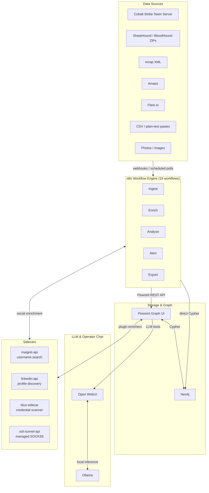
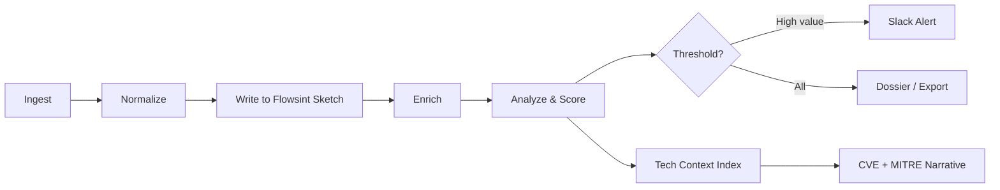
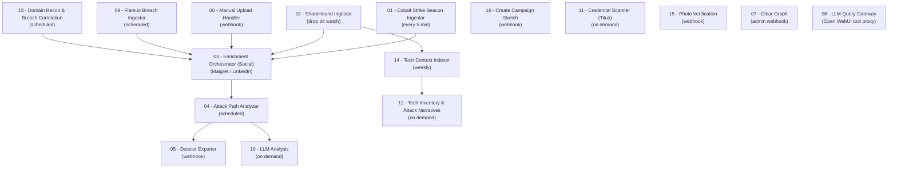

# SPOTTER
## Continuous OSINT & Red Team Recon Platform

Self-hosted, operator-facing intelligence platform for authorized red team engagements. Ingests data from Cobalt Strike, SharpHound/BloodHound, nmap, Amass, Flare.io, CSV, and plain-text recon; correlates everything into interactive Individual dossiers in a Neo4j-backed graph via **Flowsint**; runs a continuous OODA Loop through **n8n** automation workflows; and provides a natural-language query interface via **Open WebUI + Ollama**.

> **Authorization required.** Designed for use under documented Rules of Engagement on authorized engagements only.

---

## Architecture



---

## Data Flow



---

## Workflow Orchestration



---

## Prerequisites

- Docker + Docker Compose v2
- [Flowsint](https://github.com/reconurge/flowsint) cloned alongside this repo
- jq (required by `scripts/create_flowsint_investigation_and_sketch.sh`)
- (Optional) NVIDIA GPU + NVIDIA Container Toolkit for GPU-accelerated LLM inference
- Cobalt Strike Team Server with REST API enabled (for workflow 01)
- Flare.io API key (for workflow 09)
- FOFA.io API key (for workflow 13)
- Slack incoming webhook URL (for operator alerts)

---

## Quick Start

### 1. Generate secrets

```bash
bash deployment/setup-secrets.sh
```

Edit `.env` and fill in the `REPLACE_WITH_*` values:
- `AUTH_SECRET` / `MASTER_VAULT_KEY_V1` / `NEO4J_PASSWORD` / `WEBUI_SECRET_KEY` / `N8N_PASSWORD` — generated by `setup-secrets.sh`
- `CS_API_URL` / `CS_API_TOKEN` — your Cobalt Strike Team Server REST API
- `SLACK_WEBHOOK_URL` — incoming webhook for operator alerts
- `FLOWSINT_API_KEY` — generated after step 3
- `FLOWSINT_SKETCH_ID` — generated after step 3 (fallback/default sketch only; campaigns provision their own via WF16)
- `FLARE_API_KEY` — from https://app.flare.io → Profile → API Keys
- `FOFA_API_KEY` — from https://en.fofa.info → Personal Center → API
- `SHODAN_API_KEY` — optional, from https://account.shodan.io
- `SOCIAL_ENRICHMENT_OWNER` — `direct` (default, sidecars called by WF03) or `plugin` (Flowsint enricher flows own the writes)
- `SOCIAL_MAIGRET_FLOW_ID` / `SOCIAL_LINKEDIN_FLOW_ID` — Flowsint enricher flow IDs (only when `SOCIAL_ENRICHMENT_OWNER=plugin`)
- `SPOTTER_CRED_ENRICHER_FLOW_ID` — Flowsint credential enricher flow ID
- `SSH_KEY_DIR` — absolute host path to SSH keys used by managed tunnel startup (default `/home/user/.ssh`)
- `TUNNEL_API_TOKEN` — optional shared secret for managed tunnel control (`/infra/tunnel/*`)
- `SERP_API_KEY` — optional SerpAPI key for LinkedIn profile search; falls back to DuckDuckGo
- `LINKEDIN_CONFIDENCE_THRESHOLD` — minimum confidence to accept a LinkedIn match (default `0.40`)
- `SPOTTER_SCRIPTS_DIR` — absolute path to `SPOTTER/scripts` so the multi-file compose stack mounts the correct directory

### 2. Clone Flowsint

```bash
git clone https://github.com/reconurge/flowsint.git ../flowsint
cp .env ../flowsint/.env
cp .env ../flowsint/flowsint-api/.env
cp .env ../flowsint/flowsint-core/.env
cp .env ../flowsint/flowsint-app/.env
```

### 3. Build the custom runners image

```bash
# Required once, and after any change to deployment/Dockerfile.runners
docker build -t spotter-n8n-runners:local deployment/ -f deployment/Dockerfile.runners
```

### 4. Start the full stack

```bash
docker compose \
  --project-directory deployment \
  --env-file .env \
  -f ../flowsint/docker-compose.prod.yml \
  -f deployment/docker-compose.n8n.yml \
  -f deployment/docker-compose.llm.yml \
  -f deployment/docker-compose.flowsint.yml \
  -f deployment/docker-compose.frontend.yml \
  --project-name spotter up -d
```

| Service | URL | Purpose |
|---|---|---|
| Flowsint UI | http://localhost:5173 | Graph exploration and dossiers |
| Flowsint API | http://localhost:5001 | REST API (internal) |
| n8n | http://localhost:5678 | Workflow automation engine |
| Open WebUI | http://localhost:3000 | LLM chat + file upload |
| Ollama | http://localhost:11434 | Local LLM inference |
| SPOTTER Frontend | http://localhost:8080 | Operator dashboard |
| Maigret API | (internal) | OSINT username search sidecar |
| LinkedIn API | (internal) | LinkedIn profile discovery sidecar |
| Titus Sidecar | (internal) | Credential pattern scanner |
| SSH Tunnel API | (internal) | Managed SSH SOCKS5 tunnel control-plane |

If you set `TUNNEL_API_TOKEN`, the tunnel control-plane enforces token auth on Start/Stop/Status and rejects unauthenticated requests with HTTP 401.

### 5. Configure Flowsint credentials

1. Go to http://localhost:5173/register — create your Flowsint account
2. **Settings → API Keys** → generate a token → paste into `FLOWSINT_API_KEY` in `.env`
3. Create an Investigation and a Sketch → copy the Sketch UUID into `FLOWSINT_SKETCH_ID` in `.env` (this is the fallback/default sketch)
4. Restart n8n to pick up the new env vars:
   ```bash
   docker compose --project-name spotter restart spotter-n8n
   ```
5. In n8n → **Credentials** → add:
   - `Flowsint API Key` (HTTP Header Auth: `Authorization` → `Bearer <key>`)
   - `Cobalt Strike API Token` (HTTP Header Auth: `Authorization` → `Token <token>`)

### 6. Import workflows

In n8n → **Workflows → Import from file** — import all files in `n8n-workflows/` then **activate** each:

| File | Workflow |
|---|---|
| `01-cobalt-strike-ingestor.json` | Polls CS Team Server every 5 min |
| `02-sharphound-ingestor.json` | Watches drop dir for SharpHound ZIPs |
| `03-enrichment-orchestrator.json` | Gravatar / Maigret / LinkedIn / breach enrichment |
| `04-attack-path-analyzer.json` | Scores AD attack paths, sends Slack alerts |
| `05-dossier-exporter.json` | Exports operator dossiers (JSON / Markdown) |
| `06-manual-upload-handler.json` | Upload endpoint for Open WebUI + curl |
| `07-clear-graph.json` | Wipes the active Sketch (use with caution) |
| `08-llm-query-gateway.json` | Proxies LLM queries from Open WebUI tools |
| `09-flare-ingestor.json` | Ingests Flare.io breach / credential data |
| `10-security-llm-analysis.json` | Runs LLM attack-path analysis on graph entities |
| `11-credential-scanner.json` | Titus credential scanner sidecar trigger |
| `12-tech-inventory.json` | Builds technology inventory + attack narratives |
| `13-domain-recon.json` | Runs domain-level recon aggregation + FOFA/Shodan |
| `14-tech-context-indexer.json` | Weekly CVE/MITRE context index |
| `15-photo-verification.json` | Image verification webhook |
| `16-create-sketch.json` | Per-campaign sketch provisioning |

### 7. Pull the LLM model and configure Open WebUI

```bash
# Pull the analysis + extraction model — runs once
# (ollama-init pulls this automatically on first start; run manually to re-pull)
docker exec spotter-ollama ollama pull qwen3.5:9b
```

In Open WebUI → **Admin → Tools** → import each file from `llm/tools/`:
- `flowsint_search_tool.py`
- `dossier_tool.py`
- `attack_path_tool.py`
- `graph_query_tool.py`
- `technology_tool.py`
- `tech_context_tool.py`

Paste the contents of `llm/system-prompt.md` into the model's System Prompt field.

---

## Campaign Isolation

Each SPOTTER campaign should provision its own Flowsint sketch via the **Create Campaign Sketch** workflow (`16-create-sketch.json`). The SPOTTER frontend sends the campaign's `sketch_id` on every webhook call so data never mixes between campaigns. The `FLOWSINT_SKETCH_ID` value in `.env` is only a fallback used when a request carries no `sketch_id` (e.g. scheduled workflows WF01/WF14, or a legacy client). Point it at a throwaway "default" sketch; it is **not** where campaign data should land.

---

## First-Run Tests

```bash
# SharpHound ingest via upload endpoint
curl -s -X POST http://localhost:5678/webhook/upload \
  -H "Content-Type: application/json" \
  -d "{\"zip_b64\": \"$(base64 -w0 /path/to/BloodHound.zip)\", \"filename\": \"BloodHound.zip\", \"sketch_id\": \"YOUR_SKETCH_UUID\"}"

# Dossier export (JSON)
curl -s -X POST http://localhost:5678/webhook/dossier \
  -H "Content-Type: application/json" \
  -d '{"identifier": "jdoe", "format": "json", "sketch_id": "YOUR_SKETCH_UUID"}' | jq .

# nmap XML upload
curl -s -X POST http://localhost:5678/webhook/upload \
  -H "Content-Type: application/json" \
  -d "{\"zip_b64\": \"$(base64 -w0 /path/to/scan.xml)\", \"filename\": \"scan.xml\", \"sketch_id\": \"YOUR_SKETCH_UUID\"}"

# CSV paste
curl -s -X POST http://localhost:5678/webhook/upload \
  -H "Content-Type: application/json" \
  -d '{"csv_text": "username,email\njdoe,jdoe@corp.local", "filename": "users.csv", "sketch_id": "YOUR_SKETCH_UUID"}'

# Create a campaign sketch
curl -s -X POST http://localhost:5678/webhook/create-sketch \
  -H "Content-Type: application/json" \
  -d '{"campaign_name": "client-redteam-2026", "investigation_id": "YOUR_INVESTIGATION_UUID"}' | jq .
```

## Validation Checks

```bash
# 1) Validate social ownership env requirements (owner=plugin needs flow IDs)
python3 scripts/preflight_env_check.py --env-file .env

# 2) Workflow 09 smoke scenarios with simulated auth/403/timeout
python3 scripts/smoke_workflow09.py

# Optional: run a subset
python3 scripts/smoke_workflow09.py --scenarios auth_ok,auth_403,auth_timeout

# 3) Focused regression checks for workflows 01, 06, 09, 11
python3 scripts/check_workflow_regressions.py

# 4) Tech-context smoke tests
python3 scripts/smoke_tech_context.py
```

---

## Repository Structure

```
SPOTTER/
├── .env.example                            # All configuration variables (template)
│
├── deployment/
│   ├── setup-secrets.sh                    # Generates random secrets into .env
│   ├── Dockerfile.runners                  # Custom n8n runners image (Python + scripts)
│   ├── docker-compose.n8n.yml             # n8n workflow engine + task runners + autoheal
│   ├── docker-compose.llm.yml             # Ollama + Open WebUI
│   ├── docker-compose.flowsint.yml        # Flowsint overlay + sidecars (Maigret, LinkedIn, Titus, SSH tunnel)
│   ├── docker-compose.frontend.yml        # SPOTTER operator frontend (nginx)
│   └── n8n-task-runners.json              # n8n task runner configuration
│
├── scripts/                                # Python scripts mounted into n8n runners
│   ├── flowsint_client.py                 # Flowsint REST API wrapper
│   ├── sharphound_parser.py               # SharpHound/BloodHound ZIP parser (v2/v3)
│   ├── cobalt_normalizer.py               # CS REST API fetcher + tech-stack inferrer
│   ├── flare_client.py                    # Flare.io breach API client (JWT rotation)
│   ├── setup_openwebui.py                 # Open WebUI bootstrap helper
│   ├── upload_router.py                   # Multi-format detector + dispatcher
│   ├── cve_client.py                      # NVD CVE retriever with local cache
│   ├── mitre_client.py                    # MITRE ATT&CK STIX downloader
│   ├── rag_indexer.py                     # Vector index for CVE/MITRE/guides/assets
│   ├── tech_context_engine.py             # Map tech → CVEs/MITRE, composite scoring
│   ├── check_workflow_regressions.py      # Focused regression checks
│   ├── smoke_tech_context.py              # Tech-context smoke tests
│   ├── smoke_workflow09.py                # Workflow 09 auth/403/timeout scenarios
│   ├── preflight_env_check.py             # Environment preflight validation
│   └── create_flowsint_investigation_and_sketch.sh  # Bash helper for sketch creation
│
├── n8n-workflows/
│   ├── 01-cobalt-strike-ingestor.json     # OBSERVE: poll CS beacons (5 min)
│   ├── 02-sharphound-ingestor.json        # OBSERVE: watch drop dir for SharpHound ZIPs
│   ├── 03-enrichment-orchestrator.json    # ORIENT: Gravatar, Maigret, LinkedIn, breach lookup
│   ├── 04-attack-path-analyzer.json       # DECIDE: score paths, Slack alert on high value
│   ├── 05-dossier-exporter.json           # ACT: export Individual dossiers
│   ├── 06-manual-upload-handler.json      # Upload webhook (multipart / JSON / base64)
│   ├── 07-clear-graph.json                # Wipe active Sketch (admin / re-run)
│   ├── 08-llm-query-gateway.json          # LLM proxy for Open WebUI tool calls
│   ├── 09-flare-ingestor.json             # Flare.io breach + credential ingest
│   ├── 10-security-llm-analysis.json      # LLM attack-path analysis
│   ├── 11-credential-scanner.json         # Titus sidecar credential scan trigger
│   ├── 12-tech-inventory.json             # Technology inventory + attack narratives
│   ├── 13-domain-recon.json               # Domain recon aggregation + FOFA/Shodan
│   ├── 14-tech-context-indexer.json       # Weekly CVE/MITRE context index
│   ├── 15-photo-verification.json         # Image verification webhook
│   └── 16-create-sketch.json              # Per-campaign sketch provisioning
│
├── flowsint-custom/
│   ├── types/                             # Custom Flowsint node types (Pydantic)
│   │   ├── cobalt_beacon.py
│   │   ├── credential.py
│   │   ├── flare_breach.py
│   │   ├── ad_permission.py
│   │   ├── file_share.py
│   │   ├── social_profile.py
│   │   ├── technology.py                  # Hardware/software technology node schema
│   │   └── service.py                     # Network service node schema
│   └── enrichers/                         # Custom Flowsint enrichers (SPOTTER category)
│       ├── cobalt_beacon_enricher.py
│       ├── credential_enricher.py
│       ├── flare_breach_enricher.py
│       ├── ad_permission_enricher.py
│       ├── maigret_enricher.py
│       ├── linkedin_enricher.py           # LinkedIn profile discovery
│       ├── process_tech_stack_enricher.py
│       ├── device_tech_enricher.py        # OS EOL + risk-tier parsing
│       └── technology_enricher.py         # Create Technology nodes from tech_stack / OS
│
├── llm/
│   ├── system-prompt.md                   # Red team analyst persona for Open WebUI
│   └── tools/                             # Open WebUI tool plugins
│       ├── flowsint_search_tool.py        # Search graph entities by name / type
│       ├── dossier_tool.py                # Fetch complete Individual dossier
│       ├── attack_path_tool.py            # Enumerate scored attack paths
│       ├── graph_query_tool.py            # Natural language → Cypher → Neo4j
│       ├── technology_tool.py             # OS inventory, user tech stacks, narratives
│       └── tech_context_tool.py           # CVE + MITRE contextualization
│
├── frontend/
│   ├── index.html                         # SPOTTER operator dashboard (React SPA)
│   └── nginx.conf                         # nginx configuration
│
├── maigret-api/
│   ├── app.py                             # OSINT username search microservice
│   └── Dockerfile
│
├── linkedin-api/
│   ├── app.py                             # LinkedIn profile discovery microservice
│   └── Dockerfile
│
├── ssh-tunnel-api/
│   ├── app.py                             # Managed SSH SOCKS5 tunnel controller
│   └── Dockerfile
│
└── titus-sidecar/
    ├── main.py                            # Credential pattern scanner microservice
    └── Dockerfile
```

---

## Operator Dashboard Tabs

The SPOTTER frontend at http://localhost:8080 is organized into operator tabs:

| Tab | Purpose |
|---|---|
| **Objectives** | Campaign goals, scope, and RoE reminders |
| **Infrastructure** | Managed SSH tunnel control and sidecar status |
| **Ingest** | Drag-and-drop upload for SharpHound, nmap, CSV, images, and plain text |
| **Dossier** | Search and export Individual dossiers |
| **Targets** | Prioritized high-value individuals and attack-path summary |
| **Prompt** | Copy the Open WebUI system prompt and tool instructions |
| **Live Analysis** | Trigger LLM analysis and view attack-path narratives |
| **Tech Intel** | OS inventory, technology stacks, CVE context, and risk tiers |

---

## License & Usage

SPOTTER is released for authorized red team, penetration testing, and intelligence-analysis education. Use only on systems and networks you own or have explicit written permission to test.
