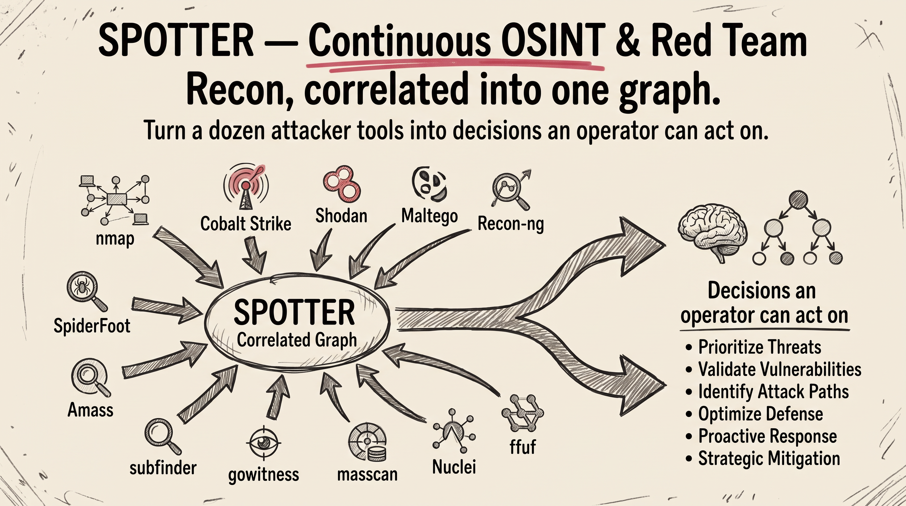
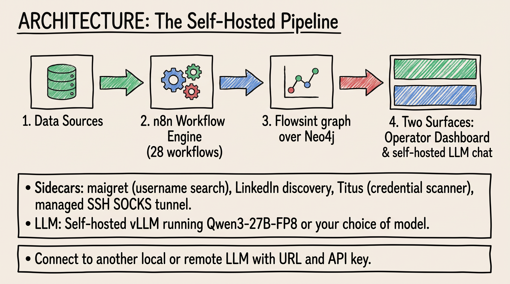
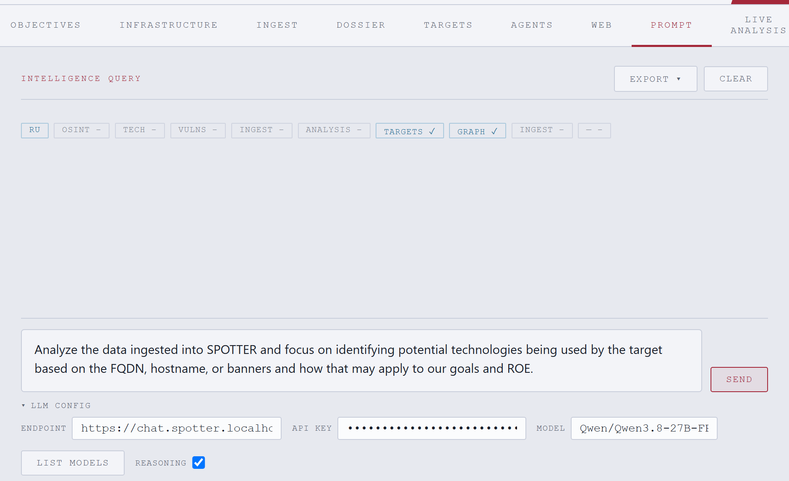
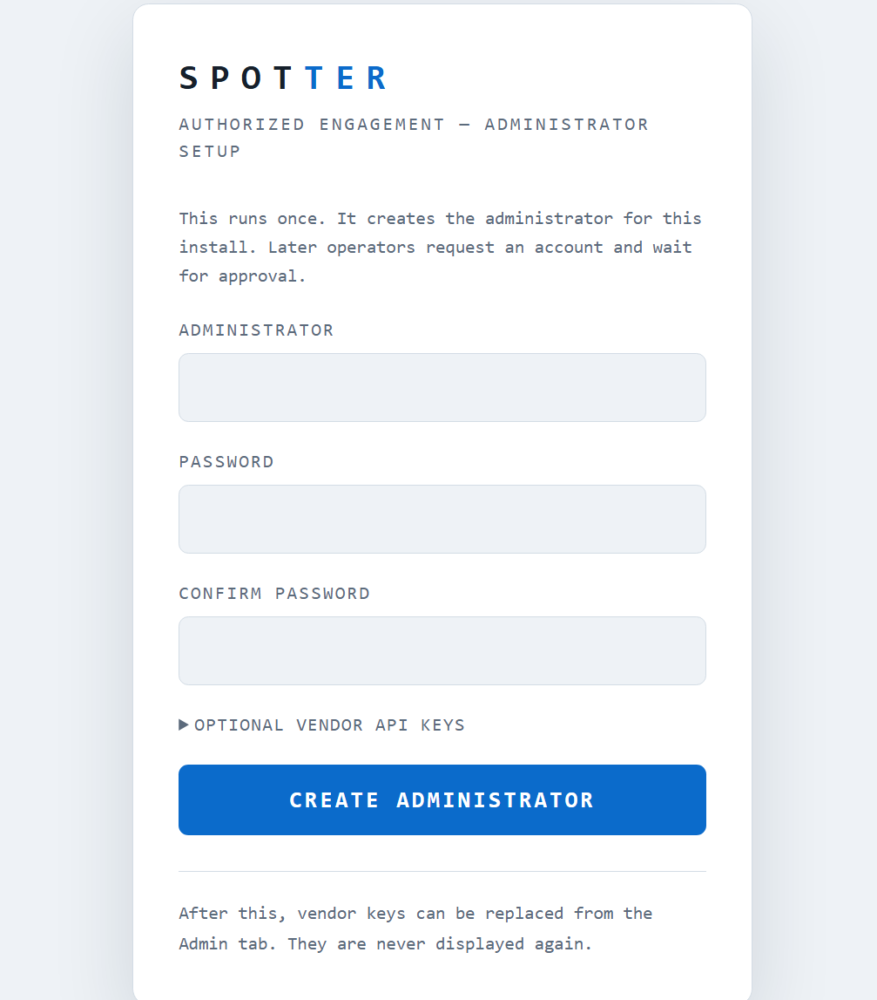
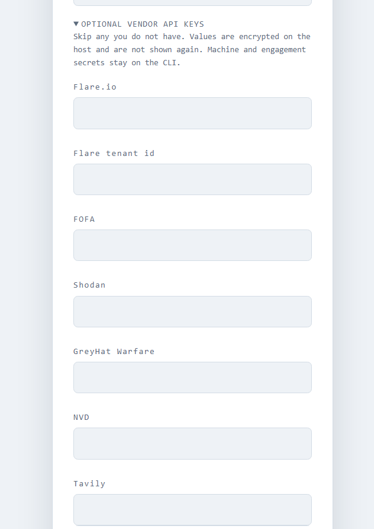
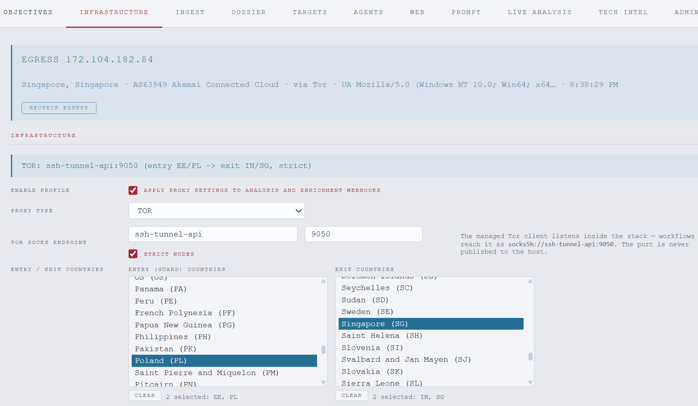

# SPOTTER
## Continuous OSINT & Red Team Recon Platform

Self-hosted, operator-facing intelligence platform for authorized red team engagements. Ingests data from Cobalt Strike, **Brute Ratel**, **Adaptix C2**, SharpHound/BloodHound, PingCastle, nmap, Amass, Nessus, EyeWitness, **ScoutSuite**, **subfinder/httpx JSON-lines**, Flare.io, CSV, and plain-text recon; correlates everything into interactive Individual dossiers in a Neo4j-backed graph via **Flowsint**; runs a continuous OODA Loop through **n8n** automation workflows; and provides a natural-language query interface via **Open WebUI** over a local **vLLM** server.

> **Authorization required.** Designed for use under documented Rules of Engagement on authorized engagements only.

---

## Overview

<div align="center">
  
  <p>SPOTTER OVERVIEW</p>
</div>

<div align="center">
  
  <p>SPOTTER ARCHITECTURE</p>
</div>

<div align="center">
  
  <p>SPOTTER PROMPT</p>
</div>

<div align="center">
  
  <p>SPOTTER REGISTRATION</p>
</div>

<div align="center">
  
  <p>SPOTTER API REGISTRATION</p>
</div>

<div align="center">
  
  <p>SPOTTER TOR PROXY</p>
</div>

---

## Prerequisites

- Linux, Docker Engine + Docker Compose v2, root access for the current RAM-only secret mount
- `git`, `curl`, `jq`, `openssl`, `python3`, `sops`, and `age-keygen`
- Flowsint is cloned by `scripts/bootstrap.sh` into `vendor/flowsint` at the pinned commit; do not clone it beside SPOTTER
- NVIDIA GPU + NVIDIA Container Toolkit — required only for the `local-large` and
  `local-small` LLM tiers. With `SPOTTER_LLM_TIER=remote` or `none` the stack runs
  on a host with no GPU at all; see INSTALL.md §3

See [INSTALL.md](INSTALL.md) for the fresh-install path and the qualified hardware
planning guidance. The earlier 8 GB RAM and 20 GB disk figures have not been
validated as supported minimums.

The current reference deployment host has 125 GiB RAM and two RTX 6000 Ada GPUs
with about 48 GiB each. The default local model uses one GPU; the optional
embedding profile defaults to GPU index 1. This describes the exercised host,
not a minimum hardware specification.

**None of the following are needed to stand the stack up.** Each enables one
feature and is inert when absent — see INSTALL.md §1:

- Cobalt Strike Team Server with REST API enabled (for workflow 01)
- Adaptix C2 teamserver reachable from this host, plus an operator account (for workflow 28)
- Flare.io API key (for workflow 09)
- FOFA.io API key (for workflow 13)
- SerpAPI key, or a Tavily key, or both (for workflow 13's `org` source — either
  one enables the LinkedIn provider independently)

## PingCastle AD Health Check Ingest

[PingCastle](https://github.com/netwrix/pingcastle) grades a domain's configuration from
a normal user account in minutes — no agent, no admin. SPOTTER ingests the
**machine-readable** report it writes next to the HTML one:

```
ad_hc_<domain>.xml     XmlSerializer output   ← upload this
ad_hc_<domain>.json    same data as JSON      ← or this
ad_hc_<domain>.html    the human report       ✗ no structured data to lift
```

Drop the file on the **Ingest** tab (or POST it to `/webhook/upload`); WF06 sniffs the
bytes, so the filename does not have to be intact. Encrypted reports (`<EncryptedData>`
root) and the HTML report are rejected with a message saying which file to use instead —
they never fail silently.

What lands in the graph:

| Node | From | Merges with |
|---|---|---|
| `Organization` (domain) | `DomainFQDN` + the five risk scores, maturity level, krbtgt age, LAPS/backup dates, account-hygiene counters, OS distribution | the SharpHound domain node — same uppercase FQDN label |
| `Device` (per DC) | `DomainControllers` — SMBv1, null session, **remote spooler**, LDAP channel binding / signing, WebClient, RODC, FSMO roles, IPs | the SharpHound computer node — `DC01` + domain → `DC01.CORP.LOCAL` |
| `Organization` (privileged group) | `PrivilegedGroups` + member statistics | the SharpHound group node — `DOMAIN ADMINS@CORP.LOCAL` |
| `Individual` (privileged member) | `PrivilegedGroups`/`AllPrivilegedMembers` — SPNs, delegation, protected-users, pwd age | the SharpHound user node, via the member DN |
| `Organization` (trust partner) | `Trusts` — direction, type, decoded `TrustAttributes`, SID-filtering and RC4 flags | the SharpHound trusted domain |
| `ADRisk` (per rule) | `RiskRules` — points, category, model, rationale, details | *(new type — see step 6b)* |

Edges: `(:device)-[:DC_OF]->(:organization)`, `(:individual)-[:MEMBER_OF]->(:organization)`,
`(:organization)-[:TrustedBy]->(:organization)`, `(:organization)-[:HAS_RISK]->(:adrisk)`,
and `(:adrisk)-[:AFFECTS]->(object)` wherever a rule's detail lines name an object that
was also ingested.

Notes:
- **It merges rather than duplicates.** Flowsint MERGEs on `(type, nodeLabel, sketch_id)`,
  so labels are built to match BloodHound's uppercase convention. Run PingCastle and
  SharpHound into the same campaign sketch and the DC nodes get both views. Because
  Neo4j applies `SET n += $props`, everything PingCastle-specific is namespaced
  `pingcastle_*`, and booleans SharpHound also derives are written only when true.
- **A health check is not a SharpHound replacement.** It reports *counts and rules*, not
  per-object ACLs — there are no ACE edges to path-find over. It is the fast first look
  and the source for DC hardening gaps SharpHound does not collect.
- **Cleartext GPP passwords are never stored.** PingCastle recovers them from SYSVOL;
  SPOTTER records the account and the GPO (`pingcastle_gpp_password_accounts`) and drops
  the value, the same rule SPOTTER applies to Flare breach credentials.
- Detail lists are capped by `SPOTTER_PINGCASTLE_MAX_DETAILS` (50) and `AFFECTS` edges by
  `SPOTTER_PINGCASTLE_MAX_AFFECTS` (500); truncation is flagged on the node, never silent.
- Cartography (`ad_carto_*`), cloud/Azure AD reports and consolidated reports are not
  parsed.

---

## Nessus Vulnerability Scan Ingest

SPOTTER ingests a **Nessus CSV export** or the **`.nessus` XML export** and turns it
into graph findings that join the AD, C2 and OSINT data already in the campaign — so
"what is exploitable" and "who can reach it" become one question instead of two tools.

```
Export → CSV        Nessus Professional / Essentials    ← upload this
report.nessus       the XML export (same scan)          ← or this
vulnerability CSV   Tenable Security Center (.sc)       ← or this
findings CSV        Tenable Vulnerability Management    ← or this
```

The three CSV dialects are the same table under different column names; headers are
matched by *meaning*, not position, so an export with a trimmed column set still parses.
Only `Plugin ID` and a host column are structurally required. The `.nessus` XML is the
same scan un-flattened — one `<ReportItem>` is exactly one CSV row (plugin × host ×
port) — so it is streamed into those same canonical columns and produces the **identical
graph** as the CSV of that scan (pinned by `scripts/smoke_nessus.py`). Drop the file on
the **Ingest** tab (or POST it to `/webhook/upload`) — WF06 sniffs the bytes, so the
filename does not have to be intact.

**A report over 1 GB skips the in-runner parse.** The browser warns before any bytes
are sent and does not upload it unless the operator chooses to stage it anyway.
Above 4 GB it never starts. Ingest that one on the host with
[scripts/ingest_nessus_large.py](scripts/ingest_nessus_large.py) (also takes a large
CSV), which streams the file and writes straight to Flowsint + Neo4j — see the command
block below and `## Nessus Vulnerability Scan Ingest` → the caps note.

### One-time setup

```bash
python3 scripts/register_nessus_type.py --apply
```

`Vulnerability` is a custom Flowsint type, and the graph serializer returns **HTTP 500 for
the entire sketch** on a nodeType it cannot resolve. Until this is run, uploads still
import the scanned hosts and their technologies and return a warning — they never poison
the graph. Dry-run by default.

### What lands in the graph

| Node | From | Merges with |
|---|---|---|
| `Device` (named host) | the DNS Name / Host column, uppercased | the SharpHound / PingCastle computer node — `DC01.CORP.LOCAL` |
| `Ip` (address) | the Host / IPv4 Address column | the nmap and domain-recon IP node |
| `Vulnerability` (per **plugin**) | severity, CVEs, CVSS v2/v3/v4, VPR, EPSS, synopsis, solution, exploit frameworks | *(new type — see above)* |
| `Technology` (per CPE) | plugin 45590's CPE enumeration, with its human title and the CPE itself | the nmap / process-list technology nodes |

Edges: `(:device|:ip)-[:HAS_VULNERABILITY]->(:Vulnerability)`,
`(:device)-[:RESOLVES_TO]->(:ip)`, `(:device|:ip)-[:USES_TECH]->(:technology)`.

**A plugin is the node; a host is an edge.** A 500-host scan is 100k rows but only a few
hundred distinct plugins, and a plugin's severity, CVEs and remediation are identical
wherever it fires. Rows for the same host and plugin on several ports fold into one edge.

Per-host detail — ports, plugin output, first/last seen — lives on the **node**, in
`host_details`, not on the edge. **Flowsint drops edge properties on import**:
`batch_import`'s bulk Neo4j writer sends only `(from, to, label)`, and so does its
`_add_edge` REST fallback. Every relationship in a live SPOTTER graph carries exactly
`from_element_id`, `rel_label`, `sketch_id`, `to_element_id` — nothing a caller put in
`data` survives. Worth knowing before writing any new edge that means to carry evidence.

**The graph label is lowercase.** `batch_import` writes through
`/api/import/execute`, which lowercases the node type, so an ingested finding is
labelled `vulnerability` even though the type is registered as `Vulnerability`. Nodes
written with `fc.add_node` keep their PascalCase, which is why other SPOTTER custom types
(`FlareBreach`, `Subdomain`) look different in the graph. Read both spellings, or match on
`nodeType` — reading only the PascalCase one found zero nodes, so contextualization ran,
reported success, and did nothing. `scripts/smoke_nessus.py` pins this.

### Contextualization (workflow 25)

Ingest alone leaves findings connected to nothing. `POST /webhook/vuln-context` — fired
automatically after a successful upload, and by **Contextualize** in the Tech Intel tab —
runs [scripts/nessus_context.py](scripts/nessus_context.py):

- **public exploit availability** per finding, from the local PoC-in-GitHub mirror
  (offline; see [Exploit availability](#exploit-availability-poc-in-github))
- **MITRE ATT&CK** context from the local STIX bundle and RAG index
- a recomputed **`priority_score`** (0-100): severity sets the band, and breadth,
  weaponisation and public exploit code move within it, each bounded so no one term
  dominates — a plugin on 400 hosts is not more urgent than a remotely exploitable one
- a **per-host rollup** — `nessus_risk_score`, `nessus_cve_exposure`,
  `nessus_exploitable_findings` — named to drop straight into
  `tech_context_engine.compute_composite_risk()`. This is the half that lets a scan
  finding move a target up the attack-path ranking.

`POST /webhook/vuln-summary` reads the result back for the Tech Intel tab's
**Vulnerability Findings** panel and the `spotter_vulnerabilities` LLM tool, so both see
identical numbers.

### Working the panel

Both tables were read-only dead ends: a card showed four of a finding's twelve CVE badges,
its remediation only as a tooltip, and nothing in the section could leave the browser.

- **Every finding card pops out** — click it (or Enter/Space) for the full record: all
  CVEs as links to NVD, every ATT&CK technique *by name*, the synopsis, the remediation,
  the shipping exploit framework, and every PoC repository with its trust tier.
- **Every card exports on its own** (CSV / Markdown / HTML / PDF), as does each section
  header and the panel as a whole. Buttons inside a card stop the click, so exporting does
  not also open the pop-out.
- **Worst Hosts sorts on every column**, marks **COMP / OI**, exports per row or per
  selection, and each row opens its own pop-out — the host's own worst findings, and a jump
  to its AD device dossier when Tech Inventory has been run and the hostname matched.
- **The marks are the Targets tab's device marks**, not a third namespace:
  `s.dev_compromised` / `s.dev_oi_targets`, keyed by hostname, which is the only store
  shipped to WF10 in `operator_tags.devices`. A mark made here therefore reaches the
  analysis LLM and scores the host. Lookups fold case because WF10 matches
  case-insensitively against hostname / nodeLabel / SAM — `DC01.CORP.LOCAL` from Nessus and
  `dc01.corp.local` from SharpHound are one host. A row that is a bare `Ip` will not match
  any computer node; WF10 reports it back as an unmatched tag rather than dropping it.
- **Every export carries the caveats**, because each is a way to under-read the file: how
  many findings were never contextualized (their exploit column is blank because nothing
  looked, not because nothing is exploitable), the PoC mirror's age, and the fact that both
  tables are the top N of a larger set. The per-finding "seen on" list is derived from each
  host's own top-8 rollup, so it states how much of the blast radius it is showing.

### Notes

- **NVD is opt-in** (`{"with_nvd": true}`). Nessus already supplies severity, CVSS,
  description and remediation, and a live per-CVE lookup publishes to a third party
  exactly which CVEs interest you. The PoC mirror is local and carries no such cost, so
  it always runs.
- **Absence of exploit code is not evidence.** A mirror that was never synced answers
  "no public exploit" for every CVE. `poc_mirror` travels in every response and the panel
  and the LLM tool both say so out loud. PoC repositories are **unvetted** — the warning
  renders on every card that shows one.
- **Informational rows are skipped, not lost.** Roughly two thirds of a report is severity
  `None` — banners, enumeration, "SSL certificate information". Those are skipped as
  findings and the count is reported in `rows_skipped_info`; they are still mined for OS
  identification (plugin 11936) and CPE enumeration (45590), which is how the scan tells
  you what a host runs. Set `SPOTTER_NESSUS_INCLUDE_INFO=1` to keep them as nodes.
- **It merges rather than duplicates.** Host labels follow BloodHound's uppercase
  convention, which is the only reason a scan lands on the SharpHound `Device` instead of
  beside it. Because Neo4j applies `SET n += $props`, everything scanner-specific is
  namespaced `nessus_*`. The one exception is `operating_system`, written **only** on an
  `Ip` node — a host with no AD identity, where there is no SharpHound value to clobber.
  On a `Device` the fingerprint goes to `nessus_os` alone.
- **Caps report what they dropped.** `SPOTTER_NESSUS_MAX_ROWS` (300k), `_MAX_HOSTS` (20k),
  `_MAX_PLUGINS` (5k) and `_MAX_TECH` (2k) bound one upload; a truncated report says so in
  its errors, because one that says nothing reads as a clean estate. The first three plus
  `NESSUS_CONTEXT_MAX_NODES` are tunable at runtime from the Configuration panel.
- **Plugin output is truncated and never mined for secrets.** Nessus recovers default
  passwords and SNMP community strings; SPOTTER keeps the first 800 characters for context
  and promotes nothing out of it, the same never-store-the-value rule. Run the file through WF11's Titus
  scan if you want credentials extracted deliberately.
- `severity_counts` is **per plugin**, matching what the graph reports back; `findings` is
  host × plugin. Two numbers labelled the same thing that disagree is worse than either.

### Clearing a scan to re-import it

```bash
RUN="docker exec spotter-n8n-runners \
     /opt/runners/task-runner-python/.venv/bin/python /data/scripts/purge_nessus_data.py"

$RUN --list                           # campaigns and their sketch ids
$RUN --sketch <sketch-id>             # REPORT ONLY — always run this first
$RUN --sketch <sketch-id> --apply     # remove the findings
```

[purge_nessus_data.py](scripts/purge_nessus_data.py) removes the `Vulnerability` nodes and
strips `nessus_*` from the hosts, leaving the AD/C2/OSINT graph standing. Two things it
does deliberately:

- **It deletes through Neo4j, not the Flowsint API.** `DELETE /api/sketches/{id}/nodes` is
  a *soft* delete (it sets `deleted_at`), but Flowsint MERGEs on
  `(node_type, nodeLabel, sketch_id)` and MERGE does not filter on `deleted_at`. A
  soft-cleared sketch would silently merge the re-import onto the tombstones, report
  success, and produce a graph every reader filters out. The same reason WF07's durable
  path is a scoped `DETACH DELETE`.
- **It never deletes host nodes by default.** `DC01.CORP.LOCAL` is the *same node*
  SharpHound created; removing it to tidy a scan would take the DC's ACEs with it. Only
  the `nessus_*` namespace is stripped — which is why the parser namespaces it.

Use the Clear Graph button instead only when the campaign holds nothing but the scan —
it wipes the whole sketch. Clear the browser cache too (`localStorage.removeItem('s.vulnScan')`),
or the Tech Intel tab keeps rendering the old findings.

Offline contract tests: `python3 scripts/smoke_nessus.py` (no live stack needed) and
`node scripts/smoke_frontend_vulnscan.js`.

---

## EyeWitness Web Screenshot Ingest

SPOTTER ingests the output of [EyeWitness](https://github.com/RedSiege/EyeWitness) —
the RedSiege web-screenshot/scrape tool — and turns each captured web endpoint into a
built-in `Website` node with its screenshot viewable in the **Web** tab.

**Run EyeWitness in multi mode so it produces the machine-readable index**, then zip the
output directory:

```bash
python3 EyeWitness.py --web -f urls.txt -d ew-out --no-prompt   # or -x nmap.xml / scan.nessus
cd ew-out && zip -r ../ew-out.zip .                              # zip the whole output dir
```

`--single` and `--validate-urls` are skipped on purpose: they do not write `Requests.csv`
or `ew.db`, which the parser needs.

**Upload it** on the Ingest tab (WF06 sniffs the ZIP's members — `Requests.csv` / `ew.db` /
`screens/*.png` — and routes it to the EyeWitness parser). A ZIP over 32 MB is chunked
to disk first; one over the 1 GB in-runner cap is left there and the ack names the host
command. For a wide sweep past that cap, ingest on the host instead:

```bash
python3 scripts/ingest_eyewitness.py --input ./ew-out --campaign demo-01 --dry-run  # preview
python3 scripts/ingest_eyewitness.py --input ./ew-out --campaign demo-01            # ingest
```

**What lands.** One `Website` node per captured URL, keyed (MERGE) on the URL:

| EyeWitness (`Requests.csv`) | Where it lands |
|---|---|
| `URL` | `Website.url` (required, validated — un-parseable URLs are dropped) |
| `Title` | `Website.title` |
| `Resolved` (when an IP) | an `Ip` node, joined `Website -[RESOLVES_TO]-> Ip` (the same edge nmap writes, so web endpoints share the host anchor) |
| `Category` | `ew_category` (`idrac`, `printer`, `camera`, `highval`, … flag high-value) |
| `Default Creds` | `default_creds` + `has_default_creds` |
| screenshot PNG | copied to the served screenshots dir; the node carries the relative `/screenshots/<sketch>/…png` URL |

**Screenshots are files, not graph data.** The n8n Python sandbox has no image library to
thumbnail with and full-res PNGs would bloat Neo4j, so each screenshot is written to a
host directory (`/root/SPOTTER/screenshots/<sketch_id>/`) bind-mounted read-write into the
task-runners container (`/data/screenshots`) and read-only into nginx
(`/usr/share/nginx/screens`). Nginx serves it at **`/screenshots/`, behind the auth gate**
— screenshots are client engagement data and never leave the session. The directory is
git-ignored (only a `.gitkeep` is tracked) and must be writable by uid 1000 (the runner
uid). After changing the mounts or `nginx.conf`, **recreate** (not just restart) the
`task-runners` and `spotter-ui` containers.

Credential scanning (Titus/WF11) skips EyeWitness uploads on purpose — the `Default Creds`
column and captured HTML would otherwise register as recovered credentials.

Offline contract tests: `python3 scripts/smoke_eyewitness.py`,
`python3 scripts/smoke_workflow06.py`, and `node scripts/smoke_frontend_web.js`.

---

## Python ShareACL Scanner

SPOTTER includes a cross-platform Python share scanner at
[scripts/shareacl.py](scripts/shareacl.py) that emits BOF-compatible
`[shareacl]` JSON lines and writes `shareacl_results.txt` in the current
working directory.

Install Python dependencies:

```bash
pip install -r requirements.txt
```

Usage:

```bash
python3 scripts/shareacl.py FILESERVER --username operator --password 'Secret123!' --domain CORP
python3 scripts/shareacl.py \\FILESERVER\Finance$ --username operator --password 'Secret123!' --domain CORP
python3 scripts/shareacl.py --computers --dc dc01.corp.local --username operator --password 'Secret123!' --domain CORP
```

Notes:
- `--username`, `--password`, and `--domain` are required.
- `--dc` is required with `--computers`.
- `--computers` queries Active Directory for enabled computer objects, then scans each host over SMB.

---

## Social Media Enrichment and Profile Mining

Workflow 03 works in two stages. **Discovery** asks maigret which platforms a
username exists on. **Extraction** then opens each profile it found and mines the
page for identifiers — numeric user id, real name, bio, contact emails, links to the
same person on other platforms — using
[socid-extractor](https://github.com/soxoj/socid-extractor) (164 site schemes).

socid-extractor needs no service of its own: maigret depends on it (it drives
maigret's own recursive extraction), so it ships inside `maigret-api` already pinned
to a version maigret is tested against. It is exposed as a second endpoint there:

```bash
docker exec spotter-maigret-api-1 python3 -c "import requests,json; \
  print(json.dumps(requests.post('http://localhost:7050/extract', \
  json={'url':'https://github.com/torvalds'}).json(), indent=2))"
```
```json
{ "found": true, "scheme": "GitHub API",
  "data": { "uid": "1024025", "fullname": "Linus Torvalds",
            "company": "Linux Foundation", "location": "Portland, OR" } }
```

Extracted values are merged onto the `SocialProfile` node: `fullname` → `display_name`,
`bio` → `bio`, `email` → `profile_emails`, `city`/`location` → `location`,
`image` → `photo_url`, and everything else as a `socid_*` extra
(`socid_uid`, `socid_scheme`, `socid_enriched_at`). Numeric and boolean output stays
undeclared on purpose — a DB-registered custom type rebuilds every *declared* property
as `Optional[str]` and silently drops what it cannot coerce.

### Regional platform coverage (US / RU / CN)

**Objectives → Target Social Media Enrichment Options** picks regional platform
families per campaign. The selection is saved on the campaign and shipped to WF03 as
`social_regions`, and since the Organization card was added, to **WF13** as well —
see [Organization Intelligence](#organization-intelligence-live-analysis--organization).
The region codes select regional *people* sources here and regional *company*
sources there; one checkbox, two consumers.

These options are **additive, not a filter**. Each checked region runs an *extra*
maigret pass on top of the unchanged global top-sites sweep:

| Setting | Sites swept |
|---|---|
| *(none checked)* | Global top-sites only — GitHub, Instagram, Twitter, LinkedIn, TikTok… |
| **RU** | + ~41 sites: VK, Odnoklassniki, LiveJournal, Habr, Pikabu, Rutracker, xakep.ru, codeforces — **and hh.ru as a company source** for the Organization card |
| **CN** | + ~31 sites: CSDN, Weibo, Zhihu, Douban, Gitee, v2ex, cnblogs |
| **US** | + ~40 sites: Amazon, Calendly, Venmo, MeetMe, ResearchGate and niche consumer forums |

The additive design is forced by the data, not a preference. maigret's 3187-site
database tags only 61 sites `us` and 32 `cn`, and **the major platforms carry no
country tag at all** — GitHub is tagged `coding`, Instagram `photo`/`social`, Twitter
`messaging`/`social`. Treating the checkboxes as a filter would therefore drop every
major platform and return a handful of niche sites. Region codes are maigret site-DB
tags; maigret filters by tag *before* ranking and slicing, so a region pass is a
genuine top-N of that region rather than an intersection with the global top-N.

```bash
curl -sk -X POST https://spotter.localhost:5443/webhook/enrich-individual \
  -H 'Content-Type: application/json' \
  -d '{"entity":{"id":"<node id>"},"social_regions":["ru","cn"]}'
```

This webhook is `responseMode: onReceived`, so the HTTP reply is n8n's ack — it
carries none of the run's results and a 200 here means "accepted", not "enriched".
The run's own summary (`regions`, `socid_extracted`, `socid_fields_written`,
`proxied`, `social_profiles_created`) is emitted by the `Social Enrichment` node and
is visible in the n8n execution log, or in the graph itself:

```cypher
MATCH (sp) WHERE toLower(labels(sp)[0]) = 'socialprofile'
  AND sp.sketch_id = '<sketch>' AND sp.nodeProperties.socid_enriched
RETURN sp.nodeLabel, sp.nodeProperties.socid_uid, sp.nodeProperties.display_name,
       sp.nodeProperties.region LIMIT 25;
```

The Daily Sweep schedule trigger has no request body and so no campaign selection;
it falls back to `SOCIAL_DEFAULT_REGIONS` (empty = global only).

**Egress.** The regional sweeps probe VK / Odnoklassniki / Yandex / Weibo, and the
extraction stage opens those profile pages directly. WF03 therefore honours the
Infrastructure tab's `proxy`/`opsec` envelope (it previously received and ignored it)
and passes it to both endpoints — `proxied: true` in the response confirms the
envelope parsed. Note that many RU platforms refuse unauthenticated requests from
datacenter IPs, so a zero result from a region can mean "blocked", not "no account".

Tuning: `SOCIAL_MAIGRET_REGION_TOP_SITES`, `SOCIAL_DEFAULT_REGIONS`,
`SOCIAL_SOCID_ENABLED`, `SOCIAL_SOCID_MAX_URLS`, `SOCIAL_SOCID_TIMEOUT`
(all documented in `.env.example`; direct mode only — the plugin-ownership branch
returns before either stage).

---

## Organization Intelligence (Live Analysis › Organization)

Everything else on Live Analysis describes the target's *infrastructure* or its
*people*. This card describes the **company**: who it is, what it is made of, where
it sits, who it depends on, and which of the people already in the graph hold a role
it is actively hiring for.

Run it from **Live Analysis → DOMAIN RECON ▾ → Enrich Organization**, or as part of
**Enrich All**. It is source `org` on WF13.

### Seven sources, and they fail independently

| Source | Where it comes from | Needs a region? | Needs egress? | Needs a key? |
|---|---|---|---|---|
| **Vendors / partners** | The domain's own SPF `include:`, MX, NS and CNAME records, already collected by base recon | no | no | no |
| **Website crawl** | The target's own site — the only source that works for a private company | no | yes | no |
| **LinkedIn (via search)** | Google's index of `linkedin.com/company` and `linkedin.com/in`, read through SerpAPI | no | yes | SerpAPI |
| **LinkedIn (via Tavily)** | The same LinkedIn pages, read through Tavily's semantic index. A *peer* of the SerpAPI provider, not a transport of it: it emits its own row, and when both keys are present **Tavily answers first and SerpAPI fills the gaps** | no | yes | Tavily |
| **Open roles (Google Jobs)** | Postings the target is advertising, via SerpAPI's `google_jobs` engine, falling back to `site:linkedin.com/jobs/view`. The only vacancy source that is not region-gated | no | yes | SerpAPI |
| **SEC EDGAR** | The company's own SEC filings — the only *record* on the card, everything else is inference | no | yes | no |
| **hh.ru** | The Russian job board, for corporate profile, departments, offices and recruiters | **RU** | yes | no |

That independence is why an empty card is never just "empty". The card prints
**one row per provider**, naming the transport it used and, when it did not run,
why:

| Provider row shows | Means |
|---|---|
| `hh.ru — hh.ru-scrape` | Ran and matched. Anything missing genuinely was not found |
| `hh.ru — not run` + *RU not selected…* | No region ticked. Not a failure, and not evidence about the company |
| `LinkedIn (via search) — bing · unreliable` | A free engine answered. Bing ignores `site:` and DuckDuckGo blocks datacenter IPs, so an empty result here means "blind", not "no presence". Set `SERP_API_KEY` |
| `LinkedIn (via Tavily) — tavily` | Ran and matched. Restricts by domain rather than by Google's `site:` path operator, so one company search also returns profiles — which is why its search budget is smaller than SerpAPI's for the same ground |
| `LinkedIn (via Tavily) — not run` + *needs TAVILY_API_KEY* | No key. Unlike the SERP provider there is **no keyless transport to fall back to**, so this is "not asked", never "nothing found" |
| `LinkedIn (via Tavily) — no match` | Tavily answered and nothing cleared the company-identification gate. The near misses and the reason are on the card |
| `Open roles (Google Jobs) — google_jobs` | The jobs engine answered. `linkedin-serp` instead means the engine was unavailable and the `site:` fallback ran |
| `Open roles (Google Jobs) — not run` | No `SERP_API_KEY`. Google Jobs is only reachable through SerpAPI; the free engines cannot answer it |
| `Open roles (Google Jobs) — no match` | Postings came back but none were advertised by *this* employer. The count of refusals is in the note, and the postings themselves are on the card |
| `Website crawl — crawl` + *N pages, M chunks* | The site was crawled and indexed by SPOTTER's own crawler, from the campaign egress |
| `Website crawl — tavily-crawl` / `tavily-map+extract` | `SITE_TAVILY` is set, so **Tavily fetched the pages**, not this deployment. See *Company-website crawl* below before using it |
| `Website crawl — site_backend_unconfigured` | Tavily was selected but `TAVILY_API_KEY` is not set. It **fails closed** and does not quietly fall back to the built-in crawler — choosing Tavily is a choice not to touch the target from this egress |
| `Website crawl — site_provider_failed` | `api.tavily.com` refused or was unreachable. **The target was never contacted**, so this says nothing about the site: not a WAF, not a dropped egress, not an empty estate |
| `Website crawl — unreachable` | **No HTTP response at all** over the campaign egress — connect or read timeout. Evidence of nothing: the target may simply drop this exit. The note names the egress, because changing it is the decision this raises |
| `Website crawl — blocked` | The site answered and refused us (403/429/503), robots.txt included. Also not evidence that the site is empty |
| `Website crawl — no match` | The site answered and had nothing readable in scope. **The only one of the three that is a finding about the site** |
| `SEC EDGAR — edgar` | A registrant matched. Its legal name, state of incorporation and Exhibit 21 subsidiaries are filings, not guesses |
| `SEC EDGAR — no match` | No registrant matched closely enough. **The normal case** — most companies are not SEC filers |
| any row showing `failed` | See **Recon warnings/errors** at the bottom of the tab |

`org_source`, the single scalar phase 1 used, is still emitted as a comma-joined
summary so a recon record cached in an operator's browser before this change
keeps rendering. `org_sources` is the real structure.

### Which company is the target

Before any of the five sources can tell you about the company, something has to
decide **which company they came back with**. That decision used to not exist.
Each provider was handed one seed string and took the top row of whatever its
search returned, and a live campaign proved what that costs: Objectives named the
target, its Russian legal entity, a second domain and a company email, and the
Organization card described an unrelated military-history journal. hh.ru's
employer search matches *description* text, so a query about the target's field
returned organisations working in that field; nothing checked the answer, and the
tie-break — most open vacancies — picked among them.

That mis-identification does not stay on the card. The adopted name becomes
`org_profile.name`, `org_aliases()` feeds it back as an alias, and the employment
gate then scores every candidate person against the **wrong company** for the
rest of the run.

So the operator's identifiers are now the input, and a match is now a decision:

* **Everything in Objectives is sent and used.** `Primary Target`, `Additional
  Identifiers` **and** `Company Email Address`. Two of the three never arrived:
  `additional_ids` was not in the request at all, and `company_email` was sent by
  the frontend and never read by WF13.
* **Identifiers are sorted by shape.** A domain-shaped identifier
  (`maket-aero.test`) becomes a **corroborating domain**; everything else becomes a
  **name**. The email address contributes its domain. Names are what gets
  searched; domains are what confirms an answer.
* **Every name is searched, not just the first.** A Russian company's employer
  record is filed under its legal entity (`ООО ОБРАЗЕЦ`), which no amount of matching
  on the trading name will ever find — but which the operator already typed.
  EDGAR resolves each alias in turn for the same reason: a registrant files under
  its legal name.
* **Nothing is adopted without evidence.** A candidate is the target when its
  name matches an identifier at ≥ `ORG_COMPANY_MATCH_MIN` (default 72, the same
  word-aligned, Cyrillic-aware matcher the employment gate uses), *or* when its
  own website is one of the target's domains. The domain test outranks the name
  test: a candidate serving `maket-aero.test` is the target whatever it calls
  itself, which is the only identification that survives a rename or a change of
  script. For hh.ru, whose search rows carry no website, the strongest few near
  misses have their profile fetched and re-checked — but only on the path that
  would otherwise return nothing.
* **Refusing is a first-class outcome.** When nothing clears the floor the card
  says so, names the near misses it refused with their scores, and lists the
  identifiers it searched on. The right company is sometimes in that list under a
  name nobody thought to type; add it to `Additional Identifiers` and re-run.
  An empty card an operator can act on beats a populated card about somebody else.
* **The card states its basis.** A matched profile carries an **Identified by**
  row — `its website is maket-aero.test`, or `its name matches "ООО ОБРАЗЕЦ" (100)` —
  and a **Searched as** list. Both are in the export too: a report that names a
  company without saying how it was identified cannot be checked by its reader.
* **A run with nothing in Objectives says so.** With no Primary Target the
  identity is the domain label alone (`maket-aero.test` → `maket aero`), which
  matches a job board poorly and returns thematic noise. The card prints *None of
  these came from Objectives* rather than an unexplained blank.

The same identifiers also widen the **employment gate** below: someone whose
LinkedIn headline names the target's legal entity rather than its trading name
used to be scored as naming a *different* company and held.

`ORG_COMPANY_MATCH_MIN` is tunable from the Configuration panel — lower it for a
target whose identifiers are all translations of one another. **0 restores the
old behaviour**, which is to adopt whatever a provider ranked first.

Note that this only governs new runs. `add_node` MERGEs on the node label, so a
`Company` node written by an earlier mis-identified run stays in the sketch until
it is removed.

### What lands on the card

* **People & Positions** — who works there, the title they hold, the specialty
  that normalises to, where they are, and the technologies they name. Merged
  across the SERP and website providers, deduped, and then **gated on evidence
  of employment**. This is the pivot the card exists for, and the gate is what
  makes it trustworthy: the providers return *candidates*, not employees. A
  `"<company>" <role> site:linkedin.com/in` search returns every former member
  of staff, vendor, recruiter, applicant and coincidental mention along with the
  real ones — on one live campaign, dozens of people of whom nearly none worked
  there, every one of them written to the graph.

  `scripts/employment_evidence.py` weighs each candidate once, over the union of
  every provider, and sorts them into two lists:

  | Tier | Meaning | Edge written |
  |---|---|---|
  | `confirmed` | The **organisation's** own records place them there: an AD account, a name the company published on its own site, an address on the target domain, a contact on its own vacancy | `WORKS_FOR` |
  | `reported` | Their **own profile** names the target as employer and the name matches at ≥72/100, but nothing corroborates it | `CLAIMS_WORKS_FOR` |
  | `weak` / `contradicted` | No employer named, or a *different* employer named, or a location in a country the target is not in | none |

  Nothing profile-only can ever reach `confirmed` — that is arithmetic, not
  policy: a search engine cannot confirm employment. `weak` and `contradicted`
  rows are **not** discarded; they render under **Employment not established**,
  each with the reason, so a gate false-negative is still visible. They are not
  counted in the header and never reach the graph. Technologies a confirmed or
  reported person names still become `—[USES_TECH]→ Technology`.

  The location rule only arms when the target's country has **two** independent
  attestations (WHOIS, profile, ccTLD, an hh.ru match), because a registrant
  country is frequently the privacy proxy's.

  Company names are compared **after romanisation**, so a profile that names its
  employer in Cyrillic matches the company's Latin branding — `ООО ПРИМЕР АВИА`
  and `Primer Avia` are one name. Russian/CIS corporate forms (ООО, АО, ЗАО, ТОВ)
  are stripped like `Inc`/`LLC`. Scripts that cannot be romanised — Chinese,
  Japanese, Arabic — score *nothing* rather than counting as a different
  employer: not being able to read a name is not evidence against it.

  Tune all of it from the Configuration panel: `ORG_PEOPLE_EMPLOYER_MIN`,
  `ORG_PEOPLE_MIN_SCORE`, `ORG_PEOPLE_GEO_GATE`, `ORG_PEOPLE_MAX_WRITES`. The
  aliases this gate scores against include the operator's Additional
  Identifiers — see [Which company is the target](#which-company-is-the-target).
* **Org Units** — affiliated LinkedIn pages (`/company/example-cloud` beside
  `/company/example-fixture`) and divisions the website names. Kept strictly apart from
  *mentions*: a `site:linkedin.com/company "Example"` search also returns every
  vendor, reseller and recruiter that references Example, and rendering one of
  those as a subsidiary would be plainly wrong. A unit's name is *built on* the
  target's — a word-aligned prefix, so `Example Logistics` qualifies and `Initech
  Partners — Example Spend Specialists` does not. hh.ru's non-matching employers
  land here too; they used to become `related` wholesale, so a wrong pick
  published a stranger's competitors as the target's group structure.
* **Website Intelligence** — what the crawl did: pages fetched, chunks indexed,
  and **how many off-domain URLs the scope lock refused**. That last number is
  shown rather than buried, because this crawler ignores robots.txt by design
  and scope is the only thing keeping it off third parties. When it fetched
  nothing, the block says which kind of nothing — unreachable, blocked, or a
  site that genuinely had no readable page — in place of the RoE note.
* **SEC EDGAR** — the filed record: legal name, CIK, SIC industry, entity type,
  state of incorporation, tickers and exchanges, former names, registered address,
  EIN, and a link to the 10-K the data came from. Everything else on this card is
  an inference; this block is what the company told a regulator.
* **Profile** — legal name, industries, described business, corporate site, HQ and
  region, employee band, open-role count, employer rating, IT-accreditation and
  verification flags. Merged with the LinkedIn company record and the WHOIS
  registrant, so the block is populated even with no regional provider.
* **Related & partner companies** — subsidiary and sibling brands (a query for a
  holding company returns its per-brand legal entities as separate employers),
  plus the third-party providers derived from DNS.
* **Org structure** — department names and a hiring-by-role histogram. **The two
  have different denominators and the labels say so:** departments are counted
  across the vacancies actually fetched (`HH_MAX_VACANCIES`), while the role
  histogram comes from the provider's own search facets and covers *every* open
  role, however many were paged.
* **Job title match** — the pivot this card exists for. People already in the graph
  (`Individual.linkedin_job_title`, or a linked `SocialProfile.job_title`) against
  the roles the company is hiring for. Both sides are normalised through the same
  `derive_specialty()` table, which is what lets an English LinkedIn title meet a
  Russian vacancy title. A specialty present on only one side is dropped — a role
  nobody holds is not a match.

  Three things about this block are load-bearing, and each was a live bug until
  2026-09-21:

  * **The offered side is vacancies and nothing else** — the hh.ru role facets
    plus the fetched vacancy titles. It used to also include the org roster's
    *own* job titles, which made every specialty match by construction, turned
    "*N* open roles" into a count of people, and — because `derive_specialty()`
    Title-Cases anything it cannot classify instead of returning `None` — printed
    an unparseable LinkedIn headline, usually **a person's name**, as an open role.
  * **It is computed after the employment gate and after the graph writes.** It
    used to run before both, over the ungated candidate roster, so the card
    offered a dossier link for people the gate had already rejected — and the
    click answered `No Individual matching: <name>`, because nothing was ever
    written for them. A person with no node does not appear; if one ever does,
    the card renders the name as plain text rather than as a link it cannot honour.
  * **Chips link by Neo4j node id, not by display name.** A name is not a key
    here: `sharphound_parser` labels every AD principal `SAM@DOMAIN.LOCAL`, so a
    name-based lookup misses them entirely. WF05 resolves `elementId(n)` before
    it falls back to a `CONTAINS` match, so the id is exact.

  Two legs supply the offered side: the **open-roles** leg below, which is not
  region-gated, and hh.ru, which is. When neither returns a vacancy the card
  says so, naming its empty kind (`no_role_source` / `no_titled_people` /
  `no_overlap`, from `scripts/job_titles.py`) the same way People & Positions
  does. An empty card here is not a regression; a full one with no vacancy
  source running would be.

* **Open roles** — the vacancies themselves, with the board each came from and
  how old it is. Card data only; no posting is ever written to the graph.
  **Every posting is gated on the employer name** before it counts, because
  `google_jobs` aggregates LinkedIn, Indeed and Glassdoor and a company-name
  query comes back carrying other companies' vacancies — a job board's "similar
  roles" block, a recruiter reposting, or simply the wrong company. Refusals are
  shown under *Other employers' postings* rather than dropped: a long refusal
  list is how an operator notices the target was identified wrongly, and an
  ungated roles list would feed a competitor's vacancies straight into the match
  above. Note the two role denominators differ and the labels say which is
  which — hh.ru's facets cover the employer's *whole* vacancy set, while the
  open-roles leg can only count the postings it fetched.
* **Offices** — distinct physical addresses across the postings, with metro hints.
* **Recruiters & tech stack** — published recruiter names, emails and phones, and
  the skills named in the postings. **Contacts are usually withheld.** hh.ru answers
  anonymous views with `contactsHidden: true` on most vacancies, so the card prints
  the hidden count next to the list: an empty list with a denominator means
  "withheld", not "this employer has no recruiters". The card paints the first 8
  contacts and 14 skills; **`show all N` grows it in place** so a long list can be
  read while marking rows OoS, and the expansion survives the repaint each mark
  triggers. The `+N more` chip beside it still opens the filterable, exportable
  modal, and retires itself once everything in scope is on the card.

Every row carries the usual **OoS / FP** marks, writing to the same shared stores
the Targets tab reads — a company or recruiter marked here is excluded everywhere.

### What lands in the graph

`Company` nodes, plus `SUBSIDIARY_OF` / `VENDOR_OF` / `HAS_UNIT` edges between
them (Exhibit 21 entities land as `SUBSIDIARY_OF` with their filed
jurisdiction), `RECRUITS_FOR` from any published recruiter, and — from the SERP
and website providers, **for the people that passed the employment gate only** —
`Individual —[WORKS_FOR]→ Company` (confirmed) or `—[CLAIMS_WORKS_FOR]→`
(self-reported), carrying the person's `job_title`, derived `specialty`, and the
`employment_tier` / `employment_evidence` / `employment_score` properties, with
`Individual —[USES_TECH]→ Technology` for every technology they named.

The tier rides in the *relationship type* because Flowsint's importer drops edge
`data`; node properties survive, which is what lets
`scripts/prune_org_people.py` clear what the pre-gate branch already wrote — an
org-recon individual with no `employment_tier` is by construction its output. It
is dry-run by default:

```bash
python3 scripts/prune_org_people.py --sketch-id <id>              # what would go
python3 scripts/prune_org_people.py --sketch-id <id> --mode nodes # + the individuals
python3 scripts/prune_org_people.py --sketch-id <id> --mode props # un-pollute real AD people
```

**Register the type once per install before the first run:**

```bash
python3 scripts/register_company_type.py            # dry run — reports, writes nothing
python3 scripts/register_company_type.py --apply
```

This is not optional. Flowsint's graph serializer raises on a nodeType it cannot
resolve and has no per-node try/except, so one `Company` node in an install that
never registered the type makes `GET /api/sketches/{id}/graph` return 500 for the
**entire sketch**. Until it is applied the org source still runs and the card still
renders; it skips the graph writes and the card's header shows `not in graph`.

> **Why `Company` and not the built-in `organization` type.** In a SPOTTER graph
> `organization` does not mean "company" — SharpHound ingests AD **groups**,
> **domains** and **OUs** under that label (`scripts/sharphound_parser.py`), and
> WF05 renders any `organization` neighbour of an Individual as a group membership.
> A company written there would appear in operators' dossiers as a security group
> the person belongs to. Flowsint's own built-in organization model is a French
> SIRENE/INSEE record (`siren`, `siege_*`, `dirigeants`), which does not fit either.

### SEC EDGAR: the one filing of record

Every other provider on this card is inference — what a job board knows, what a
LinkedIn headline claims, what a company says about itself on its own website.
EDGAR is the company's own filing, so where it overlaps the others it **wins**.

Free, keyless, and about four requests for a whole profile:

```
https://www.sec.gov/files/company_tickers.json          name -> CIK (~10.4k public cos)
https://www.sec.gov/cgi-bin/browse-edgar?...&output=atom any filer, incl. non-ticker
https://data.sec.gov/submissions/CIK##########.json     the company record
.../Archives/edgar/data/<cik>/<acc>/index.json          the filing's files
.../<acc>/<...>ex21<...>.htm                            Exhibit 21
```

**Exhibit 21 is the prize.** It is the registrant's own signed list of
subsidiaries with the jurisdiction each is incorporated in — the authoritative
version of what hh.ru only infers from a shared brand name. Those rows join
**Related & Partner Companies**, tagged `filed · <jurisdiction>` so an operator
can tell a filed subsidiary from a guessed one. A small filer lists a handful; a
large conglomerate's can run to hundreds.

**Coverage is SEC filers only.** US public companies and certain funds — the
typical private engagement target appears nowhere in EDGAR. A miss is reported as
`no_match`, never `error`, and the website crawl remains the provider that always
works. EDGAR is deliberately **not region-gated**: whether a company files with
the SEC is a fact about the company, not about which regions were ticked in
Objectives.

> **The false-match trap, and the floor that exists because of it.** EDGAR's name
> search is loose. Searching *Example Harbor Information Security* returns
> **EXAMPLE HARBOR CORP** (an unrelated manufacturer, CIK 0000000002) and **PLACEHOLDER
> INFORMATION SYSTEMS**. Adopting either would present another company's
> subsidiaries, registered address and state of incorporation as the target's —
> confidently and wrongly. So candidates are scored and anything below
> `EDGAR_MIN_SCORE` (default 72) is **refused**, with the card naming what it
> declined and its score. Containment is word-aligned for the same reason: a raw
> substring test scored *NFO INC* at 70 against that company, because `nfo` sits
> inside `iNFOrmation`.

**`EDGAR_USER_AGENT` is effectively required, and here is why.** The two SEC
hosts disagree about what counts as an acceptable User-Agent. Measured from one
container in one minute, same path:

| User-Agent | `data.sec.gov` | `www.sec.gov` |
|---|---|---|
| *(none)* | 403 | 403 |
| `SPOTTER-recon/1.0 (security-assessment tooling)` | **200** | **403** |
| `SPOTTER-recon/1.0 (recon@example.com)` | 200 | 200 |

`www.sec.gov` requires a **contact address** in the string; `data.sec.gov` does
not. The company record comes from `data.sec.gov` and **Exhibit 21 comes from
`www.sec.gov`** — so without a contact address a run returns a complete company
profile and *no subsidiaries at all*, losing the one thing no other provider can
supply. SPOTTER warns about that up front rather than letting the list quietly
vanish, and it does not invent an address on your behalf.

```bash
EDGAR_USER_AGENT=SPOTTER (recon@example.com)   # set this
EDGAR_MIN_SCORE=72        # lower only if the Primary Target's legal name is exact
EDGAR_ENABLED=1
```

`company_tickers.json` (~800 KB, ~10.4k registrants) is cached under
`SPOTTER_CACHE_DIR` for a week, so a warm run resolves a name with no HTTP
request at all and costs three in total.

### LinkedIn, read through a search engine

**SPOTTER never sends a request to linkedin.com.** Two independent reasons, both
verified from this host on 2026-09-20:

1. **It would not work.** `https://www.linkedin.com/company/<slug>/about/` answers
   HTTP 200 with `<title>LinkedIn Login, Sign in | LinkedIn</title>` and zero
   company fields — no company size, no headquarters, no specialties, no
   `application/ld+json`. The 498 KB response is the login page.
2. **It is forbidden.** `linkedin.com/robots.txt` is `User-agent: *` /
   `Disallow: /`, over a notice that automated access without permission "is
   strictly prohibited".

What SPOTTER reads is a **search engine's index** of those pages. LinkedIn
explicitly allows search crawlers (`User-agent: LinkedInBot / Allow: /`), so the
data is already public through Google, and reading a SERP is reading Google.
Two targeted query families:

```
site:linkedin.com/company "<company>"        -> the company page + affiliated sub-brands
site:linkedin.com/in "<company>" <role>      -> people, one query per role keyword
site:linkedin.com/jobs/view "<company>"      -> open roles, when the jobs engine is unavailable
```

Open roles normally come from a **different SerpAPI engine**, `google_jobs`,
which answers with structured `jobs_results` rather than `organic_results` —
title, company, location, board and posting age. The `site:` query above is its
fallback, so an account whose plan does not carry that engine still gets
LinkedIn postings instead of a card that reports nobody is hiring. The fallback
parses LinkedIn's own posting title shape, `"<Company> hiring <Role> in
<Location>"`, and **returns nothing when that shape does not match** — the
opposite of the person parser's contract, and deliberately: an unrecognised
person title still names a person, but an unrecognised job title is not known to
name a role at all. Keeping the raw string is how a person's name once came to
be printed as an open vacancy.

`google_jobs` aggregates LinkedIn, Indeed, Glassdoor and the rest, so **every
posting is checked against the target's own names** before it counts, using the
same `employer_verdict()` and the same `ORG_PEOPLE_EMPLOYER_MIN` floor the
people gate uses. Without a country it answers as if from the US, so the target's
resolved ISO-2 is passed as `gl`.

A real result carries everything the card needs in the title and snippet:

```
title    Jane D. - Security Engineer at Contoso
snippet  Security Engineer at Contoso · Experience: Contoso ·
         Education: Example Technology Institute · Location: San Diego · ...
link     https://www.linkedin.com/in/jane-doe-example
```

**`Experience:` is the field that decides whether a person survives the
employment gate**, and it was parsed and then thrown away until 2026-09-21.
`parse_person_snippet()` promised it in its docstring while reading only
`Location` and `Education`, so a row whose *title* carried no `"<role> at
<employer>"` — a very common shape — reached the gate with `employer=""`, scored
`CX_NO_EMPLOYER` (−20), and was held. The symptom was not an error: it was one
individual carrying an `employment_tier` across an entire graph. Employer
precedence is now title → `Experience:` → bare headline, and only that last case
sets `employer_from_headline`, because the first two are asserted employer
fields and the third is merely the only company-shaped string on the row.

**Transport.** Measured from this host on the same query, in the same minute:

| Transport | Result |
|---|---|
| **SerpAPI** | Works. Company page, sub-brand pages, `/jobs`, and a full people roster |
| Bing HTML | HTTP 200, but the `site:` operator is **ignored** and organic links are wrapped in its `bing.com/ck/a?` redirector |
| DuckDuckGo HTML | HTTP 202 bot-anomaly page, zero results |

So SerpAPI is primary and the free engines are a **labelled** fallback. When one
returns nothing it says so in `errors` and the card marks the transport
*unreliable*, rather than showing an empty roster — the existing `linkedin-api`
sidecar swallows exactly this failure into `[]`, which is why its caller believed
for months that targets simply had no LinkedIn presence.

```bash
SERP_API_KEY=...          # from https://serpapi.com
SERP_MAX_SEARCHES=12      # 2 identifiers + 1 org-units + 6 role keywords + 1 jobs
ORG_JOBS_MAX=60           # open roles kept, after the employer gate
```

`SERP_MAX_SEARCHES` was 8 while the legs already wanted 9, which truncated the
people sweep on every run without saying so. `0` genuinely disables the provider
now — it used to be read as "unset" and silently resolve to the default.

**Egress.** Each query carries the target's company name to the SERP provider —
the same exposure class as the existing Flare and hh.ru calls. A proxy does not
hide it on the SerpAPI path, because the API key identifies the account.

#### The same pages, through Tavily

`scripts/tavily_client.py` is a **peer** of the SERP provider, not a fourth
transport inside it. It emits its own provider row, and when both keys are
present **Tavily answers first and SerpAPI fills the gaps** — expressed by block
order in WF13 plus fill-if-empty merges, not by a flag.

```bash
TAVILY_API_KEY=...        # from https://tavily.com
TAVILY_MAX_SEARCHES=10    # 2 identifiers + 6 role keywords — no org-units query
TAVILY_MAX_RESULTS=15     # 20 is the ceiling and costs no more; billing is per SEARCH
TAVILY_MAX_CREDITS=50     # ONE ceiling across search, extract, crawl and map
```

Three differences that matter, and they are not cosmetic:

- **No `site:`, no quotes, no boolean `OR`.** Tavily is a semantic API, so all
  three are searched as literal text. Domain restriction is the first-class
  `include_domains` parameter, which is why the measured "the operator goes
  LAST" rule has no counterpart here — there is no operator to place.
- **`include_domains` is domain-scoped, `site:linkedin.com/company` is
  path-scoped.** One Tavily company search therefore returns company pages *and*
  profiles, and the people sweep reuses them for free. That is why its budget is
  10 against SerpAPI's 12 for the same ground.
- **No keyless fallback.** Absent a key the row says `not run` and names
  `TAVILY_API_KEY`. The SERP provider degrades to a labelled-unreliable free
  engine; this one is simply not asked.

It never contacts `linkedin.com` either — and here that is an *active* choice
rather than a property of the transport. `include_raw_content` is pinned off so
Tavily is not asked to fetch the live page on our behalf, and `/extract` refuses
every `linkedin.com` host including country subdomains, recording the refusal
rather than dropping it.

**Known limitation — measured against the live API, not predicted.** A live run
returned **0 of 10 profiles with an employer**. Tavily's snippet is
*its own* extraction of the page rather than Google's rendering of LinkedIn's
meta description, so the `Experience:` / `Location:` / `Education:` runs the
parsers look for are simply **not there**, and the result title is a bare name
(`"Jane Doe"`) rather than SerpAPI's `"Name - Role at Company"`.

The practical consequence: **Tavily contributes names and profile URLs, not
evidenced employment.** Its rows reach the gate with no employer and are *held*
— which is the correct outcome, not a bug. Inferring the employer from the query
that found them is exactly the fabricated signal the gate exists to reject.

This is why WF13 *field-merges* the two rosters rather than taking the first: a
person both providers returned keeps one row, and the blank employer is filled
in from whichever provider had it. **On a Tavily-only deployment the people leg
yields held candidates, so budget it accordingly** — the company leg is where
Tavily earns its credits. Note also that `include_domains` is domain-scoped, so
role-keyword searches return a good deal of `linkedin.com/jobs/` noise that
Google's path-scoped `site:linkedin.com/in` would have excluded.

What the same run *did* do well, for two credits: identified the company at
score 100, returned the correct `/company/fabrikam` URL, and found
the `Fabrikam.ai` and `Fabrikam Europe` sub-brands.

**Egress.** Identical exposure to the SerpAPI path, and for the identical
reason: the API key identifies the account, so a proxy does not hide which
company is being assessed.

> **Fixed here:** WF13's `social` source used to POST to
> `linkedin-api/search/company`, **an endpoint that has never existed** — the
> sidecar defines only `/health` and `/lookup`, and `git log -- linkedin-api/`
> shows one commit. Every call returned Flask's 404 HTML into a bare
> `except Exception: pass`, so `linkedin_company_{name,url,industry,employee_count}`
> had been empty strings since the feature shipped while this README and the card
> both described them. The call is gone; the SERP provider fills those keys.

### Company-website crawl and RAG

The only source that works for a private company with no job-board presence and
a thin LinkedIn page. It reads the target's **own site**, which is in scope under
the engagement's Rules of Engagement.

**Discovery is sitemap-first, never path-guessing.** The obvious design — fetch
`/about`, `/team`, `/leadership`, `/contact` — was tested against a real
corporate site before this was written, and it fails:

```
/about  /about-us  /team  /leadership  /contact   ->  all HTTP 404
application/ld+json blocks                        ->  0
robots.txt "Sitemap:" directive                   ->  present
sitemap.xml                                       ->  200, >1,000 <loc> entries
```

The org pages were there the whole time, at `/our-team/`,
`/about/leadership-team/` and `/about/our-staff/` — paths no guess-list
produces. So every discovered URL is **scored** by how organizationally
interesting its path looks, and the top `SITE_MAX_PAGES` are fetched. The scoring
is per path *segment*, not substring: a bare `"about" in path` ranked the blog
post `/weekly-notes-about-the-news-2024-02-06/` as highly as `/about/our-staff/`.

**robots.txt is deliberately not obeyed.** Its `Disallow` rules routinely hide
the directories worth reading, and this is the client's own site under a
documented RoE. The file is still fetched — for its `Sitemap:` directive. Ignore
the restrictions, keep the map.

**The safety rail is therefore scope, not robots.** Every candidate URL's host
must be the campaign's registrable domain or a subdomain of it, checked before
any fetch, including after a redirect. Everything else is refused and **counted**,
and the card shows that count so an operator can see the lock working. Set
`SITE_ENABLED=0` for an engagement where crawling the site is out of scope.

**`SITE_TAVILY` changes who makes the request, and that is not a tuning knob.**
`0` (the default) is SPOTTER's own crawler: sitemap-first discovery, requests
leaving from the campaign egress, and nothing outside the target's registrable
domain ever fetched. `1` and `2` hand fetching to Tavily. Before setting either:

- **The requests reaching the client come from Tavily's IP addresses**, not
  yours. The campaign proxy covers only this host's call to `api.tavily.com`. An
  operator who configured a Tor egress specifically so the target could not see
  them gets no protection from it here, and the client's web logs will not show
  the engagement — so the traffic cannot be deconflicted against them afterwards.
- **Coverage may be lower, and you cannot tell.** Tavily documents that *"if a
  domain or page is not crawlable by Googlebot, then Tavily Search's bot will
  not crawl it either"*, and does not say whether that binds these endpoints.
  There is no parameter to turn it off — it is their infrastructure. So the
  `Disallow`'d directories the built-in crawler reads on purpose may simply not
  come back, and a page withheld that way looks identical to one that does not
  exist. **`SITE_TAVILY=0` is the only backend that disregards robots.txt**,
  because it is the only one doing its own fetching.
- `1` costs roughly **3× the credits** of `2` (`ceil(n/10) + ceil(n/5)` against
  `ceil(n/10)`). What it buys is keeping `score_url()` in the loop, so SPOTTER
  still chooses which pages are worth extracting rather than taking Tavily's
  order. On `2`, Tavily picks.

The scope rail stays local either way: `allow_external=false` and a
`select_domains` regex are sent, but Tavily documents that flag against *"the
final results list"* — a results filter, not a fetch constraint — so **every
returned URL is re-checked with `in_scope()` before anything is indexed**. A
non-zero `Off-domain refused` on a Tavily backend is a finding about *Tavily*.

Two further consequences, both reported rather than absorbed: Tavily returns
rendered text with no `application/ld+json`, so the deterministic JSON-LD
extractor contributes nothing and every fact comes from the model; and
`SITE_DELAY_MS` and the egress preflight become inert, the preflight *skipped*
rather than emulated because making it would contact the client from this host —
the precise thing selecting Tavily was meant to avoid.

#### Reading one page off the target's domain

`site_rag.extract_urls()` is the one entry point that may read a page outside
the target's registrable domain — a press release naming the CTO, a careers page
on `greenhouse.io`, a conference bio. It is **not** a loosening of `in_scope()`,
which stays absolute for the crawl: one URL chosen deliberately is a different
act from turning a crawler loose, so the permission is per-call
(`allow_off_domain=True`), off by default, and recorded in the result.

Off-domain pages are indexed with `in_scope: false` in their metadata, so a
retrieved passage can be attributed as somebody else's statement *about* the
target rather than the target's own — the partners-page caveat, one step
sharper. `linkedin.com` is refused whatever the flag says.

What it extracts: org facts, named people with titles (promoted to `Individual`
nodes), named technologies, and named partner/customer companies. Names come
from the analysis model, and **every name is then checked against the source text
in code** — one that does not appear verbatim is dropped. Asking a model not to
invent names is not a control.

The page text is chunked (~1500 chars, ~200 overlap, split on paragraph then
sentence boundaries, never mid-word) and indexed into a **per-campaign**
collection `company_site__<sketch_id>`. The five pre-existing RAG collections are
global; a target's website corpus must not join them. Ask questions of it from
the **Prompt** tab — the *Ask the Company Website* tool returns passages with the
URL each came from.

**An unreachable target is not an empty one.** Before the crawl opens its
budget it makes a single bounded request to the site root over the configured
egress — the *preflight*. Any HTTP answer passes, a 403 included, because being
refused is `blocked` and the crawl records that properly; only a transport
failure stops the run. Without it a target that silently drops the egress spends
all of `SITE_MAX_SECONDS` timing out one page at a time and still reports zero.

So `pages_crawled: 0` is always qualified by which kind of empty it is
(`site_unreachable`, `site_blocked`, `site_no_pages`, `site_disabled`), and the
card prints that instead of the "crawled the target's own site" note. This
matters more than it sounds: a target that silently drops the campaign's egress
makes every run fetch nothing, and before this each of them
reported `no match` — the status that means *we looked and there was nothing
there*. Choosing an egress that can reach the target stays an operator decision;
the crawl's job is to say plainly that this one cannot.

```bash
SITE_TAVILY=0             # 0 built-in · 1 Tavily map+extract · 2 Tavily crawl
SITE_MAX_PAGES=60         # the main cost knob and the main footprint in their logs
SITE_DELAY_MS=500
SITE_MAX_SECONDS=180
SITE_PREFLIGHT_TIMEOUT=10 # the bounded egress check; 0 skips it
```

### hh.ru access: scrape by default, API when credentialed

**api.hh.ru's employer and vacancy endpoints are not anonymous.** Verified
2026-09-19 from this host:

```
GET /areas          200      GET /employers        403 {"errors":[{"type":"forbidden"}]}
GET /industries     200      GET /employers/{id}   403 {"errors":[{"type":"forbidden"}]}
GET /dictionaries   200      GET /vacancies        403 {"errors":[{"type":"forbidden"}]}
```

That 403 is not an IP block and not a malformed header — it persists with a
correctly formed `HH-User-Agent`. Those endpoints carry the "client" badge in
hh.ru's own documentation and need an *application* token.

So `HH_MODE=auto` (the default) **scrapes the public pages**, which answer 200 and
embed the whole server-side state as JSON in a hidden
`<template id="HH-Lux-InitialState">`. That blob carries strictly more than the API
does for this purpose — the API's employer record has no department names and no
address list at all. Set an application credential and the client switches to the
API, which is stable and rate-limit-documented and does not depend on an
undocumented template id:

```bash
# .env — from https://dev.hh.ru/admin
HH_CLIENT_ID=...
HH_CLIENT_SECRET=...
# MANDATORY for the API path, and the shape is validated by hh.ru:
#   "<application name> (<developer contact email>)"
HH_USER_AGENT=SPOTTER (recon@example.com)
```

`HH_USER_AGENT` has **no default on purpose**. hh.ru answers **HTTP 400** for any
other shape — including a browser User-Agent, or an app name with no parenthesised
address — *before* it looks at the Bearer token, so a malformed value reads as a
broken integration rather than a config typo. SPOTTER refuses to start API mode
without it and says so, rather than sending something that will 400. A made-up
contact address would be a lie told to a third party, and hardcoding the operator's
real one would leak it to a Russian job board on every run, so neither is defaulted.
The scrape path does not use the header and is unaffected.

Both transports return the same normalised shape, so the card never branches on it.

### Opsec and budget

Every hh.ru request tells a Russian job board which company interests you. The block
honours the Infrastructure tab's `proxy`/`opsec` envelope, and **fails closed** — if
a proxy is configured and unreachable the client raises rather than silently
retrying direct.

Employer and vacancy pages run to **0.85–3.2 MB each**, so the budget is not
advisory. `HH_MAX_VACANCY_DETAILS` is the knob that actually costs: it is one extra
page fetch per vacancy, and it is the *only* source of recruiter contacts and key
skills, so `0` disables both. All four caps are runtime-tunable from the
Configuration panel.

```bash
# Verify the source end to end (auth gate: see the Web UI section for the header)
curl -sk -X POST https://spotter.localhost:5443/webhook/domain-recon \
  -H 'Content-Type: application/json' \
  -d '{"domain":"<target>","campaign_id":"<id>","sources":["org"],"social_regions":["ru"]}' \
  | jq '.org_sources, .org_profile.name, (.org_people|length), (.org_units|length), (.org_site), (.errors//[])'
```

Confirm the region gate too: with `"social_regions":[]` the hh.ru row must read
`skipped`, while the SERP and website rows — which are not region-gated — still
run and still fill the card.

Confirm the scope lock: no request in the run may target a host outside the
target's registrable domain. `org_site.pages_refused` counts the ones that were
offered and declined.

```cypher
// Verify the graph rather than trusting the response — ingest can fail green.
MATCH (c) WHERE toLower(labels(c)[0]) = 'company' AND c.sketch_id = '<sketch>'
RETURN c.nodeLabel, c.nodeProperties.relationship, c.nodeProperties.source;
```

Offline tests, no stack required:

```bash
python3 scripts/smoke_hh_client.py            # against captured hh.ru pages
python3 scripts/smoke_serp_client.py          # against captured SerpAPI payloads
python3 scripts/smoke_tavily_client.py        # query shape, the LinkedIn refusal, budgets
python3 scripts/smoke_site_rag.py             # a synthetic site, end to end
python3 scripts/smoke_edgar_client.py         # scoring floor, Exhibit 21, refusals
python3 scripts/smoke_workflow13.py           # all four providers inside WF13
node    scripts/smoke_frontend_organization.js
```

---

## Domain Breach Credentials (Flare.io)

> **Two different Flare passes, and only one of them is capped.** Workflow 13 sweeps a whole
> *domain* in one paged request. Workflow 9 searches *per individual*, one request each — so
> its unattended daily sweep is bounded by `FLARE_MAX_PER_RUN` (default 250), which searches
> never-searched people first and then least-recently-searched, walking the population across
> days. A targeted run from a dossier is exempt: the caller named who it wants. Set it to `0`
> to disable the cap, and size it against the campaign — a large AD can hold tens of
> thousands of individuals.

Workflow 13's Flare pass searches every leaked credential for the target domain
(`POST /astp/v2/credentials/_search`, `{"type":"domain","fqdn":…}`) and **pages
the `next` cursor to completion**, so `flare_exposed_creds` is the true total —
matching what [Flare's own domain export](https://api.docs.flare.io/guides/credentials-export-domain)
returns. (It previously stopped after 15 pages / 3,000 credentials, which is why
the count read low against the website.) Those records surface in the
**Credential & Breach Exposure** section of the **Live Analysis** tab, attributed
to the identity each address belongs to; addresses that reach no identity collapse
into that section's final row, which is where the parity with Flare's own export
actually lives. See §"Live Analysis tab" for the attribution rule — an on-domain
address attaches on sight, an off-corp one only after super-enrichment confirms it.

**Cleartext stays opt-in and transient.** By default the response and the on-screen
records are masked and bounded (`FLARE_DOMAIN_LIST_CAP` rows), so nothing cleartext
rides the normal run, the LLM prompt, localStorage, or a campaign export. The
section's **Reveal & export all** button re-fetches Flare-only with
`include_credentials` + `full_credentials`; that unmasked list is held in memory
for viewing and the card's CSV/HTML/PDF export only, and is **never written back
to `s.domainRecon`**. This mirrors the dossier's per-target unmask.

Tuning (Configuration panel → *Flare breach export*, or `.env`):

| Knob | Default | What it bounds |
|---|---|---|
| `FLARE_DOMAIN_MAX_CREDS` | 50000 | Safety ceiling on total credentials pulled per domain, and the size of a revealed export. A run that hits it says so in `errors` / `flare_domain_truncated`. |
| `FLARE_DOMAIN_PAGE_SIZE` | 1000 | Credentials per API request (Flare accepts up to 10000); larger pages mean fewer requests and less rate-limit exposure. |
| `FLARE_DOMAIN_LIST_CAP` | 1000 | Masked rows the default (non-revealed) response carries. The exposed-credential *count* is always the true total regardless. |
| `FLARE_DOMAIN_MATCH_CAP` | 500 | Breach-to-graph credential-match rows the default response carries. Matches are sorted admins-first then by breach count, so the cap keeps the ones that matter, and `credential_matches_total` always reports the true count. A full export lifts it. |

`credential_matches` was uncapped until 2026-09-08; on a large domain it was the
single biggest contributor to a ~1MB cached recon record, and since
`s.domainRecon` holds one record per campaign+domain, a few campaigns could
exhaust the browser's ~5MB budget. The cap bounds the **response only** — the
DomainBreach node's `matched_users` / `admin_matches` and the `EXPOSED_IN_BREACH`
edges are still written for every match. Wherever a capped list is shown the UI
says `top N of TOTAL`; see *Ingest tab → browser storage* for the reclaim.

ASTP must be licensed on the Flare tenant or the search returns 403 (surfaced in
`errors`).

---

## Open Cloud Storage Discovery

Workflow 13 finds publicly readable S3 / Azure Blob / GCS storage belonging to the
target, records the object **names** it can list, and flags credential/backup/PII-shaped
ones above a score threshold. Run it from **Live Analysis → Domain Recon → DOMAIN
RECON ▾ → Enrich Cloud Buckets**, or:

```bash
curl -sk -X POST https://spotter.localhost:5443/webhook/domain-recon \
  -H 'Content-Type: application/json' \
  -d '{"domain":"target.tld","sources":["buckets"],"sketch_id":"<active sketch>"}' \
  | jq '{open: .open_buckets, flagged: .bucket_findings, throttled: .bucket_probe_throttled}'
```

Findings land on the existing `CloudAsset` nodes (`access`, `public`, `listable`,
`object_count`, `exposure_score`, `sensitive_categories`, `sample_objects`,
`discovery_method`), so the Prompt tab, the Live Analysis tab's Security Analysis attack surface, and dossier
exports pick them up with no extra wiring. Object **contents are never downloaded**.

Two independent sources, either of which can run alone:

| Source | Traffic | Notes |
|---|---|---|
| **GrayhatWarfare** (passive) | GrayhatWarfare only | Index of already-public buckets/files. Needs `GRAYHATWARFARE_API_KEY` (free tier). The reliable path for AWS. |
| **Active list-check probe** | AWS / Azure / GCP only | Builds candidate names from the domain, WHOIS org, LinkedIn name and CT subdomains, then tests anonymous listability. |

**Authorization.** The active probe never touches the target's own infrastructure —
it asks the cloud providers whether a name is publicly listable. Confirm your RoE
permits third-party cloud probing before enabling it. Set
`BUCKET_PROBE_MAX_CANDIDATES=0` to run passive-only.

> **AWS throttles anonymous S3 probing per source IP, and once tripped every bucket
> answers `NoSuchBucket` — including ones that exist.** A blocked probe is therefore
> indistinguishable from a clean sweep. Workflow 13 checks a known-public canary
> bucket (`BUCKET_PROBE_S3_CANARY`) before and after each run; if the canary stops
> resolving it **skips S3 name-guessing and reports that in `errors`** rather than
> returning a meaningless zero, and the Domain Recon panel says
> coverage was incomplete. Blocks were observed lasting well over five minutes, so
> raising the candidate cap or concurrency makes coverage *worse*. For dependable AWS
> coverage use GrayhatWarfare, or route the probe through the managed tunnel with
> `BUCKET_PROBE_PROXY=socks5h://ssh-tunnel-api:1080`.

Azure and GCP were not observed to throttle. Azure storage accounts are pruned by a
DNS lookup before any container fan-out; S3 and GCS cannot be pruned that way because
their hostnames resolve via wildcard whether or not the bucket exists.

---

## Brute Ratel listener webhook

Workflow 21 ingests Brute Ratel badgers as `C2Session` nodes, linked `HAS_BEACON` to the
`individual` who owns them. Two things about it are the opposite of the Cobalt Strike
path (workflow 01) and cause most of the confusion:

- **BRc4 has no REST API to poll.** Its server API is WebSocket/JSON, license-gated, and
  its reference ships separately from the manual. SPOTTER cannot dial Brute Ratel; Brute
  Ratel pushes to SPOTTER.
- **Webhooks belong to a listener, not to a badger.** There is no per-agent webhook. Every
  badger calling back on a webhook-enabled listener is reported; a badger on any other
  listener is **invisible to SPOTTER, with no error anywhere**. Repeat the setup below for
  every listener in the engagement.

### Setup

**1. From the Ratel server**, forward the ingress. This needs only outbound TCP 22 to the
SPOTTER host — nothing is exposed to the network:

```bash
ssh -N -L 5443:127.0.0.1:5443 root@<spotter-host>
```

**2. Confirm the tunnel before touching Commander.** Run this *on the Ratel server*:

```bash
curl -sk https://127.0.0.1:5443/_spotter/gate
# → {"gate":"brc4","port":8099,"label":"Brute Ratel ingress"}
```

**3. In Commander, right-click the listener → `Webhook` → `Enable`**, and select **both**
data types. They do different jobs and neither alone is sufficient:

| Data type | What workflow 21 does with it |
|---|---|
| Initial connection | Builds the `individual` + `C2Session` + `HAS_BEACON` from host metadata |
| Command output | Enriches `process_list` / `tech_stack` / `is_admin` from a `ps`, `pslist` or `userinfo` — base64-decoded |

Command-output only is a dead end: the workflow answers `no_session_node`, because that
event carries no host metadata to build a session from. Initial-connection only gets you
sessions with no process data.

**4. Webhook URL** — `https`, not `http`. Caddy terminates TLS in front of nginx with its
own internal CA (BRc4 does not verify it; its own reference receiver disables
`InsecureRequestWarning`), pinned to the literal loopback IP — never a hostname, since
Commander's dialog cannot present one. Any path works, since this vhost maps every path
to the workflow's webhook:

```
https://127.0.0.1:5443
```

### Why this ingress has no login gate

BRc4's webhook dialog offers one URL field and no header controls, so a listener can never
present the session cookie that gates the dashboard/n8n/graph vhosts — a cookie-less `POST`
to `/webhook/brute-ratel` on the dashboard vhost **is answered with 401**. The nginx
`:8099` server block behind this vhost is therefore the one without `auth_request`; Caddy
itself applies no auth either, since matching the bare IP already IS the boundary between
this ingress and every other vhost. Both bind `127.0.0.1` and blank `X-Spotter-User` /
`X-Spotter-Admin` so nothing can forge an identity on the ungated path. Do **not** point
Commander at `:5678`; n8n publishes no host port on purpose.

### What actually protects this endpoint

Two layers, and only one of them is a secret.

**The network path.** Caddy's `:5443` listener binds `127.0.0.1`, so the only way in is the
operator-held `ssh -L` from the Ratel server — or anything already on this host's loopback,
or any container on `flowsint_net`. Size that against your host's trust model. It is the
layer that does not depend on Commander behaving.

**`BRC4_WEBHOOK_TOKEN`, which is SET on this host** (`.env`). Neither Caddy nor nginx checks
it — the request is proxied through with the query string untouched and nginx only reduces
it to a present/absent flag for the log. The check lives in workflow 21's `Normalise Badger
Webhook` node:
`want = os.environ.get('BRC4_WEBHOOK_TOKEN', '').strip()`, and a non-empty `want` that does not
equal `?t=` makes the workflow emit `event: rejected` and ingest nothing. An **empty** value skips
the check entirely.

> **Read this before your next engagement.** A set token plus a listener URL with no `?t=` is the
> worst of both worlds. WF21's `Build Response` returns `{"ok": true, "received": N, …}` and
> `Respond OK` sends it as **HTTP 200**, so Commander sees a clean success on every check-in while
> the graph gains nothing; the rejection appears only in `events[].errors` in the n8n execution
> log. From the Commander side that is indistinguishable from a broken tunnel — which is precisely
> why the token was left empty originally: BRc4's webhook dialog has one URL field and no header
> controls, so a secret can only ride the query string, and whether Commander preserves one is
> undocumented (the manual's page is a screenshot of a bare `scheme://host:port`). **Nothing on
> this host has ever proven it either way** — the 8099 access log holds exactly one entry, a
> `curl` probe from 2026-09-02.

**So settle it, or turn the token off. Do not leave it ambiguous.**

*Either* put the token in every listener's URL and prove Commander kept it:

```
https://127.0.0.1:5443/?t=<BRC4_WEBHOOK_TOKEN>
```

```bash
docker logs spotter-ui 2>&1 | grep ':8099' | grep POST | tail -1
#  "POST / HTTP/1.1" 200 201 token=present   → Commander preserved the query string
#  "POST / HTTP/1.1" 200 198 token=absent    → it stripped it; every badger is being rejected
```

The `brc4` log format in `frontend/nginx.conf` logs `$uri` and a present/absent flag, never the
token — it exists so this question can be answered without writing a cleartext copy of the secret
into a docker json log that nothing rotates. **Confirm the ingest as well as the flag:**
`token=present` and no new `C2Session` node still means rejected. On a throwaway sketch:

```bash
docker exec flowsint-neo4j-prod cypher-shell -u neo4j -p "$NEO4J_PASSWORD" \
  "MATCH (s) WHERE toLower(labels(s)[0])='c2session'
     AND s.\`nodeProperties.c2_framework\`='brute_ratel' RETURN count(s)"
```

> The property is **`c2_framework`**, and the backticks are load-bearing. Flowsint stores each
> field as one property whose *name* contains a dot (`nodeProperties.c2_framework`), so an
> unbackticked `s.nodeProperties.c2_framework` is parsed as a map lookup on a `nodeProperties`
> property that does not exist — it evaluates to null, matches nothing, and returns 0 on a
> perfectly good ingest. Earlier revisions of this query had both faults and could never report
> anything but zero.

*Or* blank `BRC4_WEBHOOK_TOKEN` and accept the network path as the whole boundary — a documented
open loopback port beats an authenticated one that silently drops everything.

Either way the token is read from **container env, which is fixed at creation time**, so recreate
`task-runners` *and* `spotter-n8n` after changing it. Editing `.env` alone changes nothing, and
the symptom of forgetting is the fail-green above.

---

## Adaptix C2 teamserver poll

Workflow 28 polls the Adaptix teamserver's Web API every five minutes and writes its agent
roster into the campaign sketch as `C2Session` nodes — the same node type, the same
`HAS_BEACON` / `USES_TECH` edges, and the same AGENTS tab as Cobalt Strike and Brute Ratel.

Two things differ from the Brute Ratel receiver (§"Brute Ratel listener webhook") and cause most
of the confusion:

- **It is a poll, not a push, so the connection runs OUTBOUND** — SPOTTER dials the teamserver.
  BRc4 is the reverse. Nothing here listens, so there is no ingress port, no TLS cert and no
  shared secret to configure.
- **It authenticates with an operator account, not an API token.** Adaptix mints a short-lived
  `access_token` from `POST /login`; there is no static credential to paste. Workflow 28 logs in
  on every run, because each n8n execution is a fresh process with nowhere to cache a token.

### Why it polls when Adaptix has a webhook

Adaptix does have an outbound webhook — `EventCallback` in `profile.json`, which feeds Telegram,
Slack or any URL. It is not usable as the ingest path:

| | EventCallback | `GET /agent/list` |
|---|---|---|
| Fires on | new agent registration **only** | every poll |
| Carries | a rendered message template (`%type% %id% %user% %computer% %internalip% %elevated% %externalip% %domain%`) | the full metadata record |
| Reports a check-in | **never** | `a_last_tick`, every time |

The AGENTS tab decides `live` / `stale` / `dead` from `last_checkin` against a 30-minute
threshold. A push-only integration would stamp that field once, at first contact, and never
again — so every Adaptix agent would read `stale` half an hour after it landed and never recover,
no matter how healthily it was calling home. The poll is what keeps the roster honest.

### Setup

**1. Confirm the teamserver is reachable from this host.** Either it routes directly, or you
hold a forward:

```bash
ssh -N -L 4321:127.0.0.1:4321 <teamserver>
```

**2. Set the three values in `.env`.** All three, or the poll reports itself unconfigured:

```bash
ADAPTIX_API_URL=https://10.0.0.5:4321/endpoint     # or 127.0.0.1:4321 through the forward
ADAPTIX_USERNAME=<operator account>
ADAPTIX_PASSWORD=<that account's password>
```

> **The URL must include the endpoint prefix.** Adaptix's `profile.json` sets a URI prefix that
> every API route hangs off — commonly `/endpoint`, but it is operator-chosen per teamserver. A
> bare `scheme://host:port` reaches nothing. Read it off the teamserver's own config; do not
> assume the default.

**3. Recreate the containers.** Env is fixed at container creation, so editing `.env` alone
changes nothing:

```bash
scripts/spotter_compose.sh up -d --force-recreate n8n task-runners
```

**4. Trigger it once manually** in n8n rather than waiting for the schedule, then check the
AGENTS tab's **Agents** filter.

### A rejected login answers 404, not 401

The teamserver serves its **404 page** for unauthenticated requests by default. Bad credentials
and a wrong URL are therefore indistinguishable by status code, and the natural reading — "404
means the path is wrong" — sends you hunting a URL typo that is not there.

Workflow 28 says which it believes it hit, and the odds favour credentials:

```
Adaptix login HTTP 404 - the teamserver answers a REJECTED LOGIN with its 404
page, so this is most likely bad credentials. If they are known good, check
ADAPTIX_API_URL includes the endpoint prefix from the teamserver's profile.json.
```

Settle it by hand before assuming the workflow is broken:

```bash
curl -sk -o /dev/null -w '%{http_code}\n' \
  -X POST "$ADAPTIX_API_URL/login" \
  -H 'Content-Type: application/json' \
  -d '{"username":"'"$ADAPTIX_USERNAME"'","password":"'"$ADAPTIX_PASSWORD"'"}'
```

`200` means the URL and the credentials are both right and the fault is downstream. `404` means
one of the two is wrong — change the password first, the prefix second.

### Verifying an ingest landed

An empty AGENTS tab after a green run is almost always the sketch, not the poll: workflow 28 has
no request body to read a `sketch_id` from, so it resolves the campaign from the shared registry.
Count the nodes rather than trusting the run:

```bash
docker exec flowsint-neo4j-prod cypher-shell -u neo4j -p "$NEO4J_PASSWORD" \
  "MATCH (s:C2Session) WHERE s.\`nodeProperties.c2_framework\` = 'adaptix'
   RETURN count(s) AS agents, count(s.\`nodeProperties.last_checkin\`) AS with_checkin"
```

Then wait one poll cycle and run it again. `last_checkin` **must advance** — a count that grows
while the timestamps stay frozen is the `edit_node` namespace bug, not a quiet teamserver.

### What Adaptix does not send

- **No process list.** `/agent/list` carries none; it takes a `ps` task to produce one. So
  `process_list` and the `tech_stack` inferred from it stay empty, and a fresh Adaptix agent
  scores lower than a Cobalt Strike beacon with the same privileges. Rank within a framework.
- **No parent-agent id.** SMB and TCP pivots are visible as a `pivot_channel` inferred from the
  listener name, but nothing links a pivoted agent to the one relaying it, so **no `PIVOTS_TO`
  edge is written** — unlike WF01 and WF21. Guessing a parent would fabricate a relayed-through
  relationship between agents that share nothing but a listener type.

---

## Quick Start

> **Installing for the first time? Read [INSTALL.md](INSTALL.md) instead.**
> It is the maintained install path: one bootstrap command that creates every
> account in the order they depend on each other, plus a troubleshooting table
> keyed by symptom. The sections below document what that bootstrap does, step by
> step, for when you need to do a piece of it by hand.


### 1. Generate secrets

```bash
bash deployment/setup-secrets.sh
```

> **Secrets are encrypted at rest.** `.env` holds **configuration only**. The ~25
> credentials live in three [SOPS](https://github.com/getsops/sops)-encrypted tiers under
> `secrets/`, each encrypted to the [age](https://github.com/FiloSottile/age) recipients
> listed in `.sops.yaml`:
>
> | File | In Git | Holds |
> |---|---|---|
> | `secrets/machine.sops.env` | no | generated per host — regenerate rather than copy |
> | `secrets/vendors.sops.env` | no | optional third-party API keys (Flare, Shodan, SERP, …) |
> | `secrets/engagement.sops.env` | no | C2 and tunnel credentials |
>
> Requires `sops` and `age-keygen` on the host. Bootstrap creates a local `.sops.yaml`
> and age identity; `.sops.yaml` and every secret tier are gitignored. Add optional
> vendor API keys locally with `scripts/spotter_secret.py set <KEY>`. Do not commit or
> share the resulting tier through Git. `scripts/spotter_compose.sh` decrypts tiers into
> a ramfs at launch and removes the file when the command returns — nothing else needs to
> know. To edit one: `sops secrets/vendors.sops.env` (never decrypt in place). To read a
> value from a script: `scripts/spotter_env.py`. To add an operator: add their public key
> to `.sops.yaml`, then `sops updatekeys secrets/<file>.sops.env` — values do not change,
> so nothing has to be rotated. The honest limits: there is no read audit, and the
> age key is plaintext beside the data unless you passphrase it.
>
> For a legacy installation, `scripts/split_env_to_sops.py --dry-run` shows which
> credentials would move into local encrypted tiers. Fresh public installs create
> their own SOPS configuration and age identity during setup.

Edit `.env` for the **configuration** values below. Anything marked *(credential)*
does **not** go in `.env` — add it with `scripts/spotter_secret.py set <KEY>`,
which prompts without echoing and writes it to the right encrypted tier:
- `AUTH_SECRET` / `MASTER_VAULT_KEY_V1` / `NEO4J_PASSWORD` / `WEBUI_SECRET_KEY` / `N8N_PASSWORD` — generated by `setup-secrets.sh`
- `CS_API_URL` / `CS_API_TOKEN` — your Cobalt Strike Team Server REST API
- `ADAPTIX_API_URL` / `ADAPTIX_USERNAME` / `ADAPTIX_PASSWORD` — your Adaptix teamserver (the URL **must** include the endpoint prefix from its `profile.json`)
- `FLOWSINT_API_KEY` — generated after step 3
- `FLOWSINT_SKETCH_ID` — generated after step 3 (fallback/default sketch only; campaigns provision their own via WF16)
- `FLARE_API_KEY` — from https://app.flare.io → Profile → API Keys
- `FOFA_API_KEY` — from https://en.fofa.info → Personal Center → API. FOFA rejects the **whole query** (HTTP 200, `{"error":true,"errmsg":"[820001] …"}`, zero rows) when any single requested field is above the account's tier, so WF13 walks a ladder of progressively smaller field sets and reports which one answered in `fofa_status`. `product`, `as_organization` and `lastupdatetime` are premium fields and are never requested; the server banner stands in for `product`
- `SHODAN_API_KEY` — optional, from https://account.shodan.io
- `SOCIAL_ENRICHMENT_OWNER` — `direct` (default, sidecars called by WF03) or `plugin` (Flowsint enricher flows own the writes)
- `SOCIAL_MAIGRET_FLOW_ID` / `SOCIAL_LINKEDIN_FLOW_ID` — Flowsint enricher flow IDs (only when `SOCIAL_ENRICHMENT_OWNER=plugin`)
- `SPOTTER_FLOW_ID` — Flowsint main enrichment flow ID launched after ingest (WF06); unique per Flowsint install
- `SPOTTER_CRED_ENRICHER_FLOW_ID` — Flowsint credential enricher flow ID (WF11); unique per Flowsint install
- `SSH_KEY_DIR` — absolute host path to SSH keys used by managed tunnel startup (default `${HOME}/.ssh`); mounted **read-only** at `/ssh-keys` in the sidecar, which is the path the Infrastructure tab wants
- `SPOTTER_TUNNEL_KEYS_DIR` — absolute host path to the **writable** key root (default `${SPOTTER_HOME}/tunnel-keys`), mounted read-write at `/ssh-keys-uploaded`. This is where the Infrastructure tab's uploader puts a key. Kept separate from `SSH_KEY_DIR` so the web UI never has write access to the operator's real `~/.ssh`
- `TUNNEL_MAX_KEY_BYTES` — ceiling on an uploaded key (default 65536); nginx caps the request body at 256k independently
- `TUNNEL_MAX_SECRET_LENGTH` — ceiling on a passphrase or SSH password (default 4096)
- `TUNNEL_API_TOKEN` — optional shared secret for managed tunnel control (`/infra/tunnel/*`)
- `SERP_API_KEY` — optional SerpAPI key for LinkedIn profile search; falls back to DuckDuckGo
- `TAVILY_API_KEY` — optional Tavily key. A peer of the SerpAPI provider with its own
  card row; preferred over SerpAPI when both are set. No keyless fallback, so absent it
  the provider reports `not run` rather than an empty result
- `SITE_TAVILY` — website-crawl backend: `0` built-in (default), `1` Tavily map+extract,
  `2` Tavily crawl. `1` and `2` fetch the client's site from Tavily's IPs, not yours
- `LINKEDIN_CONFIDENCE_THRESHOLD` — minimum confidence to accept a LinkedIn match (default `0.40`)
- `SPOTTER_SCRIPTS_DIR` — absolute path to `SPOTTER/scripts` so the multi-file compose stack mounts the correct directory

### 2. Clone Flowsint

`scripts/bootstrap.sh` does this for you, at the commit pinned in
`deployment/flowsint.lock`, and applies `deployment/flowsint-patches/`. By hand:

```bash
git clone https://github.com/reconurge/flowsint.git vendor/flowsint
git -C vendor/flowsint checkout "$(sed -n 's/^FLOWSINT_COMMIT=//p' deployment/flowsint.lock)"
git -C vendor/flowsint apply "$PWD"/deployment/flowsint-patches/*.patch
ln -s "$PWD/.env" vendor/flowsint/.env
```

The checkout lives **inside** this repo (gitignored) so the whole stack is one
copyable directory. The `.env` is a **symlink**, not a copy: two divergent files
was a recurring source of "the setting I changed had no effect", and
`scripts/preflight_env_check.py` fails if it is ever a real file again. The
per-package `.env` copies this step used to make (`flowsint-api/`, `flowsint-core/`,
`flowsint-app/`) are not read by the prod compose file and are no longer created.

### 3. Build the custom runners image

```bash
# Required once, and after any change to deployment/Dockerfile.runners
docker build -t spotter-n8n-runners:local deployment/ -f deployment/Dockerfile.runners
```

### 4. Start the full stack

```bash
scripts/spotter_compose.sh up -d
```

That wrapper is the only supported entry point. It supplies `-p spotter`, the env
file, the LLM/embed profiles and absolute `-f` paths, with Flowsint's compose file
first — and deliberately omits `--project-directory`, because the project directory
has to stay at `vendor/flowsint` for Flowsint's own `./flowsint-app/nginx.conf`
mount to resolve.

| Service | URL | Purpose |
|---|---|---|
| SPOTTER Frontend | https://spotter.localhost:5443 | Operator dashboard (**login required**) |
| n8n editor | https://n8n.spotter.localhost:5443 | Workflow automation engine, behind the SPOTTER login |
| Flowsint UI | https://graph.spotter.localhost:5443 | Graph exploration and dossiers, behind the SPOTTER login |
| Open WebUI | https://chat.spotter.localhost:5443 | LLM chat + file upload (**its own** account, not the SPOTTER login). Also published on `http://localhost:3000` for host-side tooling — `scripts/setup_openwebui.py` and `scripts/smoke_deploy.py` run there, but a browser reaching SPOTTER through the forwarded 5443 has no route to it, which is why the dashboard's Chat link uses the vhost |
| vLLM | http://localhost:8000 | The only model server. OpenAI-compatible, serves `VLLM_MODEL`, advertises `max_model_len` |
| llm-gateway | http://localhost:8001 | Ollama-shaped shim (`POST /api/chat`, `/api/generate`) so WF10/WF12 reach vLLM unchanged via `OLLAMA_URL` |
| Flowsint API | http://localhost:5001 | REST API (internal) |
| Auth Sidecar | (internal) | Session/login service backing the nginx auth gate |
| Maigret API | (internal) | OSINT username search sidecar |
| LinkedIn API | (internal) | LinkedIn profile discovery sidecar |
| Titus Sidecar | (internal) | Credential pattern scanner |
| SSH Tunnel API | (internal) | Managed SSH SOCKS5 tunnel control-plane |
| Brute Ratel ingress | https://127.0.0.1:5443 | Inbound listener webhook (workflow 21). The one Caddy vhost with **no login gate at all** (the chat vhost has no *SPOTTER* session gate either, but Open WebUI's own account login is still in front of it) — a C2 listener can hold neither a session cookie nor a header — pinned to the literal loopback IP (never a hostname) and reached behind the operator's SSH tunnel. A shared secret on `?t=` **is** enforced, by WF21 rather than by nginx, whenever `BRC4_WEBHOOK_TOKEN` is non-empty. It ships **empty**, and empty means the check is skipped rather than that requests are refused — so on a fresh install the loopback bind plus the operator's SSH tunnel is the whole boundary. Read *"What actually protects this endpoint"* before pointing a listener at it |

The four SPOTTER hostnames above are `*.localhost` by default, which every current browser
and OS resolves to `127.0.0.1` on its own (RFC 6761) — no `/etc/hosts` edit needed. Each
will warn once in the browser until Caddy's internal root CA is trusted:
```bash
docker exec spotter-caddy cat /data/caddy/pki/authorities/local/root.crt
```

`n8n` no longer publishes port 5678 at all, and the Flowsint app's 5173 is loopback-only —
both are reached through the authenticating gate behind Caddy. Republishing 5678 would
reopen a path that bypasses authentication entirely (see below).

**Reaching SPOTTER through a tunnel or forwarded port.** Every port binds to `127.0.0.1`, so
a remote operator forwards them (`ssh -L`, or VS Code's PORTS panel) — **5443 is the only
one a browser needs**, and carries the dashboard, n8n, graph and chat vhosts alike,
distinguished by Host header. Chat used to be the exception, aimed straight at Open WebUI's
own `:3000`; that port is not part of the front door, so unless you had separately forwarded
it the Chat button opened a blank tab. It now has a vhost of its own like the rest.
Forward 5443 to a *matching* local port number: the
Workflows, Graph and Chat quick-launch buttons assume each vhost's hostname resolves (on its own,
since they're `*.localhost` by default — or via `/etc/hosts` if you changed them) to
wherever that forward lands. If a hostname
doesn't resolve, or resolves to the wrong place, the buttons handle it: each verifies its
target on load, marks itself with a `!` when nothing answers there — or when it resolves to
the dashboard itself, the classic symptom of a stale `/etc/hosts` entry (if you overrode the
defaults) or a resolver that doesn't handle multi-label `.localhost` — and clicking it
then asks for the URL that works from *your* browser. The answer is remembered per browser
and alt-clicking a healthy button changes it; a blank answer restores the default. Workflows
and Graph keep their own keys (`localStorage` `s.url.n8n` / `s.url.graph`), while Chat
retargets the Prompt tab's ENDPOINT field (`s.llmEndpoint`) — one Open WebUI address, not
two settings that have to agree. An override still pinned to the retired `:3000` is dropped
on load, so the new default applies without the operator having to find the setting.
Whatever you forward, keep one hostname throughout per
vhost: the session cookie ignores port numbers but not hosts.

**A quick-launch button that says a vhost "did not answer".** The probe behind those
buttons is a `fetch()`, and `fetch()` reports a rejected TLS handshake, a refused connection
and an unresolvable name as the same opaque failure — so a healthy vhost your browser has
never been introduced to reads as a dead one. When the failing target is on the same port as
the page you are reading it from, the transport is demonstrably fine and it is almost always
one of two things. **Open the URL directly in a tab** and the browser will tell you which:

| What the tab shows | Cause | Fix |
|---|---|---|
| *"Your connection is not private"* | Caddy issues a **separate short-lived leaf cert per vhost**. If you click through the warning per hostname instead of trusting the CA, a hostname added later has never been accepted — and a background probe cannot raise that interstitial to ask. | Accept it once, or better, trust the root CA: `docker exec spotter-caddy cat /data/caddy/pki/authorities/local/root.crt` |
| `ERR_NAME_NOT_RESOLVED` | You have `/etc/hosts` (or `C:\Windows\System32\drivers\etc\hosts`) entries for the vhosts — needed only if you renamed them or your resolver predates RFC 6761 — and the new hostname is not in the list. | Add it alongside the others, pointing at the same address |

Both are per-hostname, which is why adding a vhost can break exactly one button while the
rest stay green. The dialog the button opens names whichever is likelier.

**Port 5443 also runs the other way, for BRc4.** Everything above is about forwarding
SPOTTER's vhosts *out* to an operator's browser via named hostnames. The Brute Ratel ingress
is forwarded *in*, from the Ratel server, to the SAME port but the literal loopback IP — so
that a listener can reach SPOTTER — `ssh -N -L 5443:127.0.0.1:5443 <spotter-host>`, run **on
the Ratel server**, needing only outbound TCP 22. Nothing about it belongs in your own
browser's forwarding table, and adding it there is the likeliest way to confuse the two —
your browser should forward 5443 to
`spotter.localhost`/`n8n.spotter.localhost`/`graph.spotter.localhost`/`chat.spotter.localhost`,
never to the bare IP. See §"Brute Ratel listener webhook".

If you set `TUNNEL_API_TOKEN`, the tunnel control-plane enforces token auth on Start/Stop/Status and rejects unauthenticated requests with HTTP 401.

### 4b. Create an operator account

The dashboard requires a login. A fresh install with no operator opens a one-time
administrator wizard at the login page. Later operators use `/register.html`; that
request stays pending and non-admin until an administrator approves it, and the reply
does not reveal whether the username was already taken. The Admin tab can also create
accounts and replace vendor API keys. Those keys are written to the encrypted vendors
tier by `scripts/spotter_secret_broker.py` and are never shown again. That broker is a
host process, not a container: `scripts/spotter_compose.sh up` starts it, but after a
reboot it stays down (and the Admin tab shows "secret broker is not running") until the
next `up` or `python3 scripts/spotter_secret_broker.py --daemon`. The host CLI
remains the headless path:

```bash
scripts/spotter_user.py add steve --admin          # prompts for a password
scripts/spotter_user.py add steve --admin --random # or generate and print one
scripts/spotter_user.py list
scripts/spotter_user.py passwd steve               # also revokes their sessions
scripts/spotter_user.py disable steve              # blocks login AND drops live sessions
scripts/spotter_user.py sessions --revoke-all
```

> **Two different things are sometimes confused here: a dashboard login and a vendor API
> key.** `spotter_user.py` (above) is the SPOTTER portal account. A vendor key like
> `FOFA_API_KEY` is not a login at all — it is added with
> `scripts/spotter_secret.py set <KEY>` (see step 1), which prompts without echoing and
> writes it into the right encrypted SOPS tier under `secrets/`, never into `.env`. Adding
> a key to a container that's already running still needs a
> `--force-recreate` of that container — env is fixed at creation time.

Then open https://spotter.localhost:5443 and sign in. Accounts live in
`deployment/auth-data/auth.db` (SQLite, bind-mounted into the `spotter-auth` container);
passwords are scrypt-hashed and only the SHA-256 of each session cookie is stored.

**How the gate works.** nginx runs an `auth_request` subrequest against the auth sidecar for
every proxied request. On success it injects `X-Spotter-User: <operator>` into the upstream
request, overwriting anything the client sent — that header is what WF16/17/18 trust to
enforce campaign ownership. Because `proxy_set_header` always overwrites, the header cannot
be spoofed from a browser; it is only trustworthy while n8n has no host port of its own.

**Per-user campaigns.** Each operator may own up to `SPOTTER_MAX_CAMPAIGNS_PER_USER`
campaigns (default 3). Campaigns are private to their owner, who can share them with named
operators from the Ingest tab's `Share…` button. Shared-in campaigns are read-only and do
**not** count against the reader's quota. Campaigns created before authentication was
enabled have no owner: they stay visible and editable by everyone until claimed with
`scripts/spotter_user.py adopt <campaign_id> <username>`.

Sharing covers the campaign record and its Flowsint sketch (the graph). It does **not** move
per-operator local state — analyses, dossier annotations and tech intel live in each
browser's `localStorage`, so a shared campaign shows the shared *graph*, not the owner's
annotations.

### 5. Configure Flowsint credentials

1. Go to https://graph.spotter.localhost:5443/register — create your Flowsint account (the Flowsint app
   keeps its own separate login; the SPOTTER gate sits in front of it)
2. **Settings → API Keys** → generate a token, then store it with
   `scripts/spotter_secret.py set FLOWSINT_API_KEY` (it lives encrypted in
   `secrets/machine.sops.env`, not in `.env`)
3. Create an Investigation and a Sketch → copy the Sketch UUID into `FLOWSINT_SKETCH_ID` in `.env` (this is the fallback/default sketch)
4. Recreate n8n to pick up the new env vars — a **restart will not do it**, because
   container environment is fixed when the container is created:
   ```bash
   scripts/spotter_compose.sh up -d --no-deps --force-recreate n8n task-runners open-webui
   ```
   (`n8n` is the compose *service*; `spotter-n8n` is the container name, which
   `docker compose` does not accept.)
5. In n8n → **Credentials** → add:
   - `Flowsint API Key` (HTTP Header Auth: `Authorization` → `Bearer <key>`)
   - `Cobalt Strike API Token` (HTTP Header Auth: `Authorization` → `Token <token>`)

### 6. Deploy workflows

Bootstrap deploys all 29 workflows. To deploy repository changes later, use
`scripts/deploy_workflow.sh`; do not import the JSON files through the n8n UI,
which can leave active workflows and publication pointers inconsistent. The table
below is an inventory of the workflow files, not a manual import procedure:

| File | Workflow |
|---|---|
| `01-cobalt-strike-ingestor.json` | Polls CS Team Server every 5 min. Ships **active**, and no-ops immediately on an unset or placeholder `CS_API_URL` / `CS_API_TOKEN` — deactivate it if you would rather not see the failed poll every 5 minutes |
| `02-sharphound-ingestor.json` | Watches drop dir for SharpHound ZIPs every 2 min. Each archive is ingested **once** — fingerprinted by name+size+mtime against a ledger in `(:SpotterMeta {key:'sharphound_ingested'})`. `touch` a file to force a re-ingest. Scheduled runs carry no campaign, so they land in `FLOWSINT_SKETCH_ID` |
| `03-enrichment-orchestrator.json` | Gravatar / Maigret / LinkedIn / breach enrichment. Daily sweep at **03:15 UTC**, bounded by `SOCIAL_MAX_PER_RUN` (25) and incremental via the `social_enriched` flag, so repeated fires walk the backlog |
| `04-attack-path-analyzer.json` | Scores AD attack paths, writes high-value marks to dossiers |
| `05-dossier-exporter.json` | Exports operator dossiers (JSON / Markdown) |
| `06-manual-upload-handler.json` | Upload endpoint for Open WebUI + curl. Sniffs the bytes and routes to a per-format parser (SharpHound ZIP, **PingCastle `ad_hc_*.xml`/`.json`**, nmap, Amass, Nessus, **EyeWitness ZIP**, ScoutSuite, CSV, Cobalt, JSON, plain text) |
| `07-clear-graph.json` | Wipes the active Sketch (use with caution) |
| `08-llm-query-gateway.json` | Proxies LLM graph queries (search / dossier / attack paths / Cypher / schema) |
| `09-flare-ingestor.json` | Ingests Flare.io breach / credential data. Daily sweep at **02:30 UTC**, bounded by `FLARE_MAX_PER_RUN` (250) — one Flare search is issued per individual, so an uncapped sweep scales with AD size. Targeted runs from a dossier ignore the cap |
| `10-security-llm-analysis.json` | Runs LLM attack-path analysis on graph entities |
| `11-credential-scanner.json` | Titus credential scanner sidecar trigger |
| `12-tech-inventory.json` | Builds technology inventory + attack narratives |
| `13-domain-recon.json` | Runs domain-level recon aggregation + FOFA/Shodan |
| `14-tech-context-indexer.json` | Weekly CVE/MITRE context index |
| `15-photo-verification.json` | Image verification webhook |
| `16-create-sketch.json` | Per-campaign sketch provisioning |
| `17-list-campaigns.json` | Reads the shared campaign registry |
| `18-save-campaigns.json` | Merge-upserts the shared campaign registry |
| `19-export-campaign.json` | Pages one campaign's graph out for an encrypted bundle |
| `20-import-campaign.json` | Writes a decrypted bundle into a freshly provisioned sketch |
| `21-brute-ratel-receiver.json` | Receives Brute Ratel listener webhooks and ingests badgers as `C2Session` nodes. A **push receiver, not a poller** — BRc4 has no REST API. Enable the webhook **per listener** in Commander; see §"Brute Ratel listener webhook" |
| `28-adaptix-ingestor.json` | Polls the Adaptix teamserver Web API every 5 min and ingests its agent roster as `C2Session` nodes. A **poller, like WF01** — Adaptix's own webhook fires on new-agent registration ONLY and never on check-in, so push alone would leave every agent reading `stale`. Ships **active**, and no-ops immediately while `ADAPTIX_API_URL` is the `.env` placeholder; see §"Adaptix C2 teamserver poll" |
| `22-settings.json` | Runtime configuration panel (admin-gated) |
| `23-c2-agents.json` | `/webhook/agents` — the unified C2 roster behind the **Agents** tab: Cobalt Strike beacons, Brute Ratel badgers and Adaptix agents side by side, live/stale decided from `last_checkin` against `active_minutes` (default 30). It imports `c2_common.framework_display` hard rather than falling back to a local map — a fallback would relabel every badger as a beacon and look like it worked. **Framework-agnostic:** adding a C2 needs no change here, only the two `c2_common` registry entries |
| `24-notifications.json` | `/webhook/notifications` — the header ticker's feed, and **the only alerting surface in SPOTTER**. It replaced the Slack emitters stripped from WF01/02/04/09/13/14/25. `scripts/spotter_notify.py` sweeps the graph on a rate limit (attack scores, C2 check-ins, Flare breaches, alert tags, cloud buckets), diffs against what it already reported, and persists each notification as a node labelled **both** `:SpotterMeta` and `:SpotterNotification` carrying **no** `sketch_id` — so WF07's orphan sweep inherits its existing guard and cannot delete the feed. Its sketch comes from the campaign registry, never the request body. Reading never raises: a failed sweep degrades to "no new notifications" rather than painting an error across every operator's header |
| `25-vulnerability-context.json` | `/webhook/vuln-context` contextualizes ingested Nessus findings (exploit availability, ATT&CK, priority) and rolls them up onto the affected hosts; `/webhook/vuln-summary` reads the campaign's vulnerability picture back for the UI and the LLM tool |
| `26-web-inventory.json` | `/webhook/web-inventory` reads every `Website` node in the campaign sketch (captured by EyeWitness ingest) back for the **Web** tab — URL, resolved host, page title, category, default-cred hits and the served screenshot URL |
| `27-super-enrich.json` | `/webhook/super-enrich` — operator-initiated identity pivot for one selected person (the Targets tab's `Action ▾` fans out 1–5). AD seed → LinkedIn lookup → maigret username variants → socid-extractor profile mining → Flare **exact-email** search on each discovered alternate address → password-reuse and password-format correlation, written back into the dossier fields that are read everywhere and written by nobody (`personal_emails`, `personal_phones`, `personal_location`, `work_history`, `social_*`). Exact-email rather than username keyword on purpose — that is WF09's own contract, and the keyword search it removed bled hundreds of unrelated people onto one person. Cleartext credential values ride the synchronous response only, never the graph |
| `29-analysis-correction.json` | Captures operator corrections for analysis results in the local analysis history |

### 6b. Register the ADRisk custom type (needed for PingCastle ingest)

PingCastle risk rules land as `ADRisk` nodes, which is a **custom** Flowsint type and has
to exist in the type registry first. Run once per install:

```bash
python3 scripts/register_pingcastle_type.py            # dry-run: reports what it would do
python3 scripts/register_pingcastle_type.py --apply    # register + publish
```

This is not cosmetic. Flowsint's graph serializer raises on a `nodeType` it cannot
resolve and has no per-node guard, so one unresolvable node makes `GET /graph` return
HTTP 500 for the **whole sketch**. Until the type is registered, a PingCastle upload
still ingests the domain, DCs, trusts and privileged accounts — `upload_router` checks
the registry, drops just the risk nodes, and returns the reason in `errors`.

### 6c. Register the Vulnerability custom type (needed for Nessus ingest)

Same rule, same failure mode, different type. Scanner findings land as `Vulnerability`
nodes:

```bash
python3 scripts/register_nessus_type.py            # dry-run: reports what it would do
python3 scripts/register_nessus_type.py --apply    # register + publish
```

Until it is registered a Nessus upload still imports the scanned hosts and the
technologies its CPE enumeration resolved, drops just the finding nodes, and says why in
`errors`. See §"Nessus Vulnerability Scan Ingest".

### 7. Load the model and configure Open WebUI

There is nothing to pull by hand. `vllm` downloads `VLLM_MODEL` from Hugging Face into the
`vllm_model_cache` volume on first start and serves it. Budget a long first boot:

```bash
docker logs -f spotter-vllm

# Then read the SERVED window — this is the number the Prompt tab sizes each turn against
curl -s -H "Authorization: Bearer $VLLM_API_KEY" http://127.0.0.1:8000/v1/models \
  | jq '.data[] | {id, max_model_len}'
docker logs spotter-vllm 2>&1 | grep -i 'GPU KV cache size'
```

`VLLM_MAX_MODEL_LEN` in `.env` is what was *requested*; the engine refuses to start if the KV
cache cannot hold it, so read the served value rather than the env. **Ollama was removed from this
stack on 2026-09-04** — the comment block at the top of `deployment/docker-compose.llm.yml` says
why, and what to re-add if it ever comes back. Do not re-point Open WebUI at `llm-gateway` to fill
the gap: the gateway implements only `/api/chat` and `/api/generate`, has no `GET /api/tags` (so
Open WebUI cannot enumerate models through it), hardcodes `stream:false`, forces
`response_format=json_object`, and drops the tools array — which would break the Prompt tab's
native tool calling.

Then install the tools and system prompt in one step:

```bash
python3 scripts/setup_openwebui.py --url http://localhost:3000 \
  --email "$OWUI_ADMIN_EMAIL" --password "$OWUI_ADMIN_PASSWORD"
#   add --prune to remove workspace entries no backend serves
```

It installs all eleven files from `llm/tools/` under the ids Open WebUI expects, attaches them plus
`llm/system-prompt.md` to the tooled profile, and reports what it changed. Importing them by hand
through **Admin → Tools** still works — see §"Open WebUI tools" for the full list and the id trap.

`OWUI_ADMIN_EMAIL` / `OWUI_ADMIN_PASSWORD` are a **record of the Open WebUI account, not
configuration that provisions it** — this command is their only consumer, and it merely signs in
with them. No container receives either value, and Open WebUI has no env var that resets an existing
account, so editing `.env` and restarting changes nothing. To actually change the account, use
`POST /api/v1/users/<id>/update` for the email (Admin Panel → Users; it writes both the `user` and
`auth` tables, which hand-written SQL on one table does not) or `POST /api/v1/auths/update/password`
for the password (Settings → Account), back up `webui.db` *and its `-wal`* first, then update `.env`
to match. Three separate credentials get confused here: this account; the **SPOTTER portal login**
that nginx `auth_request` gates the dashboard with (`deployment/auth-data/auth.db`, managed by
`scripts/spotter_user.py passwd`); and the dashboard **Prompt tab**, which has no credential of its
own — its "API key" is an Open WebUI JWT that LLM CONFIG → Connect mints from this account and caches
in `localStorage`. That JWT carries the user *id* and is signed with `WEBUI_SECRET_KEY`, so an email
change leaves live sessions working; only a password change requires re-Connecting.

---

## Deploying to a New Host

> Nothing in this repo is tied to a particular directory any more: `SPOTTER_HOME`
> and `FLOWSINT_HOME` in `.env` are the only host-layout facts, and
> `deployment/setup-secrets.sh` derives both. The checklist below is what to think
> about when moving an EXISTING install; for a fresh one, [INSTALL.md](INSTALL.md)
> is shorter and current.


When moving SPOTTER to a different machine (e.g. a trial deployment), most of the
stack is portable, but a handful of values are host- or install-specific and must be
re-pointed. **Do not blindly reuse a backed-up `.env` from another machine** — walk
this checklist:

1. **Install prerequisites** (Docker + Compose v2, `git`, `curl`, `jq`, `openssl`,
   `python3`, SOPS, age-keygen, root access, and the optional NVIDIA toolkit) and run
   `scripts/bootstrap.sh`, which clones Flowsint into `vendor/flowsint` at the pinned
   commit. Nothing outside this directory is needed.
2. **Host-path values** — update these to match the new checkout / user. Every one of
   them must be **ABSOLUTE**: compose resolves a relative bind source against the project
   directory (`vendor/flowsint`), not this repo, and Docker *creates* a missing bind
   source rather than erroring, so a relative value fails silently and green. The
   launcher now refuses to start if one is relative.
   - `SPOTTER_HOME` / `FLOWSINT_HOME` → this checkout, and `vendor/flowsint` inside it
   - `SPOTTER_SCRIPTS_DIR` → absolute path to `SPOTTER/scripts` on the new host
   - `SSH_KEY_DIR` → the read-only key root (default `${HOME}/.ssh`)
   - `SPOTTER_TUNNEL_KEYS_DIR` → the writable key root the Infrastructure tab uploads
     into; `${SPOTTER_HOME}/tunnel-keys` keeps it inside the checkout
   - `SHARPHOUND_DROP_DIR` → `${SPOTTER_HOME}/sharphound-drops`, **not** `./sharphound-drops`
3. **Regenerate machine secrets** — these are exactly `secrets/machine.sops.env`, which
  is why that tier is not tracked and not meant to travel to a fresh install. Do NOT copy the source
   host's copy: generate a fresh one, or the two installs share a JWT signing key and a
   vault key. `AUTH_SECRET`, `MASTER_VAULT_KEY_V1`, `NEO4J_PASSWORD`,
   `WEBUI_SECRET_KEY`, `N8N_PASSWORD`, `N8N_ENCRYPTION_KEY`, `TUNNEL_API_TOKEN` can be
   regenerated with `deployment/setup-secrets.sh` on a clean `.env` (a fresh Flowsint DB
   means the old `N8N_ENCRYPTION_KEY` no longer needs to match anything).
  Vendor credentials are also local-only; enter optional keys on the new host with
  `scripts/spotter_secret.py set <KEY>` rather than expecting Git to supply them.
4. **Re-provision Flowsint-specific IDs** — these are UUIDs from *your* Flowsint instance
   and will not exist on a fresh one. Recreate them in the new Flowsint UI and paste the
   new values:
   - `FLOWSINT_API_KEY` (Settings → API Keys)
   - `FLOWSINT_SKETCH_ID` (fallback/default sketch)
   - `SPOTTER_FLOW_ID` and `SPOTTER_CRED_ENRICHER_FLOW_ID` (enricher flow UUIDs)
   - `SOCIAL_MAIGRET_FLOW_ID` / `SOCIAL_LINKEDIN_FLOW_ID` (only if `SOCIAL_ENRICHMENT_OWNER=plugin`)
5. **Build the runners image** (`docker build -t spotter-n8n-runners:local …`) — it is not
   published to a registry, so it must be built on each host.
6. **Start the stack**, then wait for `spotter-vllm` to report healthy — it downloads
   `VLLM_MODEL` (`Qwen/Qwen3.8-27B-FP8`, ~30 GB) from Hugging Face on first boot, and nothing can
   answer a chat or an analysis run until it does. Watch it with `docker logs -f spotter-vllm`.
7. **Run the preflight check**: `python3 scripts/preflight_env_check.py --env-file .env`.

### Where SPOTTER keeps state

Two supported layouts. `deployment/setup-secrets.sh` picks one per host, once, and records
it as `SPOTTER_STATE_LAYOUT` in `.env`. `python3 scripts/preflight_env_check.py` prints
which one this host is on and whether a copy of the folder would be a complete backup.

| What | Container path | Folder layout (`SPOTTER_*` set) | Named-volume layout (unset) | Survives `down -v` |
|---|---|---|---|---|
| Neo4j graph | `/data` | `data/neo4j/data` | `spotter_neo4j_data_prod` | folder: yes / volume: **no** |
| Neo4j logs / import / plugins | `/logs`, `/var/lib/neo4j/import`, `/plugins` | `data/neo4j/{logs,import,plugins}` | `spotter_neo4j_{logs,import,plugins}_prod` | as above |
| Postgres | `/var/lib/postgresql/data` | `data/postgres` | `spotter_pg_data_prod` | as above |
| Redis (Celery broker) | `/data` | `data/redis` | *anonymous volume* | **no**, either way |
| n8n — workflows, credentials, binary data | `/home/node/.n8n` | `data/n8n` | `spotter_n8n_data` | folder: yes / volume: **no** |
| Open WebUI — `webui.db` | `/app/backend/data` | `data/open-webui` | `spotter_open_webui_data` | as above |
| Tor guard set | `/var/lib/spotter-tor` | `data/tor` | `spotter_spotter_tor_data` | as above |
| vLLM model cache (~32 GB) | `/root/.cache/huggingface` | *(stays a volume by design)* | `spotter_vllm_model_cache` | **no** |
| Operator accounts — `auth.db` | `/data` | `deployment/auth-data` | same — always in-folder | yes |
| CVE / MITRE / PoC / RAG caches | `/data/spotter-cache` | `.spotter-cache` | same | yes |
| EyeWitness screenshots | `/data/screenshots` | `screenshots` | same | yes |
| SharpHound drop folder | `/data/sharphound-drops` | `sharphound-drops` | same | yes |
| Uploaded SSH keys | `/ssh-keys-uploaded` | `tunnel-keys` | same | yes |
| Caddy internal CA + issued certs | `/data` | `data/caddy` | `spotter_caddy_data` | as above |
| Campaign annotations, analyses, ingest log | — | **the operator's browser** (localStorage) | same | n/a — not on the host at all |

The bottom block is already inside the checkout under both layouts; only the databases
move. `data/` is gitignored, as is everything else in that block.

Two consequences worth knowing:

- Under the **folder layout**, `docker compose down -v` stops being destructive — the
  databases are bind mounts, not volumes. "Start clean" then also means `rm -rf data/`.
- Under the **named-volume layout**, a `tar`/`rsync` of this directory is *not* a backup,
  however complete it looks. Use `deployment/migrate-backup.sh`.

A relative value for any `SPOTTER_*_DATA` is the one dangerous typo: compose resolves it
against `vendor/flowsint`, not this repo, and Docker *creates* it rather than erroring, so
the database initialises empty with no error anywhere. `scripts/spotter_compose.sh` refuses
to launch on one — and on an absolute path whose directory does not already exist.

### Cloning a running instance (keep all data)

If instead of a clean install you want an exact copy of an existing box — graph data,
dossiers, n8n workflows/credentials, and the Flowsint account/API-key/sketch/flow UUIDs
all intact — snapshot the live state rather than re-provisioning. Images rebuild on the
target from the repo.

State lives in two places, and which ones depends on the layout this host uses (see
**Where SPOTTER keeps state** above): named Docker volumes under `/var/lib/docker`, and
read-write bind mounts inside the checkout. `migrate-backup.sh` covers both — it reads the
rendered compose project, so it captures whatever the stack is actually configured with.

> **Run `--list` first.** It prints exactly what would be archived and touches nothing.
> Until 2026-09-22 this script discovered volumes by the compose project label, and the
> volumes that matter — the graph, the n8n database, Postgres, Open WebUI — predate the
> current project name and carry no labels. It archived two re-derivable caches, printed
> "Done.", and exited 0, and the restore side then reported success. If you took a backup
> with an older copy of this script, it is not a backup.

```bash
# On the SOURCE host — see what a run would cover before committing to it.
bash deployment/migrate-backup.sh --list

# Then take it. Stops the stack briefly for a consistent snapshot, and restarts it after.
bash deployment/migrate-backup.sh                 # -> ./spotter-migration/*.tar.gz
#   --include-models also archives the ~32 GB vLLM weight cache. Without it the target
#   re-downloads from Hugging Face on first boot, which is usually what you want.

# Copy ./spotter-migration/, the repo, and your .env to the TARGET host, then:
sudo bash deployment/migrate-restore.sh -i ./spotter-migration
#   sudo because the archives carry uids and modes that have to survive: tunnel-keys/ is
#   0700 with 0600 keys inside, and data/n8n must end up owned by uid 1000 — n8n's
#   container never runs as root, so it cannot repair its own ownership.
```

`migrate-restore.sh` reads `MANIFEST.txt` to tell a volume archive from a directory
archive, and refuses to overwrite anything already populated unless given `--force`.

Then finish steps 2 (host paths), 5 (build images), and the launch command above on the
target — **using the same `--project-name spotter`** so compose binds to the restored
volumes (`scripts/spotter_compose.sh` supplies it).

**Not carried by any of this:** campaign annotations, analysis history and the ingest log
live in the operator's *browser*, in localStorage, not on the host. A perfect host
migration still lands on a new box with no campaigns until each operator re-creates them. Because the Postgres/Neo4j data is preserved, the per-install Flowsint UUIDs from
step 4 stay valid and do **not** need to be recreated. Caveat: raw volume copies require the
target to run the same image versions (pinned in the compose files) and the same CPU
architecture; across architectures, use `pg_dump` / `neo4j-admin database dump` for the two
databases instead.

---

## Campaign Isolation

Each SPOTTER campaign should provision its own Flowsint sketch via the **Create Campaign Sketch** workflow (`16-create-sketch.json`). The SPOTTER frontend sends the campaign's `sketch_id` on every webhook call so data never mixes between campaigns. The `FLOWSINT_SKETCH_ID` value in `.env` is only a fallback used when a request carries no `sketch_id` (e.g. scheduled workflows WF01/WF14, or a legacy client). Point it at a throwaway "default" sketch; it is **not** where campaign data should land.

WF19 and WF20 are the deliberate exceptions: they **refuse** the `FLOWSINT_SKETCH_ID` fallback and reject a request with an empty `sketch_id`. A campaign transfer that silently defaulted would export the wrong graph, or write an imported one into a live engagement.

A schedule trigger carries no request body, so it has no `sketch_id` to send. Three sweeps now resolve one themselves through `fc.resolve_campaign_sketch()` — **WF04** (attack paths, fixed 2026-08-28) and **WF03**/**WF09** (social enrichment and Flare, fixed 2026-09-06) — which returns the most recently created campaign that owns a sketch, mirroring the frontend's own auto-adopt rule. `FLOWSINT_SKETCH_ID` remains only their last-resort fallback.

**WF02's drop-dir watch still cannot be campaign-scoped** and writes to `FLOWSINT_SKETCH_ID`. Keep it pointed at a throwaway sketch — if it points at a real engagement, an unattended sweep writes straight into it. To get a drop-dir capture into an actual campaign, ingest it through the Ingest tab instead, which stamps the active campaign's `sketch_id` on the request.

> Resolution picks the **newest** campaign, not an "active" one — there is deliberately no server-side notion of active, because operators may each be viewing a different campaign. Creating a new campaign therefore silently redirects every scheduled sweep to it. That is usually what you want, and it is worth knowing before you wonder why last month's engagement stopped being enriched.

### Exporting and importing a campaign

**Ingest tab → Campaign**. `Export…` on a campaign row writes everything belonging to it — the full sketch graph, the registry entry and objectives, and this browser's dossier annotations, analyses, domain recon, ingest log and tech intel — into one password-encrypted `SPOTTER_campaign_<ID>_<date>.spotter` file. `Import campaign…` reads one back.

- **Encryption runs in the browser**, never on the server: gzip'd NDJSON sealed with PBKDF2-SHA256 (600k iterations) → AES-GCM-256, with the container header as additional authenticated data. The passphrase is never transmitted and never stored — **there is no recovery**. This needs a secure context; SPOTTER is served over `https://` by default (via Caddy on :5443), which qualifies — over a LAN IP the buttons refuse to run.
- **Import always creates a NEW campaign.** The existing one is never modified. On an ID collision you are prompted for a fresh ID, checked against the shared registry rather than just the local cache.
- **Imported campaigns are not activated.** They appear in the campaign list; click **Activate** to switch to one.
- **Bundles are portable across installs.** The bundle carries the definitions of the custom node types its graph uses (GPO, Subdomain, SocialProfile, …), and import recreates any the target install is missing. This matters: Flowsint's graph serializer raises on an unresolvable `nodeType` with no per-node guard, so one missing type makes `GET /graph` return HTTP 500 for the *whole* sketch. If a type cannot be resolved, the import aborts before creating anything.
- A failed import offers to roll back the partially created sketch. Decline, and the campaign is flagged **⚠ partial import** in the list rather than passing as complete.

Not carried in a bundle: another operator's browser-local annotations (they live in *their* browser), the regenerable `s.targets_cache`, and chat transcripts (in-memory only — use the Prompt tab's own `Export ▾`). Integral floats outside the `x`/`y` layout coordinates come back as Neo4j integers; Flowsint's models coerce, so this is cosmetic.

---

## First-Run Tests

```bash
# SharpHound ingest via upload endpoint
curl -sk -X POST https://spotter.localhost:5443/webhook/upload \
  -H "Content-Type: application/json" \
  -d "{\"zip_b64\": \"$(base64 -w0 /path/to/BloodHound.zip)\", \"filename\": \"BloodHound.zip\", \"sketch_id\": \"YOUR_SKETCH_UUID\"}"

# Dossier export (JSON)
curl -sk -X POST https://spotter.localhost:5443/webhook/dossier \
  -H "Content-Type: application/json" \
  -d '{"identifier": "jdoe", "format": "json", "sketch_id": "YOUR_SKETCH_UUID"}' | jq .

# nmap XML upload
curl -sk -X POST https://spotter.localhost:5443/webhook/upload \
  -H "Content-Type: application/json" \
  -d "{\"zip_b64\": \"$(base64 -w0 /path/to/scan.xml)\", \"filename\": \"scan.xml\", \"sketch_id\": \"YOUR_SKETCH_UUID\"}"

# PingCastle health check upload (the machine-readable report, not the HTML one)
curl -sk -X POST https://spotter.localhost:5443/webhook/upload \
  -H "Content-Type: application/json" \
  -d "{\"zip_b64\": \"$(base64 -w0 /path/to/ad_hc_corp.local.xml)\", \"filename\": \"ad_hc_corp.local.xml\", \"sketch_id\": \"YOUR_SKETCH_UUID\"}"

# Parse a PingCastle report without ingesting it (scores + rule summary to stdout)
python3 scripts/pingcastle_parser.py /path/to/ad_hc_corp.local.xml

# Nessus upload — CSV export or the .nessus XML export, both accepted
curl -sk -X POST https://spotter.localhost:5443/webhook/upload \
  -H "Content-Type: application/json" \
  -d "{\"zip_b64\": \"$(base64 -w0 /path/to/scan.nessus)\", \"filename\": \"scan.nessus\", \"sketch_id\": \"YOUR_SKETCH_UUID\"}"

# Large .nessus / CSV (over the 1 GB in-runner cap): ingest on the host, streamed.
# A file between 32 MB and 1 GB can be uploaded in the browser; it is chunked to disk.
python3 scripts/ingest_nessus_large.py --input /path/to/scan.nessus --campaign YOUR_CAMPAIGN --dry-run
python3 scripts/ingest_nessus_large.py --input /path/to/scan.nessus --campaign YOUR_CAMPAIGN

# Parse a Nessus report without ingesting it (severity picture + ranked findings)
python3 scripts/nessus_parser.py /path/to/scan.nessus     # .csv works too

# EyeWitness upload (zip the -f/-x output directory first — needs Requests.csv + screens/)
curl -sk -X POST https://spotter.localhost:5443/webhook/upload \
  -H "Content-Type: application/json" \
  -d "{\"zip_b64\": \"$(base64 -w0 /path/to/ew-out.zip)\", \"filename\": \"ew-out.zip\", \"sketch_id\": \"YOUR_SKETCH_UUID\"}"

# Large EyeWitness sweep (over the 1 GB in-runner cap): ingest on the host.
# A ZIP between 32 MB and 1 GB can be uploaded in the browser; it is chunked to disk.
python3 scripts/ingest_eyewitness.py --input ./ew-out --campaign YOUR_CAMPAIGN --dry-run
python3 scripts/ingest_eyewitness.py --input ./ew-out --campaign YOUR_CAMPAIGN

# Read the web-endpoint inventory back (backs the Web tab)
curl -sk -X POST https://spotter.localhost:5443/webhook/web-inventory \
  -H "Content-Type: application/json" -d '{"sketch_id": "YOUR_SKETCH_UUID"}' | jq .

# Contextualize ingested findings, then read the campaign's vulnerability picture
curl -sk -X POST https://spotter.localhost:5443/webhook/vuln-context \
  -H "Content-Type: application/json" -d '{"sketch_id": "YOUR_SKETCH_UUID"}'
curl -sk -X POST https://spotter.localhost:5443/webhook/vuln-summary \
  -H "Content-Type: application/json" -d '{"sketch_id": "YOUR_SKETCH_UUID"}' | jq .

# Same, from the host, with a read-back that proves the properties landed
python3 scripts/nessus_context.py --sketch YOUR_SKETCH_UUID
python3 scripts/nessus_context.py --sketch YOUR_SKETCH_UUID --verify

# CSV / pasted text (the same shape the Ingest tab posts)
curl -sk -X POST https://spotter.localhost:5443/webhook/upload \
  -H "Content-Type: application/json" \
  -d '{"csv_text": "username,email\njdoe,jdoe@corp.local", "filename": "users.csv", "sketch_id": "YOUR_SKETCH_UUID"}'

# CSV paste
curl -sk -X POST https://spotter.localhost:5443/webhook/upload \
  -H "Content-Type: application/json" \
  -d '{"csv_text": "username,email\njdoe,jdoe@corp.local", "filename": "users.csv", "sketch_id": "YOUR_SKETCH_UUID"}'

# Create a campaign sketch
curl -sk -X POST https://spotter.localhost:5443/webhook/create-sketch \
  -H "Content-Type: application/json" \
  -d '{"campaign_name": "client-redteam-2026", "investigation_id": "YOUR_INVESTIGATION_UUID"}' | jq .
```

## Validation Checks

Everything here runs **offline** — no live stack, no real client data — unless it says
otherwise. Run the guard on every workflow change; run the test that pins a fix before
claiming the fix works.

```bash
# Environment
python3 scripts/preflight_env_check.py --env-file .env   # owner=plugin needs flow IDs, etc.

# The guard that pins workflow invariants. It AST-parses the embedded Python in each
# target workflow and asserts what cannot be caught at runtime: no fc.get_graph(), no
# sandbox-absent builtins, every SETTINGS_SPEC knob present in compose AND in the
# runner allowlist.
python3 scripts/check_workflow_regressions.py

# Parsers and ingest contracts
python3 scripts/smoke_pingcastle.py        # PingCastle XML/JSON -> graph
python3 scripts/smoke_nessus.py            # Nessus CSV and .nessus XML produce the identical graph
python3 scripts/smoke_eyewitness.py        # EyeWitness zip, both Requests.csv header variants
python3 scripts/smoke_scoutsuite.py        # ScoutSuite artifact directory / zip
python3 scripts/smoke_upload_router.py     # detection + dispatch, incl. subfinder/httpx JSON-lines
                                           # and the zip_unknown -> loud error path

# Workflow code nodes, executed on the host with the stack stubbed out
python3 scripts/smoke_workflow06.py        # upload routing
python3 scripts/smoke_workflow09.py        # Flare auth / 403 / timeout
python3 scripts/smoke_workflow04.py        # attack-path scorer over eleven fixtures
python3 scripts/smoke_workflow13.py        # domain recon: THC, source quotas, proxy envelope
python3 scripts/smoke_workflow23.py        # C2 roster (beacons + badgers + agents)
python3 scripts/smoke_adaptix.py           # Adaptix normalizer (offline fixtures)
python3 scripts/smoke_workflow28.py        # Adaptix ingest node code (offline fixtures)
python3 scripts/smoke_notify_agents.py     # WF24's C2 liveness source (offline fixtures)
python3 scripts/smoke_super_enrich.py      # WF27 identity pivot

# Libraries and sidecars
python3 scripts/smoke_tech_context.py      # CVE/MITRE/RAG engine
python3 scripts/smoke_poc_client.py        # PoC-in-GitHub client
python3 scripts/smoke_spotter_cache.py     # cache permission repair (the gid-1000 trap)
# smoke_infra_sidecar.py imports flask — run it INSIDE the sidecar, see the table below
docker compose -p spotter exec -T -e TUNNEL_API_TOKEN= ssh-tunnel-api \
  python3 - < scripts/smoke_infra_sidecar.py   # torrc generation, proxy specs, egress parsing

# Frontend, headless (jsdom — no browser, no stack)
node scripts/smoke_frontend_sort.js            # every sortable table: arrow vs rendered order
node scripts/smoke_frontend_assets.js          # Targets · Assets
node scripts/smoke_frontend_targets_cap.js     # Targets caps and "X of Y" slice labels
node scripts/smoke_frontend_vulnscan.js        # Vulnerability Findings panel
node scripts/smoke_frontend_tech_poc.js        # PoC cards and the unvetted warning
node scripts/smoke_frontend_web.js             # Web tab
node scripts/smoke_frontend_notifications.js   # header ticker
node scripts/smoke_frontend_context_budget.js  # Prompt-tab turn budgeting
node scripts/smoke_frontend_domain_creds.js    # Credential & Breach Exposure: attribution, mask/reveal, expansion
node scripts/smoke_frontend_super_enrich.js    # Super-Enrich result rendering
node scripts/smoke_frontend_infra_opsec.js     # Infrastructure tab, every sidecar call stubbed
node scripts/smoke_frontend_oos.js             # out-of-scope marks
node scripts/smoke_frontend_tunnel_token.js    # tunnel control-plane token handling
node scripts/smoke_frontend_recon_cache.js     # recon cache under a full localStorage: degrade, disclose, reclaim
```

### Test scope

Run the regression guard and offline smoke tests in a clean environment. Tests that
need a running stack or a campaign graph must be run only against an authorized,
disposable test installation; consult each script's usage before running it.
`smoke_workflow04_deployed.py` mutates a temporary campaign and requires a live
installation; it is not an offline test.

---

## Repository Structure

```
SPOTTER/
├── .env.example                            # All configuration variables (template)
│
├── deployment/
│   ├── Caddyfile                          # TLS front door and virtual hosts
│   ├── docker-compose.caddy.yml           # Caddy reverse proxy
│   ├── flowsint.lock                      # Pinned upstream Flowsint revision
│   ├── setup-secrets.sh                    # Generates secrets, then encrypts them into secrets/
│   ├── Dockerfile.runners                  # Custom n8n runners image (Python + scripts)
│   ├── docker-compose.n8n.yml             # n8n workflow engine + task runners + autoheal
│   ├── docker-compose.llm.yml             # vLLM + llm-gateway + Open WebUI
│   ├── docker-compose.flowsint.yml        # Flowsint overlay + sidecars (Maigret, LinkedIn, Titus, SSH tunnel)
│   ├── docker-compose.frontend.yml        # SPOTTER operator frontend (nginx)
│   ├── n8n-task-runners.json              # n8n task runner configuration
│   ├── Dockerfile.llm-gateway             # Ollama-shaped shim image (vLLM behind it)
│   ├── llm-gateway.py                     # The shim: /api/chat + /api/generate -> vLLM OpenAI API
│   ├── migrate-backup.sh                  # Snapshot the live 'spotter' volumes
│   └── migrate-restore.sh                 # Restore them on a new host
│
├── scripts/                                # Python scripts mounted into n8n runners
│   ├── bootstrap.sh                       # Fresh-host install and workflow deployment
│   ├── spotter_compose.sh                 # Supported multi-file Compose launcher
│   ├── flowsint_client.py                 # Flowsint REST API wrapper
│   ├── sharphound_parser.py               # SharpHound/BloodHound ZIP parser (v2/v3)
│   ├── pingcastle_parser.py               # PingCastle AD health check parser (XML/JSON)
│   ├── register_pingcastle_type.py        # One-time ADRisk custom-type registration
│   ├── nessus_parser.py                   # Nessus / Tenable parser — CSV + streamed .nessus XML
│   ├── ingest_nessus_large.py             # Host-side ingest for large .nessus / CSV (skips the webhook)
│   ├── nessus_context.py                  # Exploit/ATT&CK context + per-host rollup for findings
│   ├── register_nessus_type.py            # One-time Vulnerability custom-type registration
│   ├── purge_nessus_data.py               # Remove one campaign's scan findings (AD graph survives)
│   ├── cobalt_normalizer.py               # CS REST API fetcher + tech-stack inferrer
│   ├── brc4_normalizer.py                 # BRc4 webhook payload normaliser (badger -> C2Session)
│   ├── c2_common.py                       # Canonical C2 session schema + framework registry, shared by every C2
│   ├── adaptix_normalizer.py              # Adaptix /agent/list -> canonical C2Session (workflow 28)
│   ├── flare_client.py                    # Flare.io breach API client (JWT rotation)
│   ├── setup_openwebui.py                 # Open WebUI bootstrap helper
│   ├── upload_router.py                   # Multi-format detector + dispatcher
│   ├── cve_client.py                      # NVD CVE retriever with local cache
│   ├── mitre_client.py                    # MITRE ATT&CK STIX downloader
│   ├── rag_indexer.py                     # Retrieval index for CVE/MITRE/guides/assets (TF-IDF unless a remote embedder is configured)
│   ├── tech_context_engine.py             # Map tech → CVEs/MITRE, composite scoring
│   ├── check_workflow_regressions.py      # Focused regression checks
│   ├── smoke_tech_context.py              # Tech-context smoke tests
│   ├── smoke_workflow09.py                # Workflow 09 auth/403/timeout scenarios
│   ├── smoke_pingcastle.py                # PingCastle ingest contract tests (offline)
│   ├── smoke_nessus.py                    # Nessus ingest contract tests (offline)
│   ├── smoke_frontend_vulnscan.js         # Vulnerability Findings panel tests (jsdom)
│   ├── smoke_frontend_sort.js             # Every sortable table: arrow vs rendered order (jsdom)
│   ├── smoke_frontend_recon_cache.js      # Recon cache vs a full localStorage quota (jsdom)
│   ├── preflight_env_check.py             # Environment preflight validation
│   ├── analysis_history.py                # Local analysis run and correction history
│   └── create_flowsint_investigation_and_sketch.sh  # Bash helper for sketch creation
│
├── n8n-workflows/
│   ├── 01-cobalt-strike-ingestor.json     # OBSERVE: poll CS beacons (5 min)
│   ├── 02-sharphound-ingestor.json        # OBSERVE: watch drop dir for SharpHound ZIPs
│   ├── 03-enrichment-orchestrator.json    # ORIENT: Gravatar, Maigret, LinkedIn, breach lookup
│   ├── 04-attack-path-analyzer.json       # DECIDE: score paths, mark high-value on dossiers
│   ├── 05-dossier-exporter.json           # ACT: export Individual dossiers
│   ├── 06-manual-upload-handler.json      # Upload webhook (multipart / JSON / base64)
│   ├── 07-clear-graph.json                # Wipe active Sketch (admin / re-run)
│   ├── 08-llm-query-gateway.json          # LLM proxy for Open WebUI tool calls
│   ├── 09-flare-ingestor.json             # Flare.io breach + credential ingest
│   ├── 10-security-llm-analysis.json      # LLM attack-path analysis
│   ├── 11-credential-scanner.json         # Titus sidecar credential scan trigger
│   ├── 12-tech-inventory.json             # Technology inventory + attack narratives
│   ├── 13-domain-recon.json               # Domain recon + FOFA/Shodan + open cloud buckets
│   ├── 14-tech-context-indexer.json       # Weekly CVE/MITRE context index
│   ├── 15-photo-verification.json         # Image verification webhook
│   ├── 16-create-sketch.json              # Per-campaign sketch provisioning
│   ├── 17-list-campaigns.json             # Read the shared campaign registry
│   ├── 18-save-campaigns.json             # Merge-upsert the shared campaign registry
│   ├── 19-export-campaign.json            # Page a campaign's graph out for an encrypted bundle
│   ├── 20-import-campaign.json            # Write a decrypted bundle into a new sketch
│   ├── 21-brute-ratel-receiver.json       # OBSERVE: receive BRc4 listener webhooks (push, not poll)
│   ├── 22-settings.json                   # Runtime configuration panel (admin-gated)
│   ├── 23-c2-agents.json                  # Unified C2 roster (beacons + badgers + agents) for the Agents tab
│   ├── 24-notifications.json              # Header ticker feed — the only alerting surface
│   ├── 25-vulnerability-context.json      # Contextualize Nessus findings + per-host rollup; read the summary back
│   ├── 26-web-inventory.json              # Website nodes + screenshots for the Web tab
│   ├── 27-super-enrich.json               # Identity pivot: corporate identity -> real-world persona
│   ├── 28-adaptix-ingestor.json           # OBSERVE: poll the Adaptix teamserver Web API (poll, not push)
│   └── 29-analysis-correction.json        # Capture operator corrections for analysis history
│
├── flowsint-custom/
│   ├── types/                             # Custom Flowsint node types (Pydantic)
│   │   ├── cobalt_beacon.py
│   │   ├── credential.py
│   │   ├── flare_breach.py
│   │   ├── ad_permission.py
│   │   ├── file_share.py
│   │   ├── social_profile.py
│   │   ├── vulnerability.py               # Scanner finding node schema (one per plugin)
│   │   ├── technology.py                  # Hardware/software technology node schema
│   │   └── service.py                     # Network service node schema
│   └── enrichers/                         # Custom Flowsint enrichers (SPOTTER category)
│       ├── cobalt_beacon_enricher.py
│       ├── credential_enricher.py
│       ├── flare_breach_enricher.py
│       ├── ad_permission_enricher.py
│       ├── maigret_enricher.py
│       ├── linkedin_enricher.py           # LinkedIn profile discovery
│       ├── process_tech_stack_enricher.py
│       ├── device_tech_enricher.py        # OS EOL + risk-tier parsing
│       └── technology_enricher.py         # Create Technology nodes from tech_stack / OS
│
├── llm/
│   ├── system-prompt.md                   # Red team analyst persona for Open WebUI
│   └── tools/                             # Open WebUI tool plugins (all ten query Neo4j directly)
│       ├── flowsint_search_tool.py        # Search graph entities by name / type
│       ├── dossier_tool.py                # Fetch complete Individual dossier
│       ├── attack_path_tool.py            # Scored ACE attack paths, with WF04's exploit bonuses
│       ├── ad_attack_paths_tool.py        # AD path queries the scorer does not cover
│       ├── ad_kerberos_tool.py            # Kerberoastable / AS-REP / delegation
│       ├── ad_adcs_tool.py                # ADCS templates and coercion
│       ├── graph_query_tool.py            # Natural language → Cypher → Neo4j
│       ├── technology_tool.py             # OS inventory, user tech stacks, narratives
│       ├── tech_context_tool.py           # CVE + MITRE contextualization
│       └── vulnerability_tool.py          # Nessus findings ranked, with exploit availability
│
├── frontend/
│   ├── index.html                         # SPOTTER operator dashboard (single-file vanilla JS, no build step)
│   └── nginx.conf                         # nginx configuration
│
├── auth-api/                              # SPOTTER portal authentication sidecar
│   ├── app.py
│   └── Dockerfile
│
├── maigret-api/
│   ├── app.py                             # OSINT username search (/search) + socid-extractor profile mining (/extract)
│   └── Dockerfile
│
├── linkedin-api/
│   ├── app.py                             # LinkedIn profile discovery microservice
│   └── Dockerfile
│
├── ssh-tunnel-api/
│   ├── app.py                             # Managed SSH SOCKS5 tunnel controller
│   └── Dockerfile
│
├── titus-sidecar/
│   ├── main.py                            # Credential pattern scanner microservice
│   └── Dockerfile
│
└── ingest-api/                            # Chunked browser uploads (no host port)
    ├── app.py
    └── Dockerfile
```

---

## Operator Dashboard Tabs

The SPOTTER frontend at https://spotter.localhost:5443 is organized into operator tabs:

| Tab | Purpose |
|---|---|
| **Objectives** | Campaign goals, scope, and RoE reminders |
| **Infrastructure** | Egress identity, proxy profile (HTTP / SOCKS5 / **TOR**), managed SSH tunn. Files over 32 MB are chunked to disk; see the limits belowel, and OPSEC User-Agent |
| **Ingest** | Drag-and-drop upload for SharpHound, PingCastle, nmap, CSV, images, and plain text |
| **Dossier** | Search and export Individual dossiers |
| **Targets** | Prioritized targets across **all** recon, in two views — **People** (individuals, ranked on a blended AD + OSINT score) and **Assets** (AD computers, scanned IPs, subdomains, websites, cloud storage, and services, each tagged with a Type); roster and bulk dossier export |
| **Prompt** | Chat with the campaign's full intelligence picture; export the transcript |
| **Live Analysis** | Three sections: **Domain Recon** (WF13 — DNS/WHOIS/CT, subdomains, Shodan, FOFA, Flare, social, cloud buckets), **Credential & Breach Exposure** (every Flare surface, joined), and **Security Analysis** (WF10 attack-path narratives, filed by triage status) |
| **Agents** | Live C2 sessions from every framework in one roster — Cobalt Strike **beacons**, Brute Ratel **badgers** and Adaptix **agents**, filterable, sortable, with per-agent host, user, listener and process detail. Backed by WF23; live-vs-stale derives from `last_checkin` |
| **Web** | Every `Website` node EyeWitness captured, with its screenshot — filterable *All / Screenshots / High-value / Default creds*. Backed by WF26 |
| **Tech Intel** | OS inventory, technology stacks, CVE context, and risk tiers |

### Ingest tab — upload limits

A file of 32 MB or less is still one JSON POST to `/webhook/upload`. A larger file is
chunked, 16 MB at a time, to `ingest-staging/`, and the webhook carries a staged id
rather than the bytes. `ingest-staging/` is engagement data, it is gitignored, and it
is **not** the SharpHound drop folder (`sharphound-drops/`, watched by workflow 02).

| Limit | Env | Default | What the operator sees |
|---|---|---|---|
| Per-file staging cap | `SPOTTER_STAGED_UPLOAD_MAX_BYTES` | 4 GB | The browser refuses and names the host ingest script |
| Staging disk cap | `SPOTTER_STAGED_UPLOAD_DISK_CAP` | 20 GB | Create is refused if staging cannot hold the declared size |
| One active upload per session | — | 1 | A second file waits until the first finishes or expires |
| In-runner parse cap | `SPOTTER_RUNNER_PARSE_MAX_BYTES` | 1 GB | Warned when the file is chosen, before any chunk is sent. Nothing is uploaded unless the operator stages it anyway; that copy is not parsed, and the ack names the path and the host command |

Unchanged, and not raised by a larger file: `SPOTTER_UPLOAD_MAX_BYTES` (90 MB decoded)
caps the JSON body only. The credential scan skips a file over 10 MB. An unfinished
chunked upload is deleted after 24 hours. A completed file the parser never deleted is
removed after 7 days. Do not raise `N8N_PAYLOAD_SIZE_MAX` or the http-level
`client_max_body_size` to fit a file — those cap one request, and a chunk is already
under them.

A 200 MB report uploads and parses. A 2 GB archive is warned before the upload
starts; it is not sent unless the operator stages it for a host command. A 5 GB
file never starts. A file staging cannot hold is refused the same way, before
the first chunk.

### Ingest tab — browser storage budget

Analyses, cached recon records, the ingest log and every per-target annotation map share
one **~5MB `localStorage` budget per origin**, and nothing warns you as it fills. The
*Ingested Data* header carries the running total (amber past 3MB, red past 4MB — hover for
the largest stores) next to a **Reclaim** button.

Reclaim removes only dead weight, and says what it freed:

- **Legacy ingest-log blobs.** Entries used to inline the uploaded file as a base64 data URL
  or raw pasted text, up to 1MB each. The current design persists **metadata only** —
  ingested data can be breach dumps and PII — so on a current entry there is nothing to
  strip, and on an old one this is both the largest single reclaim available and a PII
  removal. It does retire the Download/View buttons only legacy entries render.
- **Rows tagged with a campaign that no longer exists**, in the ingest log, analyses,
  cached recon, and the per-campaign annotation maps. A normal campaign delete clears these
  (`purgeCampaignLocalData`), so they are only left behind by a campaign removed some other
  way — unreachable from every view either way.
- The one-time migration backup, and history past each store's cap.

Your ingested graph (the sketch) is never touched. If Reclaim finds nothing, the space is
live campaign data and the answer is to delete a finished campaign.

**A full store never fails a workflow.** Every store that can overflow degrades instead of
throwing: `saveDomainRecons()` compacts the older recon records, then all of them, then
sheds oldest-first, and finally reports that it could not cache the run — while the results
still render from the response in hand. This mattered: until 2026-09-08 that write was a
bare `setItem` called *before* the render, so a full store both discarded a finished
multi-source recon and reported it as `Connection failed … Ensure n8n is running and
workflow 13 is imported and active` — pointing the operator at a perfectly healthy stack.
A storage error now says so, and names storage. `saveAnalyses()`, `saveTechIntelData()` and
`saveVulnScanData()` follow the same rule.

### Targets tab — People and Assets

The Targets roster is **not AD-only**. WF05 (`05-dossier-exporter.json`, list mode) reads the
whole graph, not just `individual` + `device`, and splits it into two views:

- **People** — every `individual` (AD users, OSINT-discovered people, C2 identities). Ranked on
  a **blended score**: WF04's AD `attack_score` plus breach / stealer-log, credential-exposure
  (`cred_score`), and social-exposure bumps, all read from properties already on the node. An
  OSINT-only person with no AD identity therefore ranks on their own exposure instead of sitting
  at zero. The same blend is mirrored in WF10's analysis surface.
- **Assets** — one unified, scored list of every non-person target, each tagged with a **Type**:
  `HOST` / `IP` (AD computers + scanned hosts from nmap / Nessus / Amass / EyeWitness — the `ip`,
  `Ip`, `IP`, and legacy `Computer` labels), `SUBDOMAIN`, `WEBSITE` (`website` + `WebAsset`),
  `CLOUD` (`CloudAsset`, scored off its `exposure_score`), `SERVICE` (`service` + `Service`), and
  `DOMAIN`. Host scoring folds Nessus per-host risk (`nessus_risk_score`,
  `nessus_exploitable_findings`) and open-port count into the existing `_dev_score`.

Every label seek lists **both casings** (`batch_import` lowercases custom types, `add_node`
keeps PascalCase); a label that does not exist yields zero rows without error, so the seeks are
safe on a sketch that never ingested that source. `HOST`/`IP` rows open the device-dossier modal;
other asset types open a lightweight inline-props modal (`openAssetDetail`, no extra fetch). The
response carries `asset_list` / `asset_total` for the tab, plus a `device_list` host subset the
chat's `list_targets` tool maps over. Pinned by `scripts/smoke_frontend_assets.js`.

Each address is **paired inline with its name** in the Name cell (no extra column): an `IP` row
shows the FQDN it resolves to (`· host.corp.local`), a `HOST` row shows its captured `ip`
(`· 10.0.0.1`), and the `WEBSITE` / `SERVICE` detail modals list the endpoint's FQDN /
`hostnames`. The IP→FQDN map is **graph-only** — WF05's `Fetch Full Graph` sweeps the
`RESOLVES_TO` edges (always *name → address*: nmap PTR → `Domain`, Nessus → `Device`, Amass A →
`Domain`, EyeWitness → `Website`) and reads the hostname off the joined source node; URL-shaped and
IP-shaped labels are rejected so a bare-IP scan never masquerades as a name. An IP with no captured
name simply shows no FQDN (no live reverse-DNS is performed).

> **Known limitation:** the People *base* score is WF04's `attack_score`, and WF04 writes it back
> for only the highest-scoring `MAX_ATTACK_DOSSIER_WRITES` identities per run — default **400**,
> live-tunable in the Configuration panel under *Attack path analysis → Max dossier writes*.
> Everyone below that line carries no `attack_score` at all, so their People row ranks on the
> OSINT blend alone. That is a **missing** base score, not a zero one: it does not mean the
> identity has no AD reach, only that nothing scored it. Raise the knob if a campaign's AD
> population is larger than the slice you need ranked.
>
> The truncating whole-graph read that used to compound this is **fixed** (2026-08-28). WF04's
> `Fetch Full Graph` node builds the scorer payload from indexed `fc.get_nodes_by_type` /
> `fc.get_edges_by_type` reads over `AD_LABELS` / `AD_EDGES`, not `fc.get_graph()`, which returned
> only the first 100,000 nodes of a larger sketch, took minutes, and silently dropped a non-deterministic remainder. `scripts/check_workflow_regressions.py`
> pins the absence of `fc.get_graph(` in that node — and in WF01's `Dedup Check` and WF23's
> `Build Agent Roster` — so the slow, silently-truncating read cannot come back unnoticed.

### Table sorting

Four tables sort on a clicked header — Targets · People, Targets · Assets, AGENTS, and
Tech Intel's Worst Hosts. They share one convention, in `_cmpDir(av, bv, dir)`:

```js
if (av < bv) return -dir;   // dir === -1 is DESCENDING, painted ▼
if (av > bv) return  dir;
```

The sign is the whole trap. `Array.prototype.sort` puts the argument its comparator scored
**negative** first, so descending has to send the *smaller* value later — `-dir`, not `dir`.
Targets and its second view had it inverted until 2026-08-18: the default `score/-1` view
rendered the **lowest**-scoring target at the top under a ▼ arrow, so the target worth
hitting first sat at the bottom of the list. Nothing on screen contradicted it — there is no
way to tell a mis-sorted list from a sorted one by looking at it unless you already know
which end the big numbers belong at — and the AGENTS tab in the same file had the sign right,
so reading one table to learn the convention taught you the other one.

`node scripts/smoke_frontend_sort.js` pins the operator-visible invariant for every column of
all four tables: ▼ means the first row holds the largest value *read out of the rendered
cell*, clicking twice exactly reverses the rows, and each column sorts by its own key (the
fixtures are built so no two columns agree on an order). Add a new sortable table to that
file — the bug class is per-table, and this one shipped because no test rendered these tables
at all.

### Live Analysis tab — Domain Recon, Exposure, and Security Analysis

One tab, three sections that share a panel and not much else. None of them is a tab of its
own, which is where cross-references that go looking for a "Domain Recon tab" come from.

**Domain Recon** drives workflow 13 against the campaign's company-email domain — the one set
in **Objectives → Company Email Address**. With no domain configured the panel says so and the
run button does nothing, deliberately: WF13 with an empty domain returns clean zeros, which
reads as "the target has no external surface". `DOMAIN RECON ▾` picks which sources run:

| Choice | What it runs |
|---|---|
| *Enrich All* | Everything below in one pass, plus DNS / WHOIS / CT-certificate / subdomain enumeration and the ip.thc.org passive-DNS, rDNS and CNAME lookups |
| *Enrich Shodan.io* | Shodan InternetDB (keyless) or the full API with `SHODAN_API_KEY` — services, **CPEs** and scanner-reported CVEs. This is the strongest CVE match basis WF14 can get; everything else falls back to NVD phrase matching |
| *Enrich FOFA.io* | FOFA asset search (`FOFA_API_KEY`) — external hosts, ports, server banners, protocols and geo, plus subdomains. The card always renders: when it is empty it says whether FOFA errored, ran clean, or was never run |
| *Enrich Flare.io* | The domain-wide breach/credential sweep — renders in **Credential & Breach Exposure** below, not here |
| *Enrich Social* | LinkedIn **company** lookup guessed from the domain: page URL, industry, employee count. Not per-person social — that is WF03 from a dossier, or Super-Enrich from Targets |
| *Enrich Cloud Buckets* | Public S3 / Azure Blob / GCS discovery — see §"Open Cloud Storage Discovery" |

On both attack-surface cards every value is a drilldown handle: click a port, protocol, country, CVE,
server banner or host tag to open the hosts carrying it, filterable and exportable. A value with no host
row behind it stays dimmed and inert and its tooltip says why — usually the browser cache trimmed the
host rows while keeping the roll-up they came from, or (for a Shodan CVE) the per-host vuln list is
capped at 20 while the roll-up is not. Neither means nothing is listening there.

Each source runs independently and every run writes into the same `s.domainRecon` cache, so a
targeted re-run tops the panel up rather than replacing it. The cache age is printed in the
section header on purpose: recon is the surface where stale data is easiest to mistake for
current, because nothing about a rendered card says when it was fetched. That same cache is
what the Prompt tab's `get_osint_recon` tool reads — the panel and the chat see one store,
never two that can disagree.

**Asset Ownership & Attack Surface** answers "who, in this campaign, is responsible for this
thing" — and it answers it only from evidence about that specific asset. Each row carries an
evidence tier, shown as the chip next to the person's name, because the tiers are not equally
good and the panel used to imply they were:

| Chip | Edge label | What it means | Contributes to the person's score |
|---|---|---|---|
| **owns** | `OWNS_ASSET` | Someone holds AD control over the host serving this asset — `LOCAL_ADMIN`, `Owns`, `GenericAll`, `WriteDacl`, `WriteOwner`, `GenericWrite`, `AddKeyCredentialLink` — or a ScoutSuite IAM permission on the resource itself | 8 |
| **access** | `HAS_ACCESS` | Reach without control: `CanRDP`, `CanPSRemote`, `ExecuteDCOM`, or a session SharpHound observed on that host | 5 |
| **registrant** | `MANAGES` | The apex WHOIS registrant / DNS TXT address. Computed once per domain and attached to the apex, every subdomain and every bucket alike, so it is a fact about the **domain**, not this asset | 0 |

The evidence string names the host the claim came through (`AD local admin on WEB01`, and
`… via Web Team` when the right is held by a group), because `OWNS_ASSET` on its own does not
tell an operator where to look. The total ownership contribution to any one score is capped at
20 — owning six hosts is one finding about that person, not six.

The rights of built-in high-privilege groups are **never** inherited by their members, and
neither are those of any group over 40 members. `Domain Admins` holds `LOCAL_ADMIN` on every
host in a real estate; attributing that would hand the whole estate to every DA. Domain Admin
membership is already scored separately, by WF10, at +25.

**This section is empty on most externally-hosted estates, and that is the correct answer** —
a public apex on a hosting provider's address is not a domain-joined computer, so nobody in AD
holds rights over it. The panel says which kind of empty it is (no AD data at all / AD present
but no asset resolved to a host / hosts matched but nobody holds rights) rather than rendering
a blank block, because an empty section that used to be full otherwise reads as a regression.
To populate it, ingest SharpHound.

*Likely Managers* below it is a separate, weaker thing and is labelled as such: people whose
normalized job specialty plausibly matches the asset kind. It is a node property, never a graph
edge, and it contributes nothing to any score. A job title says what someone probably looks
after, not that they hold rights on this asset.

> Until 2026-09-20 this section inferred ownership by matching a person's own name tokens
> against the asset's label. That could not work: WF13 promotes unmatched on-domain breach
> emails into provisional identities **labelled with the email address**, so their tokens are
> the domain's tokens and they matched every asset on the domain. Those edges (`MANAGES_NAMED`)
> have no writer now; `scripts/prune_named_ownership.py` clears the ones already in a graph,
> dry-run by default.

**Credential & Breach Exposure** is where every Flare surface on this tab now lives.

It used to be five. Three sat in Domain Recon (the Flare summary card, a credential-to-user
list, and the full domain credential table) and two more rendered inside *every* analysis card
("Compromised Credentials" and "OSINT Intel — Flare breach & email"). The last two were the
worst of it: WF10 builds `breach_intel` and `credential_intel` from the **same** `individuals`
list filtered by two different predicates, and both carry `plaintext_exposed` and
`breach_cred_match` — so anyone holding both a Titus credential and a Flare breach rendered
twice, in adjacent sections, with overlapping tags, and nothing on screen said they were one
person. WF13 meanwhile already treats its three as one `'flare'` source bundle server-side.

One section, **one table**. The two grains — people, and the credential records themselves —
are *relatable* rather than merely adjacent: every record identifies itself by address, and
person rows already carry the corporate addresses WF13 matched. So records are **attributed to
identities** rather than listed beside them, and a row expands in place to its own records.
The section reads, in order: the domain summary card, the admin alert strip, and the identity
table, whose last row collapses everything that reached no identity.

The join is on the person (`graph_user` from WF13, `name` from WF10), booleans OR'd, counts
taken as the max, arrays set-unioned. A `Sources` column tags each row `RECON` / `ANALYSIS`,
which is the honest answer to three workflows naming the same field differently — it says *why*
a row has credentials but no breach detail instead of implying the graph knows nothing.

**Attribution is deliberately asymmetric**, and this is the part worth understanding before
trusting a row:

| Address matched via | Confirmation needed | Why |
|---|---|---|
| `corpEmails` — the on-domain address WF13 already matched to a graph individual | none | the match is a fact, not an inference |
| `personal_emails` — an off-corp address (gmail, etc.) | the person must carry `super_enriched` | that list has **mixed provenance** |

`personal_emails` is filled by WF09 from Flare's own *"associated emails"* grouping — Flare
inferring that two addresses co-occurred in breach data, which is not evidence they belong to
the same human — **and** by WF27 super-enrich, which vets the identity and marks the node
`super_enriched`. Only the second is confirmation. The gate matters because attributing a
stranger's stealer log to a named employee produces a row that looks *exactly* like a correct
one; there is no way to spot it by eye. A missing flag behaves as "not confirmed", never as
confirmed, so an analysis recorded before WF10 shipped the marker folds nothing.

Where an address sits in someone's `personal_emails` but that person has not been
super-enriched, the offsite row says so and names **Super-Enrich** (Targets → `Action ▾`) as
the way to resolve it — running it folds those records up into the person.

The offsite row is pinned last whatever the sort, because it is a residue rather than a peer of
the identities above it. It remains the parity surface with Flare's own domain export, so it
reports the true total rather than what fits on screen.

The table sorts on any column, with admins pinned above everyone else regardless — an exposed
admin credential is not a finding you should have to sort your way back to. Row expansion is
held in module state rather than the DOM, because revealing credentials re-renders the whole
section and would otherwise collapse everything the operator had just opened.

The breach-to-graph match list is capped at `FLARE_DOMAIN_MATCH_CAP` (500) rows, and when the
cap bites the section says `Showing the top N of TOTAL … admins and most-breached first`. The
same note covers a locally compacted cache, because to the operator both are the one question
— *am I looking at all of them?* A capped list that does not say so is the dangerous state:
a specific exposed admin is simply absent, with nothing on screen to explain why.

The section is bound to the newest recon record and one analysis run, and it **names both in
its header**. It is deliberately independent of the status filter below it — exposure is graph
truth, the filter is finding triage — so filtering to *Closed* can empty the analysis list while
this section stays populated. Without the header line that reads as a bug. When more than one
analysis exists a picker appears; each analysis card keeps its own exposure **counts** and a
link here, because those counts are a per-run finding someone reading a three-week-old archived
card still needs.

**Cleartext.** Expanded rows show credential values, so — unlike the first version of this
section — the identity table *can* carry them. What the merge did not add is a new **source**,
a new **persistence** path, or a new **export** path. Records are masked and bounded by
`FLARE_DOMAIN_LIST_CAP`; **Reveal & export all** re-fetches Flare-only with
`include_credentials` + `full_credentials`, holds the unmasked list in memory for viewing and
export only, and never writes it back to `s.domainRecon`. WF10 ships no credential values at
all, so nothing cleartext ever reaches `s.analyses`.

**Security Analysis** runs workflow 10 — the analysis LLM over the campaign's whole intelligence
picture, steered by the **Objectives** mission statement. The panel warns when there isn't one,
because WF10 with no mission ranks generically and the output still looks like a finished
analysis.

`Run Analysis` ships the Targets tab's operator marks with the request — `compromised`,
`of_interest` and `out_of_scope`, people and devices in separate namespaces — because those marks
live only in this browser's `localStorage` and WF10 cannot weigh what it is not sent.
Out-of-scope entities are **dropped** from scoring, scenarios and the breach/credential rollups,
not merely deprioritised.

Each run is filed as one record in `s.analyses[]`, and the filter row is that record's status:
**All / Under Review / Complete / Archived / Closed**. Status is an operator triage marker, not
something WF10 sets — a run lands as *Under Review* and stays there until someone moves it.
Records carry their own target, breach, credential and attack-surface lists, so a long campaign
can reach the browser's storage quota; `saveAnalyses()` sheds the oldest records until the write
fits and says what it dropped, rather than letting a `setItem` throw discard a run that just cost
minutes of LLM time. When the model returns malformed JSON the tab recovers what it can from
`raw_response`, files the record as *Under Review*, and says so — a partial recovery is never
presented as a clean run.

Analyses are per browser, like dossier annotations: a shared campaign shows the shared *graph*,
not the owner's analyses. They do travel inside a campaign export bundle.

### Infrastructure tab — egress, TOR, and OPSEC

Three controls, all backed by the `ssh-tunnel-api` sidecar. Its SOCKS ports are reachable only from
the compose network — neither the SSH tunnel's nor Tor's is published to the host.

**Managed SSH tunnel — the key path is a container path.** `SSH_KEY_DIR` (default `${HOME}/.ssh`) is
bind-mounted read-only into the sidecar at `/ssh-keys`, and `TUNNEL_KEY_ROOTS` (default `/ssh-keys`) is
the only root the start request will accept. So the **SSH key path** field wants `/ssh-keys/<key>` —
entering the host path the key really lives at is absolute, and the file really does exist, and is still
rejected, because it does not exist under that name *in the container*:

```
Managed tunnel start failed: key_path '/root/.ssh/id_ed25519' must be absolute and inside
allowed key roots (/ssh-keys). Keys are mounted into this container from SSH_KEY_DIR, so give
the container path, not the host one — e.g. /ssh-keys/id_ed25519
```

Leave the field blank to take `TUNNEL_DEFAULT_KEY_PATH` (default `/ssh-keys/id_ed25519`). The path is
resolved with `realpath()` before the root check, so a symlink inside `/ssh-keys` pointing out of the
mount is rejected too. A *different* message — `key_path … does not exist in this container` — means the
root rule passed and the filename or the mount itself is wrong.

> The mount exposes the **whole** directory to the sidecar, `authorized_keys` and `known_hosts` included.
> Pointing `SSH_KEY_DIR` at a directory holding only the engagement key is the tidier choice. Note also
> that the `ssh -D …` command the panel generates for copy-paste runs on the *host*, so its `-i` path is
> the one place the host spelling is the correct one.

**The field is reconciled against what actually exists.** `GET /tunnel/keys` reports the private keys
present in the allowed roots, each flagged `encrypted` (read out of the key file — `openssh-key-v1`'s
cipher field, a legacy `Proc-Type: 4,ENCRYPTED` header, or `BEGIN ENCRYPTED PRIVATE KEY` — so
"has a passphrase" is never confused with "is not a key"). Opening the tab populates the field's
datalist from it and reconciles the saved value:

| Situation | What the tab does |
|---|---|
| Saved path missing, exactly one key present | Switches to it and says so — save to keep it |
| Saved path missing, several keys present | Refuses to guess; lists the available paths |
| Encrypted key under *SSH key (no passphrase)* | Flags it before Start, not after the timeout |
| Unencrypted key under *with passphrase* | Suggests the faster, clearer mode |
| No keys at all | Says the root is empty |

This matters because the path is typed by hand and kept in **browser localStorage**, so it outlives the
deployment it was written for: repointing `SSH_KEY_DIR` leaves every saved profile naming a key the
container can no longer reach.

**Uploading a key from the browseat the http level (one request, including a small JSON
  upload). The chunked ingest location caps a single chunk at 32m. Neither number is the
  file-size limit — see the Ingest tab upload limits recently the only way to get an identity to the sidecar
was a host shell: drop a file into `SSH_KEY_DIR`, get the mode right, hope the mount was what you
thought. The panel now has an upload control — pick a key file or paste one, give it a name, and it
lands in the **writable** key root.

There are deliberately **two** roots:

| Container path | Host path | Mode | Purpose |
|---|---|---|---|
| `/ssh-keys` | `SSH_KEY_DIR` (default `${HOME}/.ssh`) | read-only | Keys you manage on the host |
| `/ssh-keys-uploaded` | `SPOTTER_TUNNEL_KEYS_DIR` (default `${SPOTTER_HOME}/tunnel-keys`) | read-write | Keys uploaded through the UI |

They are separate on purpose. `SSH_KEY_DIR` defaults to the operator's real `~/.ssh`, and mounting
*that* read-write would give the web UI the ability to rewrite their `authorized_keys`. Both roots are
readable when starting a tunnel; only the second is ever written.

What the upload enforces, in order — cheapest and least destructive first:

- **Administrator only.** nginx stamps `X-Spotter-Admin` onto every `/infra/tunnel/` request from the
  auth subrequest, and `proxy_set_header` overwrites whatever the client sent, so the header is exactly
  as trustworthy as the session gate in front of it. Non-admins keep the ability to *start* a tunnel
  with an existing key; the controls are disabled rather than hidden, so the reason is visible.
- **Size, on the encoded body, before decoding.** `TUNNEL_MAX_KEY_BYTES` (64 KB) with nginx capping the
  request at 256k independently — the sidecar is a single-worker Flask process and the surrounding
  `client_max_body_size` is 128m for ingest.
- **The filename must be a bare filename.** A path component is *refused*, not silently reduced to its
  basename: quietly writing `escape` when the operator typed `../escape` and reporting success is the
  same fail-green class as the rest of this document. Names that `/tunnel/keys` would filter out
  (`.pub`, `authorized_keys`, a dotfile) are refused too, so an accepted key is never an invisible one.
- **It has to look like a private key.** A `.pub` is the public half and cannot authenticate; saying so
  at upload beats a `Permission denied (publickey)` twenty minutes later.
- **CRLF is normalised and a trailing newline guaranteed.** A key pasted out of Windows otherwise fails
  inside `ssh` with nothing useful on stderr, which is indistinguishable from a wrong key.
- **Write is atomic and `0600`.** A temp file in the same directory, `fchmod` before it is visible under
  its final name, then `os.replace()` — so nothing ever reads a partial or world-readable key.
- **An existing name is refused** unless *replace if it exists* is ticked.

On success the tab selects the returned container path, reports the `ssh-keygen` fingerprint, and — if
the key is passphrase-protected — switches the auth mode to *SSH key with passphrase* for you, because
that particular mismatch otherwise fails as a silent `ssh` re-prompt. **Show public key** derives the
`.pub` (`ssh-keygen -y`) for pasting into the far end's `authorized_keys`; for an encrypted key it needs
the passphrase, which is sent for that one call and never stored. **Delete** removes a key from the
upload root only — a key you mounted from `SSH_KEY_DIR` is yours and is removed on the host.

Key material is never persisted anywhere: not in `localStorage`, not in the saved profile, not in the
sidecar's logs. The file input and the paste box are cleared on failure as well as on success — a
rejected key is still a key. The only thing that persists is the **path**.

> **Startup failures name their cause.** If the SOCKS listener never appears, the sidecar drains ssh's
> stderr before reporting, so the status bar reads
> `Tunnel did not open local SOCKS listener in time — ssh said: root@host: Permission denied (publickey).`
> rather than a bare stopwatch reading. When ssh printed *nothing* under `key_passphrase`, that silence
> is itself the diagnosis and is reported as such: `sshpass` answers exactly one prompt, so a wrong
> passphrase makes ssh re-prompt into a void until it is killed. Verify a passphrase with
> `ssh-keygen -y -f <key>`.
>
**Host keys.** `TUNNEL_HOST_KEY_POLICY` sets how the remote host key is treated:

| Value | Behaviour |
|---|---|
| `accept-new` (default) | Trusts a host it has not seen; **refuses** one whose key changed |
| `no` | Also proceeds through a change, and bypasses the store entirely |
| `yes` | Requires a pre-seeded entry |

The sidecar's `known_hosts` sits on the container's writable layer and is destroyed on every recreate, so
the pinning is only ever as durable as the container. What it reliably *does* do is refuse the tunnel with
`Host key verification failed` once the far end is rebuilt and presents a new key — routine for a
disposable redirector, and previously indistinguishable from any other startup failure. Under `no` the
store is bypassed (`UserKnownHostsFile=/dev/null`) rather than left to reset silently, so there is no
stale entry to go wrong. That does mean the tunnel will not detect a substituted host; `accept-new` with a
mounted, persistent `known_hosts` is the stricter posture if the far end is stable.

> Prefer a passphrase-less key for an automated tunnel. That selects `BatchMode=yes`, which fails in
> about a second with a specific message; `key_passphrase` cannot use it, because `sshpass` needs the
> prompt to exist. Note also that the passphrase is **never persisted** (`saveInfraConfig` blanks it), so
> a protected key must be re-typed after every page reload and cannot be used by a scheduled sweep.

**Egress identity strip.** The first line on the panel answers *"what will the target see?"* — it asks an
IP-reflection service **through whatever the form currently says**, with the OPSEC User-Agent applied, so a
profile can be verified before it is saved. It runs when you open the tab, when you save, when Tor
finishes bootstrapping, and on `Recheck egress` — never on page load, because the check leaves the
network and nobody asked for it yet.

> Unproxied egress renders **amber and labelled `(DIRECT)`**, not green. During an engagement a direct
> answer is usually a mistake, and green is how that goes unnoticed. A failed check shows the transport
> error per URL (`errors[]`) rather than a blank bar — a proxy that is down must never look like a clean
> direct answer.

None of these JSON shapes is a published contract, so the sidecar tries `EGRESS_IP_URLS` in order and
accepts JSON, bare text, or an HTML page, taking the first **public** address (RFC1918 answers are
rejected). Order is what keeps the country populated: the first three defaults
(`ifconfig.co/json`, `ipwho.is`, `api.ipapi.is`) each return the address **and** its location in one
response, so the normal check costs a single call. `ip.me` sits last as an IP-only floor — its JSON paths
stopped existing (`/api/json` is a 404, `/api` and `/json` serve the HTML page), and answering from its
plain-text root is what produced the `geo unavailable from https://ip.me/` readout this chain replaced.

`EGRESS_GEO_URL` (default `https://ipwho.is/{ip}`) is a second hop used **only** when the source that
answered gave an IP with no location, so it does not fire on the normal path. It travels the same proxy
as the first hop and therefore cannot deanonymise a Tor-routed check; set it empty to refuse the hop and
accept `geo unavailable from <url>` rather than render an empty country. A source that answers `success:
false` is treated as no geo at all — a half-built location on this bar is worse than none. The whole
check is capped at `EGRESS_TOTAL_BUDGET` (22s), under nginx's 30s limit on `/infra/tunnel/`.

**TOR proxy type.** `Start Tor` launches a client inside the sidecar and points the profile at
`socks5h://ssh-tunnel-api:9050` (always `socks5h` — DNS must resolve at the Tor client, never locally).
Entry and exit countries are multi-selects populated from the **geoip table of the tor build in the
container**, so a country Tor cannot resolve is never offered; a saved code that is missing from that
table is kept and marked `not in catalogue` rather than silently dropped.

| | |
|---|---|
| **ExitNodes** | Honoured reliably. |
| **EntryNodes** | Competes with guard pinning — a chosen entry country may be ignored for the life of the current guard set. |
| **Strict nodes** | Turns both into hard requirements: circuits fail rather than leave the selected countries. Better for attribution, worse for reliability. Refused unless at least one country is selected. |
| **Nothing selected** | Tor chooses freely — the least fingerprintable option. |

Start returns as soon as the SOCKS port answers, *not* at 100% bootstrap (a listening Tor with no circuit
accepts connections and then hangs), so the UI polls `/tunnel/tor/status` and reports the bootstrap
percentage until circuits exist.

**OPSEC User-Agent.** A pinned list of known User-Agents, or your own string. `Workflow default` sends no
override at all. It ships independently of the proxy toggle — you can standardise the UA without proxying
anything — and an empty custom value is refused rather than sending a blank header, which is louder than
any preset.

> **What consumes these.** The egress check uses the proxy and User-Agent end to end. The webhook envelope
> (`withInfraPayload`) now carries `proxy` — including `proxy.tor` — and `opsec.user_agent` to every
> analysis/enrichment webhook. Workflow 13 now consumes both fields for its
> passive-DNS / rDNS requests to ip.thc.org. Cloud-bucket probing remains
> controlled separately by `BUCKET_PROBE_PROXY=socks5h://ssh-tunnel-api:9050`.

Both features are covered by offline smoke tests — `scripts/smoke_frontend_infra_opsec.js` (jsdom, stubs
every sidecar call) and `scripts/smoke_infra_sidecar.py` (torrc generation, proxy-spec resolution, egress
response parsing).

### Exporting dossiers

`Export ▾` on a dossier card writes the target exactly as rendered — identity, professional and personal
data, online presence, Flare breach records, Titus credential findings, beacons, AD sessions/permissions/
groups and tech stack — as **Markdown, JSON, CSV, HTML, Word, or PDF**. Every format is produced in the
browser from one report definition, so they never drift apart. The JSON variant additionally carries this
browser's per-record breach annotations (`confirmed_id` / `valid_creds`), which live nowhere else.

Credential values follow the card's unmask state. By default a record exports as
`[stored — N chars, not unmasked]`; only after `🔓 Unmask` has re-fetched the dossier with
`include_credentials` does cleartext reach the file. Because an exported file outlives the screen it came
from, the header always states which of the two it is, and the export menu warns before writing cleartext.

**Targets tab → `Export ▾`** covers the other direction:

| Choice | What it does |
|---|---|
| *Roster (as shown)* | The individuals and devices tables as displayed — honours the search-independent hidden-target filter and includes COMPROMISED / OF INTEREST marks. No extra graph reads. |
| *All dossiers (full)* | Pulls every listed individual's full dossier and emits one document, one section per target, ordered by target value. |

Selecting rows and using `Action ▾ → Export dossiers` does the same for just those targets. Bulk export is
one WF05 call per target, so it runs three at a time and **never** requests credential values — unmasking
stays a deliberate, one-target-at-a-time decision. Targets that fail to fetch are listed in a
*Not exported* section with the reason, so a missing person is never mistaken for a clean one.

### Prompt tab — what the chat can read

The chat runs a tool-calling loop against **both** halves of the campaign data. Graph tools are proxied
through workflow 08; the intelligence collected by workflows 05/10/12/13 is cached per campaign in the
browser, so those tools execute client-side against the same stores the other tabs render.

| Tool | Reads | Served by |
|---|---|---|
| `search_entities`, `get_dossier`, `get_attack_paths`, `run_cypher`, `get_graph_schema` | Neo4j graph — AD objects, beacons, and the OSINT nodes imported by WF13 (`DomainBreach`, `Subdomain`, `WebAsset`, `SocialProfile`, …) | WF08 gateway |
| `get_osint_recon` | Domain recon: DNS, WHOIS, subdomains, CT certs, Shodan, FOFA, Flare breaches, LinkedIn, external assets | WF13 cache |
| `get_tech_intel` | OS inventory + EOL risk, technology catalog, per-user tech profiles, CVEs, attack narratives | WF12 cache |
| `get_vulnerabilities` | Nessus scan findings: severity picture, findings ranked by priority, public exploit availability, per-host risk | WF25 cache |
| `get_analysis` | Scored human/device targets, attack scenarios, breach + credential intel, attack surface | WF10 records |
| `list_targets` | Individual and computer dossiers plus operator annotations (compromised / of-interest / hidden) | WF05 cache |
| `search_intel` | Keyword sweep across every local store at once | all caches |
| `get_campaign_context` | Campaign, objectives/mission/ROE, ingest log, live data inventory | local |

A live inventory of these stores is injected into the system prompt on every turn (and shown as pills
above the chat), so the model is told exactly what exists instead of guessing that data is unreachable.
Graph node **labels are case-sensitive** — AD objects are lower-case (`individual`, `organization`,
`device`, `gpo`), OSINT nodes are CamelCase; call `get_graph_schema` rather than guessing.

`get_attack_paths` runs its traversal **inside Neo4j**, in three bounded stages: `shortestPath` to
high-value endpoints (DA/EA/SA groups, high-value objects, DCs), a capped search over the heaviest ACE
edges to any endpoint, and direct 1-hop edges. Paths are node-unique (this graph contains ACE
self-loops and `DOMAIN ADMINS`↔`ADMINISTRATORS` cycles, which otherwise inflate scores) and skip
soft-deleted nodes. Each stage's row cap and whether it was hit are reported in the response, so a
sampled ranking is never presented as exhaustive; widen it with `max_hops` / `chain_cap` / `target_cap`.
The earlier whole-graph Python DFS was exponential — from a Domain Admin there are ~3M paths within
4 hops over the heavy ACE edges alone, and it ran over 9 minutes without returning. It is now ~0.8s.

The Open WebUI tool `llm/tools/attack_path_tool.py` had a second copy of the same DFS and now uses the
same three-stage Neo4j traversal (it keeps its own richer scoring: ADCS/delegation/GPO edges, the
high-value-tech bonus, and Kerberos amplifiers). Verified against the old implementation on sources
where the DFS terminated: identical paths, 18.5s → 0.16s.

Editing a tool file does not change what Open WebUI runs — the code is stored in Open WebUI's own
database, so it must be redeployed with `scripts/setup_openwebui.py` (or pasted into Admin → Tools).

#### The turn is budgeted against the model's context window

The loop appends every tool result to the message array and removes nothing, so a long investigation
grows the request round by round. Fixed overhead is already ~5.6k tokens (the system prompt with its
live inventory block, plus the twelve tool schemas), and `MAX_TOOL_ROUNDS = 12` allows twelve more
results of up to `TOOL_RESULT_MAX_CHARS` each — about **78k tokens** if nothing intervenes. The
backend on this host does not serve that:

| Backend | Window | What happens past it |
|---|---|---|
| vLLM `Qwen/Qwen3.8-27B-FP8` | `--max-model-len` (`VLLM_MAX_MODEL_LEN`, now 49152) | **HTTP 400**, whole turn lost — every result already gathered discarded |

So `sendChat()` measures what it is about to send and trims deliberately instead of letting the backend
decide. The window is read from Open WebUI's `/api/models`, which relays vLLM's `max_model_len`
verbatim, and a backend that refuses a request for length has its real limit parsed out of the error
and remembered per model.

A backend that advertises **nothing** falls back to a conservative 8192 — which is what Ollama did
here, and why it is gone: past `n_ctx_seq` it **truncated silently** instead of refusing, so the model
answered from a transcript it never received. Two ways to land back in that fallback on a healthy
stack: registering an Open WebUI workspace entry under the *served* model's id (it shadows the real one
and reports `max_model_len: null` — see §"Open WebUI tools"), and pointing the Prompt tab's ENDPOINT at
`llm-gateway`, which serves no model list at all.

Order of sacrifice, in `_fitMessages()`: oldest tool results first (the newest two are what the model is
reasoning about), then earlier conversation turns, then the remaining results, then the system prompt —
which has a floor and is only ever cut once per turn. **Tool results are replaced in place, never spliced
out**: every `role: 'tool'` message has to keep answering the `tool_call_id` of the assistant message
that requested it, and dropping one to save tokens makes the backend reject the *entire* request. An
elided result leaves a stub naming its tool and how to re-fetch it, so the model reads a gap rather than
concluding the store is empty. Each round also sizes its own results to the room actually left, so a late
round comes back smaller rather than overflowing.

If a backend still refuses, the round is re-run against the corrected limit (`MAX_CTX_RETRIES = 2`) and
then falls back to the same degrade-never-to-zero rule as the tool-round cap: `tools` are withheld and
the model writes its conclusion from what it gathered. The operator sees a `⚠` line in the transcript
whenever anything was trimmed — an answer built on a partial transcript should never look like a
complete one. And if the window is too small to hold the brief *and* one result at the same time, the
loop says so and stops calling tools instead of running graph queries whose output is discarded unread.

Pinned by `scripts/smoke_frontend_context_budget.js` (36 checks), which replays the 2026-09-04 failure
end-to-end: a real `sendChat()` turn against a backend that refuses the fifth round exactly as vLLM did.

### Open WebUI tools

`llm/tools/*.py` are standalone files pasted/pushed into Open WebUI. Three of them used to download
the **entire** sketch graph through the Flowsint API on every call — ~19s on a ~10k-node engagement
graph — and filter in Python. They now query Neo4j directly and are filtered server-side:

| Tool | Before | After | Verified by |
|---|---|---|---|
| `attack_path_tool.py` | >9 min (unbounded DFS) | ~0.9s | identical paths to the old DFS on sources where it terminated |
| `flowsint_search_tool.py` | ~18.4s | ~0.10s | identical entities on every uncapped query |
| `dossier_tool.py` | ~18.6s | ~0.15s | byte-identical dossier JSON |

`dossier_tool` keeps all of its dossier-building logic: only the data source changed, from the whole
graph to the subject plus its 1-hop neighbourhood, reshaped into the same `{nds, rls}` payload. The one
figure that genuinely needs the whole graph — password reuse across other individuals — became a
Cypher count.

**Sketch scoping.** A tool has no campaign context, so each resolves the sketch at call time: explicit
`sketch_id` argument → `FLOWSINT_SKETCH_ID` if it actually holds data → the only populated sketch,
disclosing the substitution. If several sketches hold data it refuses to guess and lists them, so one
campaign's data is never silently substituted for another's. This matters because **container env is
fixed at creation time**: `spotter-open-webui` still carried a sketch id with 0 nodes long after `.env`
moved on, which made every tool truthfully report "nothing found" on a graph full of data.

Two Open WebUI 0.6.x gotchas, both now handled by `setup_openwebui.py` (it tries the current route and
falls back to the legacy one, and reconciles ids against what is installed):

- Routes moved: `/api/v1/tools/add` → `/api/v1/tools/create`, `/api/v1/tools/{id}/update` →
  `/api/v1/tools/id/{id}/update`, `/api/v1/models/add` → `/api/v1/models/create`,
  `/api/v1/models/{id}/update` → `/api/v1/models/model/update`. The old paths return **405**, which the
  script previously reported as success.
- Tool ids must match what is installed (the file stem, e.g. `attack_path_tool`) or a second copy is
  created while the models stay attached to the stale one. Historical `spotter_*` ids are kept as
  aliases for in-place upgrades.
- Every **public** method on a tool's `Tools` class becomes a callable tool the model can invoke —
  helpers must be underscore-prefixed.

All ten tools plus `llm/system-prompt.md` are attached to a single **workspace profile** with the id
`spotter` (`SPOTTER_OWUI_PROFILE_ID`), whose `base_model_id` points at the served vLLM model. It must
**never** be registered *as* the served model id. Open WebUI builds a workspace entry's `/api/models`
response from its own database row, so an entry shadowing `Qwen/Qwen3.8-27B-FP8` returns
`max_model_len: null` — and the Prompt tab, which sizes every turn against that number, then falls back
to 8192 and declines tool calls on a model with 49k of room. The dashboard therefore talks to the raw
model id directly and sends its own prompt and runs its own tools, which is why `configure_ui_model()`
and the old `*-spotter-ui` entry no longer exist. `scripts/setup_openwebui.py --prune` removes
workspace entries no backend serves — including the retired Ollama-tag rows, which a workspace entry's
inherited `owned_by` used to make look served.

Attachments must be written to **`meta.toolIds`** (camelCase): `ModelMeta` allows extra fields, so the
snake_case `tool_ids` this script used to send was stored and silently ignored — the database showed
tools while the model could call none of them. Note also that `/api/v1/models/create` answers "already
registered" with **401** (not 409), and the update handler re-validates `ModelForm`, so `access_grants`
must be sent as a list or it 500s.

All ten tools now query Neo4j; none downloads the sketch graph any more. `vulnerability_tool` and
`ad_attack_paths_tool` were written against Neo4j from the start. `ad_kerberos_tool`,
`ad_adcs_tool` and `tech_context_tool` filter server-side; `technology_tool` keeps its Python
classification (`_classify_os` / EOL risk / `HIGH_VALUE_TECH`) and only shrank its input, projecting
just the properties each method reads instead of every node in the sketch. Each conversion was
differential-tested against the whole-graph version and produces identical output:

| Tool | Before | After |
|---|---|---|
| `ad_kerberos_tool` (3 methods) | ~18.5s | 0.06–0.08s |
| `ad_adcs_tool` (2 methods) | ~18.5s | 0.13–0.19s |
| `tech_context_tool.get_attack_surface_for_host` | ~18.2s | 0.10s |
| `technology_tool` (3 methods) | ~18.5s | 0.07–0.42s |

Three bugs fixed along the way:

- A stale `FLOWSINT_SKETCH_ID` made the old Flowsint API call return `404 Graph not found`, so all four
  failed outright rather than slowly.
- `technology_tool.get_user_tech_profile` raised `UnboundLocalError` because `primary_device` was only
  assigned inside the optional `tech_context_engine` block but referenced unconditionally in the
  response. It is now initialised first, so that method and `generate_attack_narrative` degrade
  gracefully instead of crashing.
- `technology_tool` called `sys.path.insert("/data/scripts")` in two places but never imported `sys`.
  The resulting `NameError` was swallowed by a bare `except Exception: pass`, so its CVE, MITRE and
  composite-risk enrichment had never run in any environment. Fixed by importing `sys`.

### Tech context engine in Open WebUI

Tool code runs inside the Open WebUI container, so `tech_context_engine` (plus `cve_client`,
`mitre_client`, `poc_client`, `rag_indexer`) must be importable there. `docker-compose.llm.yml` mounts
`${SPOTTER_SCRIPTS_DIR}:/data/scripts:ro` for `open-webui`, mirroring the n8n mount. Set the optional
`NVD_API_KEY` to raise the NVD rate limit from one request per 6s to one per 0.6s.

**The cache is a host bind mount, shared with the n8n task runners** (`SPOTTER_CACHE_HOST_DIR` →
`/data/spotter-cache`). It was a Docker named volume mounted only into `open-webui` until 2026-08-18,
which meant WF14's enrichment wrote to the runner container's ephemeral layer and Open WebUI read a
different, empty copy. Both now share one directory holding `cve_cache.db`, `enterprise-attack.json`,
`rag_index/`, and the PoC-in-GitHub mirror.

> The runner executes as uid/gid 1000 while the host writes as root, so the cache must be
> group-writable by gid 1000 or WF14's RAG step fails with a bare `Permission denied`.
> `scripts/sync_poc_mirror.py` sets this automatically on every run.

Without that mount, `tech_context_tool.get_cves_for_tech` / `get_mitre_for_tech` returned
"engine unavailable", and the CVE/MITRE/composite-risk enrichment inside `technology_tool`,
`tech_context_tool` and `dossier_tool` silently no-opped. Verified after mounting: KeePass → 10 CVEs,
Mimikatz → T1003.006 DCSync, Cobalt Strike → T1090.004 Domain Fronting, and `composite_risk` now
populates. Technologies with no ATT&CK software entry (KeePass, Citrix Workspace) correctly return zero
techniques — that is a true negative, not a failure.
Converting them to Cypher, as was done for the three above, is the remaining cleanup.

### Exploit availability (PoC-in-GitHub)

SPOTTER answers the question NVD cannot: *does public exploit code exist for this finding?* That is
usually what decides which of thirty CVEs an operator picks up first.

The source is a local mirror of [nomi-sec/PoC-in-GitHub](https://github.com/nomi-sec/PoC-in-GitHub) —
a per-CVE index of GitHub repositories whose name or description matched a CVE ID. ~9,400 CVEs /
22,000 repositories / 62 MB, cloned to `$SPOTTER_CACHE_HOST_DIR/poc-in-github`.

```bash
python3 scripts/sync_poc_mirror.py --dry-run   # report size, change nothing
python3 scripts/sync_poc_mirror.py             # clone or pull, rebuild the index (~4s)

# weekly refresh (upstream is append-mostly)
17 4 * * 0  cd /root/SPOTTER && python3 scripts/sync_poc_mirror.py >> /var/log/spotter-poc-sync.log 2>&1
```

A mirror rather than live API calls, for three reasons in order of weight: **opsec** — per-CVE
fetching from the engagement's source IP publishes which vulnerabilities interest you, which
describes the target's estate, whereas one clone of a very popular public repo says nothing;
**offline** — lookups keep working with no egress; **speed** — a lookup is one file open, so
enriching hundreds of nodes in a single pass is viable.

> **These repositories are UNVETTED.** Inclusion means a repo name or description matched a CVE ID —
> nothing has read the code. The corpus contains forks of forks, empty stubs, coursework and
> occasionally malware. SPOTTER ranks and labels them and never downloads or executes their contents.
> Every record carries `unvetted: true`, a `trust` tier (`high`/`medium`/`low`) derived from stars,
> fork status, description quality, timeliness and author track record, and `trust_signals`
> explaining the score. The LLM is instructed never to describe one as safe or verified.

**Where it surfaces**

| Surface | What you see |
|---|---|
| Tech Intel → Vulnerable Technology | A `N PoC` badge and a ranked repo list per component, with the unvetted warning on the card |
| Prompt tab / Open WebUI | `get_pocs_for_cve`, `get_exploit_availability_for_tech`, and exploit fields on `get_attack_surface_for_host` |
| Graph | `exploit_available`, `poc_count`, `top_pocs` on every Technology/Service node |
| RAG | A `poc_index` collection for retrieval queries. **Lexical, not semantic, on this host** — the index falls back to a pure-Python TF-IDF vectoriser unless a remote embedding backend is configured, so a paraphrase that shares no words with a record will not match it. |

**How CVEs get attached, and how much to trust it.** WF14 resolves each Technology/Service node in
three tiers, and records which one was used in `cve_match_basis`:

| Basis | Meaning | Confidence |
|---|---|---|
| `shodan` | The scanner reported the CVE against this exact host (WF13 stores these in `vulns`) | Strongest — host-specific |
| `cpe` | Matched on the component's CPE via NVD `virtualMatchString` | Product-accurate |
| `keyword` | NVD phrase match on the product **name** | **Weak** — see below |

A name match also returns CVEs belonging to *other* products whose description mentions the name:
Ivanti Sentry's CVE-2023-38035 text names "Apache httpd", so it lands on every Apache host. The UI
tags these `name-matched` and the LLM is told to treat them as weak evidence. Supplying real CPEs
(nmap ingest does) or Shodan data removes the ambiguity.

**Running enrichment.** Tech Intel → *Run enrichment*, or `POST /webhook/tech-enrich`
(`{sketch_id, limit}`), or wait for WF14's Sunday 04:00 UTC schedule. It responds immediately rather
than with results: a full pass is minutes long at NVD's rate limit, so re-run Tech Inventory to see
the enrichment land. **Set `NVD_API_KEY`** — without it each lookup costs 6 seconds and a 500-node
pass takes hours.

```bash
python3 scripts/sync_poc_mirror.py          # required once, for exploit data
python3 scripts/smoke_poc_client.py         # 42 checks, offline except the corpus tests
node    scripts/smoke_frontend_tech_poc.js  # 18 checks on the card rendering
python3 scripts/tech_enricher.py --sketch <id> --limit 5 --dry-run
```

**Export** writes the conversation *with every tool call, its arguments and its result* as Markdown,
JSON, CSV, HTML, Word, or PDF.

> `get_graph_schema` needs the current `08-llm-query-gateway.json` imported in n8n; the other tools work
> without any n8n change.

---

## License & Usage

SPOTTER is distributed under the MIT License in [LICENSE](LICENSE). Its intended use is authorized red-team and penetration-testing engagements and intelligence-analysis education. This intended-use statement does not add restrictions to the MIT License. Follow applicable law and obtain written authorization before testing systems or networks.
